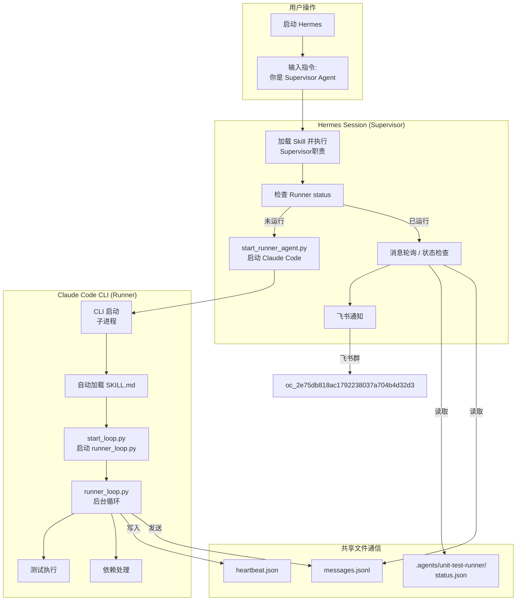
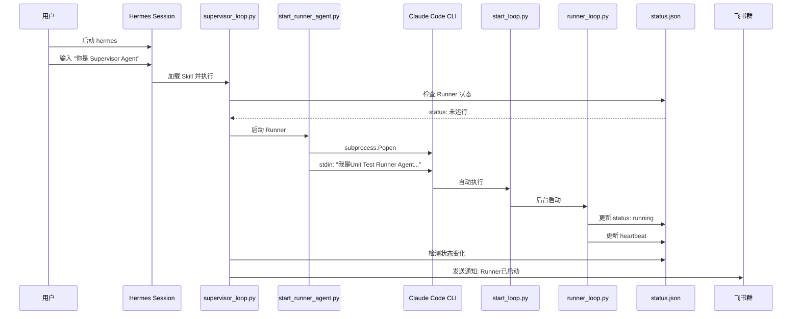
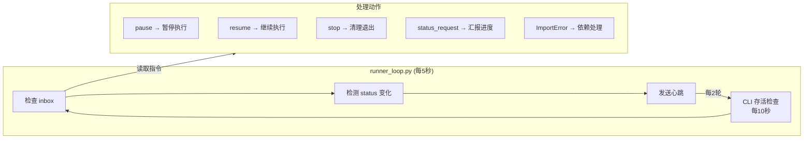
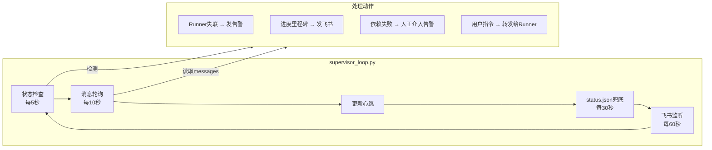
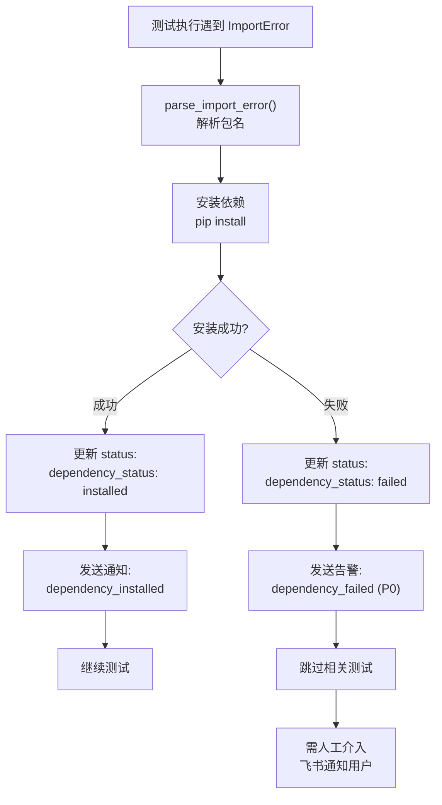

# Multi-Agent 自动化方案（简化版）

> **vLLM Unit Test Automation - 双Agent协同架构**
> **创建日期: 2026-06-08**
> **版本: 2.0.0**
> **状态: Active**

---

## 架构概述

采用 **1 Hermes Supervisor + 1 Claude Code Runner** 的简化架构：



---

## Agent职责边界

| Agent | 类型 | 核心职责 | 不负责 |
|-------|------|----------|--------|
| **Supervisor** | Hermes | 协调、消息路由、飞书通知、**启动Runner**、用户接口 | ❌ 不执行测试、不处理依赖 |
| **Runner** | Claude Code | 测试执行、失败修复、进度统计、依赖处理 | ❌ 不发飞书通知 |

---

## 启动流程

### 用户消息触发启动

```bash
# 终端窗口: 启动 Hermes
hermes

# 在 Hermes Session 中输入指令触发 Supervisor:
"你是 Supervisor Agent，开始监控"

# Supervisor 会自动:
# 1. 启动 supervisor_loop.py
# 2. 检查 Runner 状态
# 3. 如果 Runner 未运行，自动启动 Claude Code CLI
```

**注意**: Supervisor/Runner 不与 Windows 启动耦合，由用户通过消息触发。

### Runner 自动启动流程



---

## Runner 循环逻辑



---

## Supervisor 循环逻辑



---

## 依赖处理流程（Runner自处理）



### 依赖处理类型

| 依赖类型 | Runner处理方式 | 示例 |
|---------|---------------|------|
| Python包 | `pip install` | pandas, lm-eval |
| HuggingFace模型 | `huggingface-cli download` | meta-llama/Llama-3.2-1B |
| 系统库 | **告警 + 跳过** | libnvshmem_host.so.3 |
| CUDA编译问题 | **告警 + 跳过** | deep_gemm_cpp ABI不兼容 |

---

## 通信机制

### 共享文件结构

```
.agents/
├── config.json              # 全局配置
├── global_state.json        # 全局状态（Supervisor维护）
│
├── unit-test-runner/
│   ├── status.json          # Runner当前状态
│   ├── messages.jsonl       # Runner → Supervisor 消息
│   └── inbox.jsonl          # Supervisor → Runner 消息
│
├── supervisor/
│   ├── status.json          # Supervisor状态
│   └── heartbeat.json       # 心跳时间戳
│
└── archive/                 # 已处理消息归档
```

### 消息类型

| 类型 | 方向 | 优先级 | 说明 |
|------|------|:------:|------|
| `status_update` | Runner → Supervisor | P2 | 定期状态汇报 |
| `progress_milestone` | Runner → Supervisor | P1 | 进度里程碑（100, 500, 1000） |
| `error_critical` | Runner → Supervisor | P0 | 需人工介入的错误 |
| `dependency_request` | Runner → Supervisor | P1 | 依赖请求（Runner自处理，仅通知） |
| `user_command` | Supervisor → Runner | P1 | 用户指令（暂停、继续） |

---

## Runner 循环逻辑

### runner_loop.py 核心循环

```python
while True:
    # 1. 检查 inbox (每5秒)
    check_inbox()  # 处理用户指令
    
    # 2. 检测 status.json 变化 (每5秒)
    detect_status_change()  # 测试进度变化
    
    # 3. 发送心跳 (每5秒)
    send_heartbeat()
    
    # 4. 检查 CLI 存活 (每10秒)
    check_cli_alive()
    
    sleep(5)
```

### 频率定义

| 操作 | 频率 | 说明 |
|------|------|------|
| inbox检查 | 5秒 | 处理用户指令 |
| status变化检测 | 5秒 | 检测测试进度变化 |
| 心跳发送 | 5秒 | 向Supervisor汇报存活 |
| CLI存活检查 | 10秒 | 检测Claude Code CLI进程 |

---

## Supervisor 循环逻辑

### supervisor_loop.py 核心循环

```python
while True:
    # 1. 检查各Agent状态 (每5秒)
    check_agent_status()
    
    # 2. 消息轮询 (每10秒)
    poll_messages()  # 读取 messages.jsonl
    
    # 3. status.json 兜底轮询 (每30秒)
    fallback_status_check()
    
    # 4. 发送飞书通知 (触发式)
    send_feishu_notification()
    
    sleep(5)
```

### 频率定义

| 操作 | 频率 | 说明 |
|------|------|------|
| Agent状态检查 | 5秒 | 检查心跳时间戳 |
| 消息轮询 | 10秒 | 读取 messages.jsonl |
| status.json兜底 | 30秒 | 防止消息丢失 |
| 飞书通知 | 触发式 | 里程碑/告警时发送 |

---

## 用户介入方式

### 飞书介入（主要）

| 指令 | 示例 | 说明 |
|------|------|------|
| 状态查询 | `状态`、`进度` | Supervisor返回状态卡片 |
| 控制指令 | `暂停Runner`、`继续Runner` | 转发给Runner |
| OTP验证码 | `OTP 123456` | Runner处理Bastion认证 |

### 终端介入（备用）

- **Supervisor终端**: `查看当前状态`
- **Runner终端**: `暂停测试`、`我的状态`

---

## 与原架构的差异

### 移除的Agent

| Agent | 移除原因 | 职责去向 |
|-------|----------|----------|
| **Environment Agent** | Runner自处理依赖更高效 | Runner |
| **Bastion Agent** | Runner通过agent.py直接连接 | Runner |

### 简化的好处

1. **减少通信复杂度**：只有一条消息通道 (Runner ↔ Supervisor)
2. **降低启动复杂度**：只需启动2个Agent
3. **依赖处理更快**：Runner遇到问题直接处理，无等待
4. **状态一致性更好**：单一Runner，无多Agent状态同步问题

---

## 相关文档

| 文档 | 位置 | 状态 |
|------|------|------|
| 本方案 | `docs/superpowers/specs/2026-06-08-agent-automation-design.md` | ✅ Active |
| Runner Agent详细 | `docs/superpowers/specs/agents/unit-test-executor-agent/README.md` | ✅ Active |
| Supervisor Agent详细 | `docs/superpowers/specs/agents/supervisor-agent/README.md` | ✅ Active |
| 旧架构设计 | `docs/superpowers/specs/agents/README.md` | ⚠️ Deprecated |

---

*创建日期: 2026-06-08*
*状态: Active - 替代原四Agent架构*