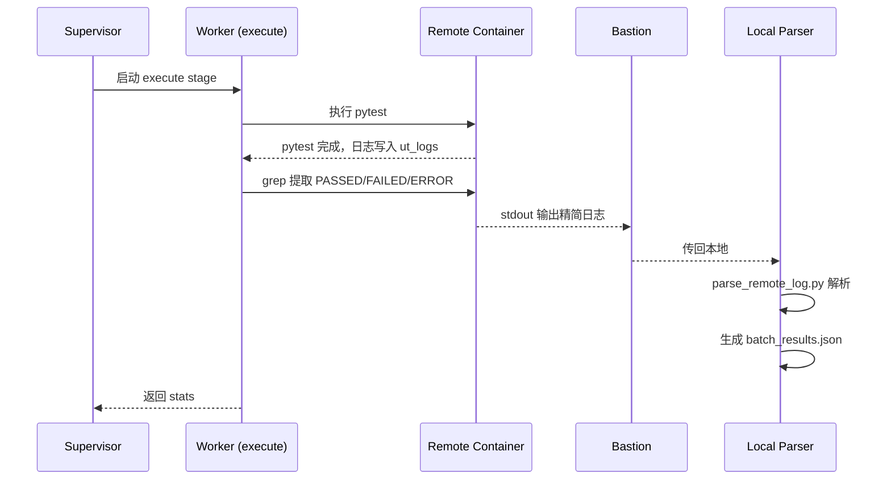

# 日志解析与传输设计

> 从远程容器 ut_logs 中 grep 提取测试结果，传回本地生成 batch_results.json

---

## 1. 问题背景

### 当前状况

- `run_batch.py` 只启动 pytest 执行，不解析结果
- 远程日志存储在 `/gpfs/gcsp/M2.7_verify/vllm/ut_logs/`
- Stage 3 → Stage 4 数据流断裂（缺少 batch_results.json）

### 用户偏好方案

> "从远程容器中,vllm/ut_logs的日志中，先grep得到通过/失败/error的测试用例，将内容传回本地记录"

---

## 2. 设计目标

1. **远程提取**：从 ut_logs/*.log 提取 PASSED/FAILED/ERROR 行
2. **高效传输**：通过 bastion 传回本地，避免传输完整日志
3. **本地解析**：生成符合 batch_results_schema.json 的 batch_results.json
4. **复用现有代码**：使用 batch_test_runner.py 中已有的解析函数

---

## 3. 技术方案

### 3.1 远程 grep 命令

**位置**：远程容器 `/gpfs/gcsp/M2.7_verify/vllm/ut_logs`

**命令设计**：

```bash
# 方案 A：按批次提取（推荐）
cd /gpfs/gcsp/M2.7_verify/vllm/ut_logs
grep -E "(PASSED|FAILED|ERROR|SKIPPED)" phase1/batch_{batch_id}.log

# 方案 B：提取所有批次
grep -E "(PASSED|FAILED|ERROR)" phase*/batch_*.log > /tmp/all_summary.log

# 方案 C：分类提取（更详细）
grep -E "PASSED" phase1/batch_*.log > /tmp/passed.txt
grep -E "FAILED" phase1/batch_*.log > /tmp/failed.txt
grep -E "ERROR" phase1/batch_*.log > /tmp/error.txt
```

**输出格式**：
```
tests/test_config.py::test_load PASSED
tests/test_model.py::test_init FAILED
tests/distributed/test_pp.py::test_pipeline ERROR
```

---

### 3.2 bastion 传输流程

**流程图**：

```
远程容器                    Bastion Server                   本地
┌─────────┐                 ┌──────────┐                 ┌─────────┐
│ ut_logs │──grep──stdout──→│ agent.py │──stdout──ssh──→│ 本地文件│
└─────────┘                 └──────────┘                 └─────────┘
```

**实现方式**：

1. **通过 agent.py 执行**：
   ```python
   # agent.py 调用示例
   result = agent.run_remote_command(
       server="t_h20",
       container="v0.13.0_torch2.5.1_compile",
       command="grep -E '(PASSED|FAILED|ERROR)' /gpfs/.../ut_logs/phase1/batch_*.log"
   )
   ```

2. **本地捕获输出**：
   ```python
   log_content = result.stdout
   # 写入临时文件或直接解析
   ```

---

### 3.3 本地解析脚本

**新脚本**：`skills/ut/unit-test-executor/scripts/parse_remote_log.py`

**功能**：
1. 解析 grep 输出的精简日志
2. 提取 test_node、status、error_type
3. 生成符合 batch_results_schema.json 的输出

**复用函数**（来自 batch_test_runner.py）：
- `parse_batch_log()` (line 647-746)：解析 pytest 输出
- `categorize_error_type()` (line 797-829)：分类错误类型
- `extract_error_message()` (line 941-960)：提取错误消息

**核心代码结构**：

```python
#!/usr/bin/env python3
"""解析远程 grep 输出，生成 batch_results.json

用法：
    python parse_remote_log.py --log-file PATH --batch-id ID --output PATH
    python parse_remote_log.py --stdin --batch-id ID --output PATH
"""

def extract_test_node(line: str) -> str:
    """从 pytest 输出行提取 test_node"""

def extract_status(line: str) -> str:
    """提取测试状态"""

def categorize_error_type(line: str) -> str:
    """分类错误类型"""

def parse_remote_log(log_content: str, batch_id: str) -> dict:
    """解析远程 grep 输出"""

def main():
    """CLI入口"""
```

---

## 4. 集成到 workflow

### 4.1 workflow.yaml 配置

```yaml
stages:
  - id: execute
    ...
    output:
      batch_results_path: "{run_dir}/batches/{batch_id}/batch_results.json"
    post_action:
      # 新增：远程日志提取步骤
      - step: extract_remote_log
        command: "grep -E '(PASSED|FAILED|ERROR)' {ut_logs_dir}/{batch_id}.log"
        server: "t_h20"
        container: "v0.13.0_torch2.5.1_compile"
      - step: parse_local
        script: "parse_remote_log.py --stdin --batch-id {batch_id} --output {batch_results_path}"
```

### 4.2 执行流程



---

## 5. bastion 传输限制（待调查）

**待调查问题**：
- bastion server 最大传输信息量？
- 是否支持压缩传输？
- 是否有超时限制？

**调查方法**：
1. 查看 bastion 文档：`docs/guides/bastion.md`
2. 检查 agent.py 配置：`.agents/agent.py`
3. 实际测试传输大小限制

---

## 6. 错误分类映射

### batch_results_schema.json error_type enum

```json
{
  "error_type": {
    "enum": [
      "dependency",
      "network",
      "resource",
      "version",
      "functional",
      "download_error",
      "other"
    ]
  }
}
```

### C/E/D/P/M/S 分类框架映射

| C/E/D/P/M/S | batch_results error_type | 说明 |
|-------------|--------------------------|------|
| **C** (Code Bug) | `functional` | 代码逻辑错误 |
| **E** (Environment) | `other` | 环境配置问题 |
| **D** (Dependency) | `dependency` | 导入/模块缺失 |
| **P** (Platform) | `resource` | CUDA/GPU 问题 |
| **M** (Model) | `download_error` | 模型下载失败 |
| **S** (Skip) | - | 跳过的测试 |

---

## 7. 待实施事项

### P1 - 必须实施

1. **创建 parse_remote_log.py**
   - 位置：`skills/ut/unit-test-executor/scripts/parse_remote_log.py`
   - 功能：解析 grep 输出，生成 batch_results.json

2. **修改 run_batch.py**
   - 在 pytest 执行后添加日志提取步骤
   - 调用 parse_remote_log.py 生成 batch_results.json

3. **调查 bastion 传输限制**
   - 确认最大传输信息量
   - 是否需要压缩传输

### P2 - 可选优化

1. **增强错误分类**
   - 使用 batch_test_runner.py 的完整分类逻辑
   - 提取更多错误细节

2. **添加 duration_ms 提取**
   - 如果 pytest 输出包含时间信息
   - 从完整日志中提取

---

## 8. 测试验证

### 测试用例

```bash
# 测试 parse_remote_log.py
echo "tests/test_config.py::test_load PASSED
tests/test_model.py::test_init FAILED - AssertionError
tests/distributed/test_pp.py::test_pipeline ERROR - ImportError: No module named 'torch.distributed'
" | python parse_remote_log.py --stdin --batch-id test_batch --output test_results.json

# 验证输出
cat test_results.json
# 应包含符合 batch_results_schema.json 的内容
```

---

## 9. 参考资料

- **现有解析函数**：`skills/ut/unit-test-executor/scripts/batch_test_runner.py` (line 647-746)
- **Schema 定义**：`skills/ut/unit-test-executor/batch_results_schema.json`
- **错误分类**：`skills/ut/unit-test-executor/references/error-classification.md`
- **workflow 配置**：`.agents/workflow.yaml`
- **bastion 文档**：`docs/guides/bastion.md`

---

## 10. 下一步行动

1. **编写 parse_remote_log.py**（已设计，待实施）
2. **调查 bastion 传输限制**（待调查）
3. **集成到 run_batch.py**（待实施）
4. **测试验证**（待测试）

---

*Created: 2026-06-11*
*Status: Draft - 待用户审核*