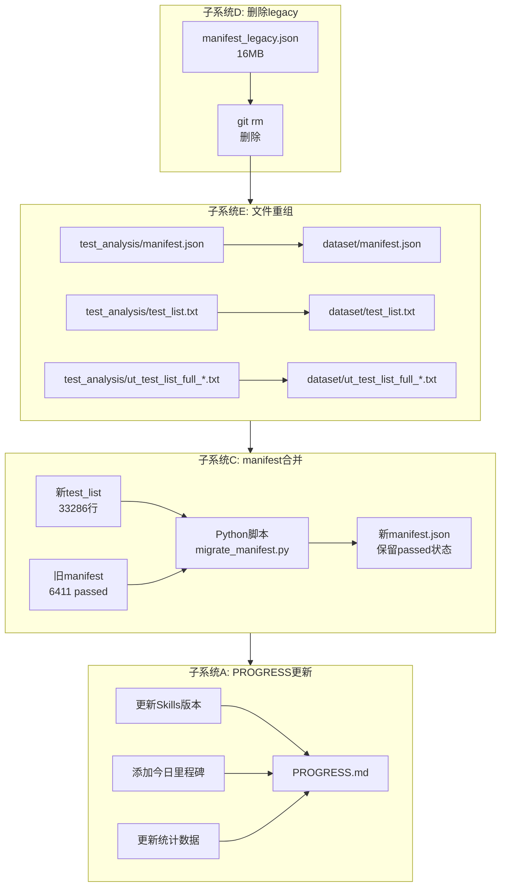

# UT Workflow Manifest Merge & Directory Reorganization Design

> Design for merging manifest.json with latest test_list, directory cleanup, and PROGRESS.md update.

## Problem Statement

UT workflow system has:
- **Old manifest.json** (31,868 tests, 6,411 passed) in `test_analysis/`
- **New test_list** (33,286 tests) with more comprehensive coverage
- **Disorganized test_analysis directory** with legacy/backup files (44MB)
- **Outdated PROGRESS.md** (last update 2026-06-13)

User requirements:
1. Merge new test_list with old manifest's passed status
2. Delete `manifest_legacy.json`
3. Reorganize test_list + manifest to `tasks/ut/dataset/`
4. Update PROGRESS.md with today's milestones

---

## Solution Design

### Overall Architecture



---

## Component Details

### 1. 子系统E：文件重组（优先执行）

**Create `tasks/ut/dataset/` directory**:
```
tasks/ut/
├── dataset/              # NEW: Core dataset directory
│   ├── manifest.json     # Moved from test_analysis/
│   ├── test_list.txt     # Moved from test_analysis/ (old version)
│   └── ut_test_list_full_20260624_173600.txt  # Moved (latest)
├── test_analysis/        # KEEP: Analysis outputs
│   ├── manifest.backup-2026-06-20.json  # Keep (history)
│   ├── remote_log_summary/              # Keep
```

**Operations**:
- `mkdir tasks/ut/dataset/`
- `git mv tasks/ut/test_analysis/manifest.json tasks/ut/dataset/`
- `git mv tasks/ut/test_analysis/test_list.txt tasks/ut/dataset/`
- `git mv tasks/ut/test_analysis/ut_test_list_full_20260624_173600.txt tasks/ut/dataset/`

**Directory responsibilities**:
- `dataset/` → **Input data** (manifest + test_list)
- `test_analysis/` → **Output data** (backup + analysis logs)
- `docs/` → **Documentation** (guides/designs/plans/incidents/reports)
- `scripts/` → **Execution** (deploy_tier.py + runtime scripts)
- `deployment/` → **Configuration** (test/profiles + production/config)

---

### 2. 子系统D：删除legacy文件

**Target**: `tasks/ut/test_analysis/manifest_legacy.json` (16MB)

**Operation**:
```bash
git rm tasks/ut/test_analysis/manifest_legacy.json
```

**Validation**: File no longer exists in `tasks/ut/test_analysis/`

---

### 3. 子系统C：manifest合并逻辑

**Script**: `tasks/ut/scripts/migrate_manifest.py` (NEW)

**Inputs**:
- `tasks/ut/dataset/ut_test_list_full_20260624_173600.txt` (33,286 lines)
- `tasks/ut/dataset/manifest.json` (31,868 tests, 6,411 passed)
- `skills/ut/ut_common/manifest_schema.json`

**Algorithm** (方案2: 增量合并):
```python
# Core merge logic
def merge_manifests(test_list_path, old_manifest_path, schema_path):
    # Step 1: Parse new test_list
    new_test_nodes = parse_test_list(test_list_path)  # 33,286 nodes

    # Step 2: Extract old manifest passed status
    old_manifest = json.load(old_manifest_path)
    passed_map = {
        t['test_node']: t
        for t in old_manifest['tests']
        if t['status'] == 'passed'
    }  # 6,411 passed tests

    # Step 3: Generate new manifest skeleton
    new_manifest = {
        'version': '2.0',
        'generated_at': datetime.utcnow().strftime("%Y-%m-%dT%H:%M:%SZ"),
        'source': 'ut_test_list_full_20260624_173600.txt',
        'tests': [],
        'statistics': {}
    }

    # Step 4: Merge passed status (方案2)
    for test_node in new_test_nodes:
        test_entry = generate_empty_entry(test_node, schema)  # status=pending

        # If test_node in old passed_map, preserve status and fields
        if test_node in passed_map:
            old_entry = passed_map[test_node]
            test_entry['status'] = 'passed'
            test_entry['log_file'] = old_entry.get('log_file')
            test_entry['last_run_at'] = old_entry.get('last_run_at')
            test_entry['error_type'] = old_entry.get('error_type')  # 修正：保留error_type

        new_manifest['tests'].append(test_entry)

    # Step 5: Update statistics
    passed_count = sum(1 for t in new_manifest['tests'] if t['status'] == 'passed')
    new_manifest['statistics'] = {
        'total': len(new_manifest['tests']),
        'passed': passed_count,
        'pending': len(new_manifest['tests']) - passed_count
    }

    return new_manifest
```

**Field merge rules**:
| Field | Source | Rule |
|-------|--------|------|
| `test_node` | New test_list | Primary key (must exist) |
| `status` | Old manifest (if passed) | `passed` → preserve, else `pending` |
| `log_file` | Old manifest (if passed) | Preserve passed test's log path |
| `last_run_at` | Old manifest (if passed) | Preserve passed test's timestamp |
| `error_type` | Old manifest (if exists) | **Preserve if exists** (修正点) |
| `max_retry` | Schema default | `3` |
| Other fields | Schema default | Generate per schema |

**Output**: New `tasks/ut/dataset/manifest.json` (33,286 tests, ~6,411 passed preserved)

---

### 4. 子系统A：PROGRESS.md更新

**Current state** (last update: 2026-06-13):
```markdown
| 指标 | 数值 |
|总测试用例数 | 31,868 |
|已执行用例数 | 6,412 |
|进度 | 20.12% |
|通过数 | 6,411 |
```

**Update to**:
```markdown
| 指标 | 数值 |
|总测试用例数 | 33,286 |  # 从新test_list
|已执行用例数 | 33,286 |  # 全量列表
|进度 | 19.26% |  # 重新计算: 6411/33286
|通过数 | 6,411 |  # 保持（合并后）
```

**Skills version update**:
- Stage 1: `ut-test-collector v2.1` → `unit-test-collector v2.1`

**Add milestone**:
```markdown
| 2026-06-26 | Documentation Cleanup + Reports Reorganization | tasks/ut/dataset/ · tests/ut/reports/ · manifest合并准备 |
```

**Hermes Kanban status update**:
- Phase 3 (真实验证): `⬜` → `✅` (framework_test迁移完成)

---

## Execution Order

**Recommended sequence** (方案C):
1. **子系统E** (文件重组) - 创建dataset目录 + 移动文件
2. **子系统D** (删除legacy) - git rm manifest_legacy.json
3. **子系统C** (manifest合并) - 运行Python脚本生成新manifest
4. **子系统A** (PROGRESS更新) - 更新文档

---

## Validation Criteria

### Success metrics:
- `tasks/ut/dataset/` exists with manifest.json + test_list files
- `tasks/ut/test_analysis/manifest_legacy.json` removed
- New manifest has 33,286 tests with 6,411 passed preserved
- PROGRESS.md shows 2026-06-26 milestone + correct stats

### Failure scenarios:
- **Passed tests lost**: Old manifest has 6,411 passed, new manifest should have ~6,411 (some may not in new test_list)
- **Schema validation fail**: New manifest must pass manifest_schema.json validation
- **Git history broken**: Use `git mv` instead of manual mv to preserve history

---

## Notes

- `.agents/_resume_comment*.txt` files preserved (Bastion daemon debugging history)
- `manifest.backup-2026-06-20.json` preserved (may contain historical progress)
- test_analysis/remote_log_summary/ preserved (analysis outputs)

---

**Approved by user**: 2026-06-26
**Ready for implementation plan**: invoke writing-plans skill