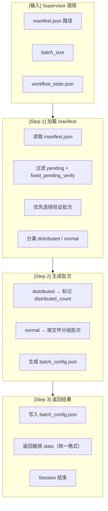

# Batch Selector (Worker Agent v2.2)

---

## Worker 角色

```
┌─────────────────────────────────────────────────────────────┐
│  Worker Agent Session (临时，执行后释放)                     │
│                                                             │
│  职责：                                                      │
│  • 从 manifest.json 选择 pending + fixed_pending_verify + failed 测试 │
│  • 优先选择验证批次（fixed_pending_verify）                  │
│  • 其次选择失败重试批次（failed）                            │
│  • 最后选择新批次（pending）                                  │
│  • 分离 distributed / normal 测试                            │
│  • 生成 batch_config.json                                   │
│  • 返回极简结果给 Supervisor                                │
│                                                             │
│  输入：manifest.json                                         │
│  输出：batch_config.json + 极简 stats                        │
│  Session 结束后：Context 释放                                │
│                                                             │
│  ⚠️ GPU 检测职责已移至 Stage 3 (unit-test-executor)         │
└─────────────────────────────────────────────────────────────┘
```

---

## 流程图



**注意：GPU 检测已移至 Stage 3 (unit-test-executor)**

---

## 输入输出

### 输入（从 Supervisor context 获取）

| 字段 | 来源 | 说明 |
|------|------|------|
| `workflow_state_path` | Supervisor context | 状态文件路径 |
| `manifest_path` | workflow.yaml | manifest.json 路径 |
| `batch_size` | workflow.yaml | 批次大小（默认 50） |
| `max_retry_per_test` | workflow.yaml | 单测试最大重试次数（默认 3） |

### 输出

| 类型 | 内容 | 说明 |
|------|------|------|
| **文件** | batch_config.json | 批次配置文件 |
| **返回** | stats (极简) | 给 Supervisor 的返回值 |

---

## Selection Logic (v5)

`select_batch(manifest, batch_size)` filters tests by **selectability** then sorts by **status priority** and takes the first `batch_size`. Each returned test is annotated with a `selected_reason` field.

### Status × Selected matrix

| status                  | selectable?                                 | priority | next stage on non-selection      |
|-------------------------|---------------------------------------------|----------|----------------------------------|
| `pending`               | yes (always)                                | 1        | —                                |
| `fixed_pending_verify`  | yes (always)                                | 2        | —                                |
| `retriable_error`       | yes iff `retry_count < max_retry`           | 3        | becomes `ignored` once exhausted (Stage 5 manifest-updater) |
| `failed`                | yes iff `retry_count < max_retry`           | 4        | failure-handler triage           |
| `error`                 | **never** selected                          | —        | routed to **Stage 4** failure-handler |
| `running` / `passed` / `ignored` | **never** selected                  | —        | terminal                         |

### Key rules

- **`error` is never selected by Stage 3.** It is always routed to Stage 4 (failure-handler) for triage.
- **`retriable_error` never goes to Stage 4.** Once `retry_count >= max_retry`, Stage 5 (manifest-updater) flips it to `ignored` with `ignore_reason = "max retry exceeded for <error_type>"`.
- Sort order is determined by `STATUS_PRIORITY = {pending: 1, fixed_pending_verify: 2, retriable_error: 3, failed: 4}` — lower number runs first.
- `selected_reason` is `"<status> retry <retry_count>/<max_retry>"` for `retriable_error` / `failed`, otherwise the bare status name.

### Reference

```python
from generate_batch import select_batch, write_batch_config

selected = select_batch(manifest, batch_size=8)
write_batch_config(
    path=batch_dir / "batch_config.json",
    batch_id="b001",
    iteration=42,
    run_id=run_id,
    selected=selected,
)
```

---

## 执行流程

### Step 1: 加载 manifest

```python
import json
from pathlib import Path

# 从 workflow_state.json 读取路径配置（不硬编码）
from shared.config_loader import get_paths
paths = get_paths(workflow_state_path)

# 读取 manifest
manifest_path = paths["manifest"]
manifest = json.loads(Path(manifest_path).read_text())

# 过滤 pending + fixed_pending_verify + failed 测试
# 优先级：fixed_pending_verify > failed > pending
fixed_pending_tests = [t for t in manifest["tests"] 
                       if t.get("status") == "fixed_pending_verify"]

# failed 测试：只选 retry_count < max_retry 的（防止无限循环）
max_retry_per_test = config.get("max_retry_per_test", 3)
failed_tests = [t for t in manifest["tests"] 
                if t.get("status") == "failed" 
                and t.get("retry_count", 0) < max_retry_per_test]

pending_tests = [t for t in manifest["tests"] 
                 if t.get("status") == "pending"]

# 合并，验证批次优先
# 比例：fixed_pending 30%, failed 40%, pending 30%
batch_size = config.get("batch_size", 50)
candidate_tests = []
fixed_limit = batch_size // 3
failed_limit = batch_size // 2

candidate_tests.extend(fixed_pending_tests[:fixed_limit])
candidate_tests.extend(failed_tests[:failed_limit])
remaining_slots = batch_size - len(candidate_tests)
candidate_tests.extend(pending_tests[:remaining_slots])

# 分离 distributed / normal
def is_distributed(test_node):
    patterns = [
        "tests/distributed/",
        "test_pipeline_parallel",
        "test_tensor_parallel",
        "test_distributed",
        "MULTI_GPU",
        "world_size"
    ]
    return any(p in test_node for p in patterns)

distributed_tests = [t for t in candidate_tests if is_distributed(t["test_node"])]
normal_tests = [t for t in candidate_tests if not is_distributed(t["test_node"])]
```

### Step 2: 生成批次

```python
from datetime import datetime
from collections import defaultdict

batch_size = 50
batch_id = f"batch_{datetime.now().strftime('%Y%m%d_%H%M%S')}"

# 按文件分组（减少 pytest 启动开销）
def group_by_file(tests):
    groups = defaultdict(list)
    for t in tests:
        groups[t["test_file"]].append(t)
    return dict(groups)

grouped = group_by_file(normal_tests)

# 生成批次
batch_tests = []
for file, tests in grouped:
    batch_tests.extend(tests)
    if len(batch_tests) >= batch_size:
        break

batch_tests = batch_tests[:batch_size]

# batch_config.json 结构（写入文件，不含 stats）
batch_config = {
    "batch_id": batch_id,
    "tests": batch_tests,
    "distributed_count": len(distributed_tests),
    "requires_multi_gpu": len(distributed_tests) > 0,
    "generated_at": datetime.now().isoformat()
}

# 如果有 distributed 测试，添加提示
if distributed_tests:
    batch_config["distributed_tests"] = [...]  # 前10个
    batch_config["note"] = "distributed tests require GPU >= 2"
```

### Step 3: 写入文件并返回

```python
# 写入 batch_config.json（路径从 workflow.yaml 读取）
batch_config_path = paths["batch_config"]
Path(batch_config_path).write_text(json.dumps(batch_config, indent=2))

# Worker 返回给 Supervisor（统一格式，只含 stats）
return {
    "stats": {
        "passed": 0,
        "failed": 0,
        "ignored": 0,
        "error": 0,
        "pending": len(pending_tests) - len(batch_tests)
    },
    "next_action": "continue",
    "error": None,
    "blocked_reason": None
}
```

---

## 返回格式规范（统一）

```json
{
  "stats": {
    "passed": 0,
    "failed": 0,
    "ignored": 0,
    "error": 0,
    "pending": 12549
  },
  "next_action": "continue",
  "error": null,
  "blocked_reason": null
}
```

**注意：只返回统一字段，不返回 batch_id、batch_size、requires_multi_gpu 等额外字段**

---

## distributed 测试处理决策表

|| distributed 测试 | 本 Stage 动作 |
||:----------------:|------|
|| 有 | 标记 `distributed_count`，写入 batch_config.json |
|| 无 | normal 批次，按文件分组 |

**注意：GPU 检测和 distributed 执行决策已移至 Stage 3 (unit-test-executor)**

---

## 前置/后置任务

|| 类型 | 任务 | 说明 |
||------|------|------|
|| **前置** | Supervisor 调用 | delegate_task 触发 |
|| **前置** | manifest.json 存在 | pending 测试 > 0 |
|| **后置** | batch_config.json 写入 | 输出文件 |
|| **后置** | 返回 stats（统一格式） | 极简返回值 |
|| **后置** | Supervisor 继续 Stage 3 | execute |

**注意：GPU 检测前置条件已移除，由 Stage 3 执行**

---

## 注意事项

1. **验证批次优先**：优先选择 `fixed_pending_verify` 测试，确保修复后验证闭环
2. **distributed 测试标记**：只标记 `distributed_count`，GPU 检测由 Stage 3 执行
3. **按文件分组**：减少 pytest 启动开销，同文件测试一起执行
4. **极简返回**：只返回 stats，不返回 tests 列表
5. **统一返回格式**：只返回 stats + next_action + error + blocked_reason

---

## 禁止操作

- ❌ 不返回 tests 详细列表（只返回 stats）
- ❌ 不检测 GPU（已移至 Stage 3）
- ❌ 不发送飞书通知（让 Supervisor 发送）
- ❌ 不修改 manifest.json（只读取）
- ❌ 不在本地或远程检测 GPU
- ❌ 不返回 batch_id/batch_size/requires_multi_gpu 等额外字段（只返回统一格式）

---

## 相关文档

- [workflow.yaml](../../.agents/workflow.yaml) - Workflow 配置

  > **配置路径说明：** workflow.yaml路径是动态的（`runs/ut-{timestamp}/workflow.yaml`），
  > 由terminal-workflow或hermes-workflow在Stage 0环境选择后确定。
  > 模板位于：`tasks/ut/deployment/production/config/workflow.yaml`（production）
  > 或 `tests/ut/integration/fixtures/workflow.l{1-4}.yaml`（test）
- [workflow/SKILL.md](../workflow/SKILL.md) - Supervisor 调度逻辑
- [unit-test-executor/SKILL.md](../unit-test-executor/SKILL.md) - 下游 Stage（GPU 检测在此执行）

---

*创建日期: 2026-06-09*
*更新日期: 2026-06-10*
*版本: 2.1.0*