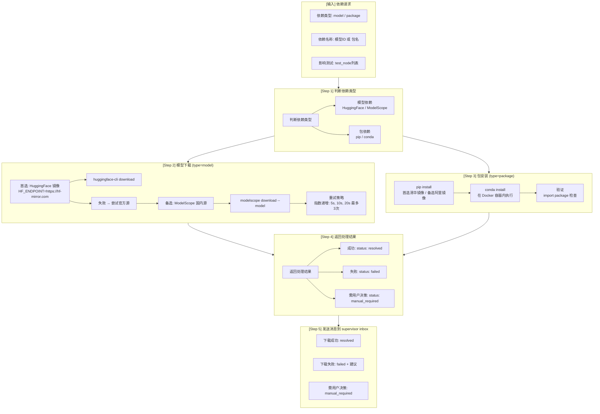

# Dependency Resolver

---

## 流程图



---

## 依赖类型判断

| 类型 | 识别规则 | 下载源 |
|------|----------|--------|
| **模型** | 包含 `/` (如 `meta-llama/Llama-3.2-1B`) | HuggingFace / ModelScope |
| **包** | 单个名称 (如 `transformers`) | pip / conda |

---

## 镜像加速配置

### HuggingFace 镜像

```bash
# 设置环境变量
export HF_ENDPOINT=https://hf-mirror.com

# 下载模型
huggingface-cli download meta-llama/Llama-3.2-1B-Instruct \
    --local-dir /gpfs/gcsp/models/Llama-3.2-1B-Instruct
```

### pip 镜像

```bash
# 清华镜像
pip install transformers -i https://pypi.tuna.tsinghua.edu.cn/simple

# 阿里镜像
pip install transformers -i https://mirrors.aliyun.com/pypi/simple
```

---

## 输入输出

| 类型 | 内容 | 格式 | 说明 |
|------|------|------|------|
| **输入** | 依赖类型 | String | `model` / `package` |
| **输入** | 依赖名称 | String | 模型ID 或 包名 |
| **输入** | 影响测试 | Array | 受影响的测试节点列表 |
| **输入** | 版本要求 | String | 可选，如 `>=4.40.0` |
| **输出** | 处理结果 | JSON | status + affected_tests |
| **输出** | supervisor inbox 消息 | JSON Lines | download_result / manual_required |

---

## 处理结果格式

### 成功

```json
{
  "status": "resolved",
  "dependency": "meta-llama/Llama-3.2-1B-Instruct",
  "type": "model",
  "local_path": "/gpfs/gcsp/models/Llama-3.2-1B-Instruct",
  "affected_tests": ["tests/test_a.py::test_x", "tests/test_b.py::test_y"],
  "resolved_at": "2026-06-09T10:00:00"
}
```

### 失败

```json
{
  "status": "failed",
  "dependency": "meta-llama/Llama-3.2-1B-Instruct",
  "reason": "网络超时，3次重试失败",
  "suggestion": "手动下载或使用VPN",
  "affected_tests": ["tests/test_a.py::test_x"],
  "retry_count": 3
}
```

### 需用户决策

```json
{
  "status": "manual_required",
  "dependency": "proprietary-model",
  "reason": "模型需要授权访问",
  "options": [
    "申请HuggingFace授权",
    "使用其他开源模型替代",
    "跳过相关测试"
  ]
}
```

---

## 前置/后置任务

| 类型 | 任务 | 来源/目标 | 说明 |
|------|------|-----------|------|
| **前置** | 依赖请求 | failure-handler | 分析出依赖缺失 |
| **前置** | 远程环境可用 | t_h20 服务器 | Docker容器可访问 |
| **前置** | 网络可用 | bastion | 可访问外网 |
| **后置** | 验证安装 | 容器内 | import检查 |
| **后置** | 发送消息到 supervisor | supervisor inbox | 下载结果通知 |
| **后置** | 更新 manifest | failure-handler | 标记测试可重试 |

---

## 重试策略

**指数递增**：5秒 → 10秒 → 20秒，最多3次

```python
retry_intervals = [5, 10, 20]  # 秒

for attempt in range(3):
    result = download_model(model_id)
    if result.success:
        return {"status": "resolved"}
    sleep(retry_intervals[attempt])

return {"status": "failed", "reason": "3次重试失败"}
```

---

## 执行位置

| 任务 | 执行位置 | 说明 |
|------|----------|------|
| 模型下载 | t_ascend (联网机器) | 有外网访问 |
| 包安装 | t_h20 容器内 | 测试环境 |
| 验证检查 | t_h20 容器内 | import测试 |

---

## 核心脚本

```bash
# 下载模型
python skills/ut/dependency-resolver/scripts/download_model.py \
    --model-id meta-llama/Llama-3.2-1B-Instruct \
    --local-dir /gpfs/gcsp/models/

# 安装包
python skills/ut/dependency-resolver/scripts/install_package.py \
    --package transformers \
    --version ">=4.40.0" \
    --mirror tsinghua

# 检查依赖状态
python skills/ut/dependency-resolver/scripts/check_dependency.py \
    --dependency transformers
```

---

## 注意事项

1. **镜像优先**：优先使用国内镜像加速
2. **联网机器下载模型**：t_ascend 有外网，下载后同步到 /gpfs
3. **容器内安装包**：在 t_h20 的 Docker 容器内执行
4. **重试指数递增**：避免频繁请求造成服务器压力
5. **影响测试记录**：记录受影响的测试，便于后续重试
6. **通知渠道**：发送消息到 supervisor inbox，不直接飞书通知

---

## 禁止操作

- ❌ 不在本地下载模型/包（通过远程机器）
- ❌ 不跳过镜像直接访问国外源（除非镜像失败）
- ❌ 不无限重试（最多3次）
- ❌ 不自动跳过需要授权的模型（需用户决策）
- ❌ 不直接发送飞书通知（通过 supervisor inbox）

---

## 作为 Hermes Gateway 运行（v2 新增）

从 2026-06-23 起，本 skill 同时以**第 5 个 Hermes gateway profile** `ut-dependency-resolver` 的形式常驻运行，订阅 Kanban 上 fixer 标记的待处理依赖任务，闭环 fixer → resolver 的断链（参见 [`tasks/ut/docs/incidents/2026-06-23-l4-postmortem-and-fixes.md`](../../../tasks/ut/docs/incidents/2026-06-23-l4-postmortem-and-fixes.md) §4）。

### Claim 过滤

```
final_status == "pending" AND
resolution.action == "delegate_to_dependency_resolver"
```

严格匹配，不抢 executor 的 `ready` 任务。

### 处理流程（`resolver_gateway_runner.run_one_iteration`）

```
1. claim_pending_delegate() → task
2. resolve_one(task) → ResolveDecision
     ├─ dependency_type=model → two_stage_sync.sync_model(dep_id)
     │    ├─ resolved → release_ready (final_status=ready)
     │    └─ 任何失败 → release_ignored (final_status=ignored)
     ├─ dependency_type=package → release_ignored (M2 暂不支持)
     └─ missing dependency_id → release_ignored (malformed)
3. release 后回到第 1 步
```

### Two-stage download（`two_stage_sync.sync_model`）

| 阶段 | 操作 |
|---|---|
| 1. probe | `agent.py -p t_ascend run true`（30s SSH 探测）|
| 2. download | `agent.py -p t_ascend run huggingface-cli download` → 落 GPFS 共享路径 `/gpfs/gcsp/.../hf_hub/` |
| 3. verify | `agent.py -p t_h20 run test -d <path>`（确认 GPFS 在 t_h20 也可见）|

GPFS 在 t_ascend / t_h20 之间共享，所以**不需要物理第二段传输**；如果未来部署改为分储存，把 `_verify_on_t_h20` 换成 `agent.py download` + `agent.py upload` 链，调用点不变。

### 失败语义（关键约束）

| 项 | 决策 | 理由 |
|---|---|---|
| Resolver 失败后回吐 fixer？ | ❌ 直接 promote `ignored` | resolver 是叶子节点；回吐易造成循环且无新信息 |
| 单 task 重试？ | ❌ 不重试 | retry 是 executor 层的事；resolver 不重试避免 HF rate-limit 浪费 |
| 单 task 超时 | 30 min 硬上限 | 大模型可慢，但不允许无限挂 |
| SSH 网络探测 | 30s | 与 task 总 budget 分两层 |
| Auth-gated model（401/403）| `ignored_reason="offline_unfixable: hf_auth_failed"` | 需要用户层面授权，resolver 无能为力 |
| Stage dir 磁盘满 | `ignored_reason="offline_unfixable: disk_full"` | 不下载，直接 ignored |

### `resolution.status` 状态机

| 值 | 含义 | 写入者 |
|---|---|---|
| `pending_resolver` | fixer 决定委托，等 resolver claim | fixer |
| `resolved` | resolver 成功 sync，executor 可重跑 | resolver |
| `failed_offline` | resolver 跑过但失败（网络/超时/auth/disk）| resolver |

`final_status` 流转：

```
failed (executor)
  → pending (fixer 设定，resolution.action=delegate_to_dependency_resolver)
  → ready  (resolver 成功 → executor 重 claim)
  → ignored (resolver 失败 → 终态；user_intervention_option_2 不再必要)
```

### 启动

由 `tasks/ut/scripts/start_hermes_ut_runtime.py` 在启动 4 个 gateway 时一并拉起第 5 个 `ut-dependency-resolver` profile（与 executor/fixer 同生命周期）。

### OTP

`t_ascend` daemon 通过 issue #2 (M3) 的 OTP bring-up 自动启动；resolver 不引入新的人工依赖。

---


*创建日期: 2026-06-09*
*版本: 1.0.0*