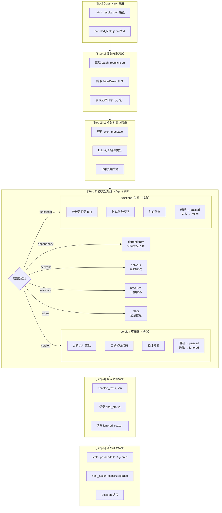

# Failure Handler (Worker Agent v2.1)

---

## Worker 角色

```
┌─────────────────────────────────────────────────────────────┐
│  Worker Agent Session (临时，执行后释放)                     │
│                                                             │
│  职责：                                                      │
│  • 分析 batch_results.json 中的失败/错误测试                 │
│  • LLM 判断错误类型和处理策略                                │
│  • 尝试修复代码（version/functional）                       │
│  • 调用 dependency-resolver 处理依赖缺失                    │
│  • 验证修复效果                                              │
│  • 写入 handled_tests.json                                  │
│  • 返回极简结果给 Supervisor                                │
│                                                             │
│  输入：batch_results.json                                    │
│  输出：handled_tests.json + 极简 stats                       │
│  Session 结束后：Context 释放                                │
│                                                             │
│  ⚠️ 这是 Agent 判断核心 Stage                               │
│  ⚠️ dependency-resolver 作为子 skill                        │
└─────────────────────────────────────────────────────────────┘
```

---

## 流程图



---

## 输入输出

### 输入（从 Supervisor context 获取）

| 字段 | 来源 | 说明 |
|------|------|------|
| `workflow_state_path` | Supervisor context | 状态文件路径 |
| `batch_results_path` | workflow.yaml | 测试结果路径 |
| `handled_tests_path` | workflow.yaml | 处理结果输出路径 |

### 输出

| 类型 | 内容 | 说明 |
|------|------|------|
| **文件** | handled_tests.json | 处理结果文件 |
| **返回** | stats (极简) | 给 Supervisor 的返回值 |
| **代码修复** | patch 文件 | 如果修复成功 |

---

## 失败分类判断规则

|| 类型 | 关键词 | Agent 处理策略 |
||------|--------|---------------|
|| **dependency** | `ModuleNotFoundError`, `ImportError` | **调用 dependency-resolver 子 skill** |
|| **network** | `timeout`, `ConnectionError` | 延时重试 (5s/10s/20s) |
|| **resource** | `CUDA out of memory`, `OOM` | 汇报 Supervisor → blocked_reason |
|| **version** | `TypeError`, `AttributeError`, API 缺失 | **尝试修复代码** → 验证 |
|| **functional** | `AssertionError`, `ValueError` | **分析 bug → 尝试修复** |
|| **download_error** | `Failed to download`, `Model not found` | **调用 dependency-resolver 子 skill** |
|| **other** | 不匹配以上 | 记录信息 → 继续 |

**ERROR 状态测试处理**：
- pytest ERROR 状态测试（collection error, setup error）归入 **other** 类型
- 需要人工介入的错误设置 `error` 字段请求暂停

---

## 执行流程

### Step 1: 加载失败测试

```python
import json
from pathlib import Path

# 从 workflow_state.json 读取路径配置（不硬编码）
from shared.config_loader import get_paths
paths = get_paths(workflow_state_path)

# 读取 batch_results
batch_results_path = paths["batch_results"]
batch_results = json.loads(Path(batch_results_path).read_text())

failed_tests = [t for t in batch_results["tests"] if t["status"] in ["failed", "error"]]
batch_id = batch_results["batch_id"]
```

### Step 2: LLM 分析错误类型

```python
# Agent 使用 LLM 判断错误类型

for test in failed_tests:
    error_message = test.get("error_message", "")
    
    # LLM 分析
    analysis = analyze_error_with_llm(error_message)
    
    # 决策处理策略
    test["error_type"] = analysis["error_type"]
    test["action"] = analysis["action"]
```

### Step 3: 按类型处理

#### dependency 缺失（调用 dependency-resolver 子 skill）

```python
if error_type == "dependency":
    # 调用 dependency-resolver 子 skill
    from hermes import delegate_task
    
    result = delegate_task(
        goal=f"处理依赖缺失: {error_message}",
        skills=["dependency-resolver"],
        context=f"""
        dependency_type: package
        dependency_name: {extract_package_name(error_message)}
        affected_tests: [{test["test_node"]}]
        """
    )
    
    if result.get("status") == "resolved":
        # 重试测试
        retry_result = retry_test(test["test_node"])
        test["final_status"] = retry_result["status"]
    elif result.get("status") == "manual_required":
        # 需要人工决策，设置 error 字段
        test["final_status"] = "pending"
        return {
            "stats": {...},
            "next_action": "pause",
            "error": f"dependency 需要人工决策: {result.get('options')}",
            "blocked_reason": None
        }
    else:
        # 下载失败
        test["final_status"] = "ignored"
        test["ignored_reason"] = f"dependency failed: {result.get('reason')}"
```

#### network 超时

```python
if error_type == "network":
    # 延时重试
    for delay in [5, 10, 20]:
        sleep(delay)
        retry_result = retry_test(test["test_node"])
        if retry_result["status"] == "passed":
            test["final_status"] = "passed"
            break
    
    if retry_result["status"] != "passed":
        test["final_status"] = "ignored"
        test["ignored_reason"] = "network timeout after 3 retries"
```

#### resource 不足

```python
if error_type == "resource":
    # 汇报 Supervisor，设置 blocked_reason
    test["final_status"] = "pending"  # 不处理，等资源可用
    return {
        "stats": {
            "passed": handled_tests["stats"]["passed"],
            "failed": handled_tests["stats"]["failed"],
            "ignored": handled_tests["stats"]["ignored"],
            "error": handled_tests["stats"]["error"],
            "pending": handled_tests["stats"]["pending"]
        },
        "next_action": "wait",
        "error": None,
        "blocked_reason": f"resource 不足: {error_message[:200]}"
    }
```

#### download_error（调用 dependency-resolver 子 skill）

```python
if error_type == "download_error":
    # 调用 dependency-resolver 子 skill 处理模型下载
    from hermes import delegate_task
    
    model_id = extract_model_id(error_message)
    
    result = delegate_task(
        goal=f"处理模型下载失败: {model_id}",
        skills=["dependency-resolver"],
        context=f"""
        dependency_type: model
        dependency_name: {model_id}
        affected_tests: [{test["test_node"]}]
        """
    )
    
    if result.get("status") == "resolved":
        retry_result = retry_test(test["test_node"])
        test["final_status"] = retry_result["status"]
    else:
        test["final_status"] = "ignored"
        test["ignored_reason"] = f"model download failed: {result.get('reason')}"
```

#### other 错误（包括 ERROR 状态测试）

```python
if error_type == "other":
    # 记录信息，不处理
    test["final_status"] = "ignored"
    test["ignored_reason"] = f"other error: {error_message[:200]}"
```

#### version 不兼容（Agent 核心）

```python
if error_type == "version":
    # 分析 API 变化
    api_change = analyze_api_change(error_message)
    
    # 示例：torch.softmax API 变化
    # TypeError: torch.softmax() got unexpected keyword argument 'dim'
    
    # 查找相关代码
    test_file = find_test_file(test["test_node"])
    code_location = find_code_location(test_file, "softmax")
    
    # 尝试修复
    original_code = read_code(test_file, code_location)
    # torch.softmax(x, dim=0)
    
    modified_code = fix_api_call(original_code, api_change)
    # torch.softmax(x, axis=0)  # PyTorch 2.5.1
    
    # 写入修复
    write_code(test_file, code_location, modified_code)
    
    # 验证修复
    retry_result = retry_test(test["test_node"])
    
    if retry_result["status"] == "passed":
        test["final_status"] = "passed"
        test["fix_details"] = f"修改 {api_change['api']} 参数"
    else:
        test["final_status"] = "ignored"
        test["ignored_reason"] = f"version incompatible: {api_change['api']} 无法修复"
```

#### functional 失败（Agent 核心）

```python
if error_type == "functional":
    # 分析是否是 bug
    bug_analysis = analyze_bug(error_message)
    
    if bug_analysis["is_bug"]:
        # 尝试修复
        fix_code = generate_fix(bug_analysis)
        
        # 写入修复
        write_fix(test_file, fix_code)
        
        # 验证
        retry_result = retry_test(test["test_node"])
        
        if retry_result["status"] == "passed":
            test["final_status"] = "passed"
        else:
            test["final_status"] = "failed"
    else:
        # 测试本身有问题，保持 failed
        test["final_status"] = "failed"
```

### Step 4: 写入处理结果

```python
# handled_tests 结构
handled_tests = {
    "batch_id": batch_id,
    "processed_at": datetime.now().isoformat(),
    "tests": failed_tests,  # 包含 final_status
    "stats": {
        "passed": len([t for t in failed_tests if t["final_status"] == "passed"]),
        "failed": len([t for t in failed_tests if t["final_status"] == "failed"]),
        "ignored": len([t for t in failed_tests if t["final_status"] == "ignored"]),
        "error": len([t for t in failed_tests if t["final_status"] == "error"]),
        "pending": len([t for t in failed_tests if t["final_status"] == "pending"])
    }
}

# 写入 handled_tests.json（路径从 workflow.yaml 读取）
handled_tests_path = paths["handled_tests"]
Path(handled_tests_path).write_text(json.dumps(handled_tests, indent=2))
```

### Step 5: 返回极简结果

```python
# 返回给 Supervisor（统一格式）
return {
    "stats": {
        "passed": handled_tests["stats"]["passed"],
        "failed": handled_tests["stats"]["failed"],
        "ignored": handled_tests["stats"]["ignored"],
        "error": handled_tests["stats"]["error"],
        "pending": handled_tests["stats"]["pending"]
    },
    "next_action": "continue",  # 或 "wait"（resource 不足时）
    "error": None,  # 或错误信息（需要人工介入时）
    "blocked_reason": None  # 或阻塞原因（resource 不足时）
}
```

---

## 返回格式规范（统一）

```json
{
  "stats": {
    "passed": 3,
    "failed": 2,
    "ignored": 1,
    "error": 0,
    "pending": 0
  },
  "next_action": "continue",
  "error": null,
  "blocked_reason": null
}
```

**注意：只返回统一字段，不返回 details_file 等额外字段**

---

## Agent 判断要点

### version 不兼容判断

1. **识别 API 变化**：分析 error_message 中的 TypeError/AttributeError
2. **查找 API 文档**：确认新旧 API 参数差异
3. **定位代码位置**：找到调用该 API 的代码
4. **尝试修改**：调整参数名/调用方式
5. **验证修复**：重新运行测试

### functional 失败判断

1. **分析 Assertion**：理解期望值 vs 实际值
2. **判断是否是 bug**：是测试 bug 还是代码 bug
3. **生成修复代码**：如果是代码 bug，尝试修复
4. **验证修复**：重新运行测试

---

## 前置/后置任务

| 类型 | 任务 | 说明 |
|------|------|------|
| **前置** | Supervisor 调用 | delegate_task 触发 |
| **前置** | batch_results.json 存在 | Stage 3 输出 |
| **前置** | 远程容器可用 | 重试测试需要 |
| **后置** | handled_tests.json 写入 | 输出文件 |
| **后置** | 返回 stats + next_action | 极简返回值 |
| **后置** | Supervisor 继续 Stage 5 | update_status |

---

## 注意事项

1. **尝试修复优先**：version 不兼容不直接 ignored，尝试修复
2. **Agent 判断核心**：这是最需要 LLM 判断力的 Stage
3. **极简返回**：只返回 stats，详细修复信息写文件
4. **blocked_reason 处理**：resource 不足时设置 blocked_reason，不继续处理
5. **error 处理**：需要人工介入时设置 error 字段
6. **ignored_reason 必填**：所有 ignored 测试必须填写原因
7. **dependency-resolver 子 skill**：dependency 和 download_error 类型调用子 skill 处理

---

## 禁止操作

- ❌ 不直接 ignored version 不兼容（先尝试修复）
- ❌ 不返回详细修复过程（只返回 stats）
- ❌ 不发送飞书通知（让 Supervisor 发送）
- ❌ 不修改 manifest.json（让 Stage 5 修改）
- ❌ 不忽略 resource 问题（必须设置 blocked_reason）
- ❌ 不直接处理 dependency（调用 dependency-resolver 子 skill）
- ❌ 不返回 details_file 等额外字段（只返回统一格式）

---

## 相关文档

- [workflow.yaml](../../.agents/workflow.yaml) - Workflow 配置
- [workflow/SKILL.md](../workflow/SKILL.md) - Supervisor 调度逻辑
- [unit-test-executor/SKILL.md](../unit-test-executor/SKILL.md) - 上游 Stage
- [manifest-updater/SKILL.md](../manifest-updater/SKILL.md) - 下游 Stage
- [dependency-resolver/SKILL.md](../dependency-resolver/SKILL.md) - 子 skill（处理依赖缺失）

---

*创建日期: 2026-06-09*
*更新日期: 2026-06-10*
*版本: 2.1.0*