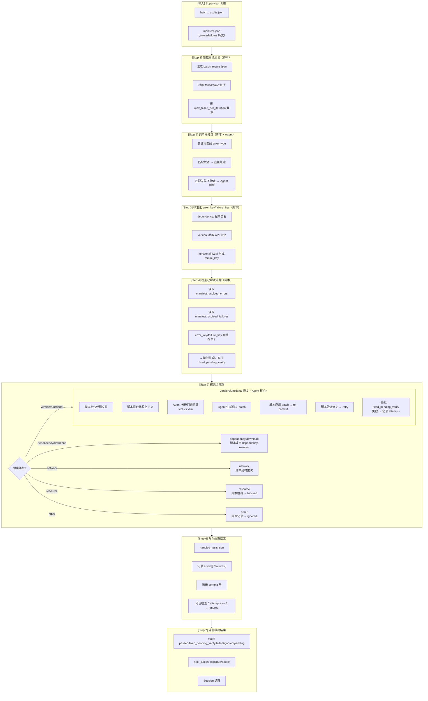

# Failure Handler (Worker Agent v3.0)

> ⚠️ **HARD CONTRACT — read first, before anything else in this file.**
>
> This 5-rule block is the **only** part of the SKILL the runtime treats as
> non-negotiable. If a rule below conflicts with anything later in this file,
> the rule wins.
>
> 1. **Output schema is canonical.** `handled_tests.json` MUST be produced
>    by `skills/ut/failure-handler/scripts/generate_handled_manifest.py` and
>    MUST validate against `skills/ut/failure-handler/handled_tests_schema.json`
>    — the schema is the contract; the script is one (sanctioned) way to
>    satisfy it. Per-test rows MUST use the same `test_node` strings that
>    appear in the upstream `batch_results.json` — those values are the join
>    key the manifest-updater uses; mismatch silently drops the override.
>    Never hand-write `handled_tests.json` to mimic an executor output: it
>    is a *delta* file, not a results file.
> 2. **Read, do not invent.** All inputs (`batch_results.json`,
>    `summary.txt`, remote pytest log) are read-only sources of truth. If
>    `summary.txt` is missing or empty, return `{"next_action":"wait",
>    "reason":"no summary"}` — do NOT classify based on test names alone,
>    and do NOT call the dependency-stall classifier on synthetic input.
> 3. **Only `failed` and `error` are in scope.** `retriable_error` is owned
>    by Stage 2 (batch-selector); `passed` / `skipped` / `pending` /
>    `ignored` are never touched here. Enforced by
>    `analyze_failures.filter_processable()`.
> 4. **Dependency-stall classifier output is schema-validated.** The LLM
>    helper at `skills/ut/failure-handler/scripts/classify_dependency_stall.py`
>    validates against `skills/ut/shared/dependency_stall_schema.json`. On
>    *any* validation failure (malformed JSON, missing field, wrong enum),
>    the classifier returns `verdict="unknown"` — never invent a verdict.
> 5. **Branch safety is mandatory.** Before any `git apply` / `git commit`,
>    call `ensure_on_branch("2.5.1_ut_verify", vllm_repo_path)` from
>    `skills/ut/terminal-workflow/scripts/check_vllm_branch.py`. Skipping this rule
>    is what nukes a fork.

---

## Behavior (v5)

This skill runs as **Stage 4** of the v5 workflow. The contract below
**overrides** any older guidance further down this file when they conflict.

### 1. Inputs that are processed

Failure-handler processes **only** tests whose status in the manifest is
`failed` or `error`. Tests with status `retriable_error` are **never**
touched here — they are owned by Stage 3 (executor) for transient retries,
and by Stage 5 (manifest-updater) for terminal `ignored` promotion. Use
`analyze_failures.filter_processable(tests)` to enforce this; it is also
applied automatically by `analyze_failed_tests_v5()`.

### 2. Pre-flight branch check

Before *any* auto-fix work — patch generation, `git apply`, or `git commit`
— call `ensure_on_branch("2.5.1_ut_verify", vllm_repo_path)` from
`skills/ut/terminal-workflow/scripts/check_vllm_branch.py`. It runs
`git rev-parse --abbrev-ref HEAD` on the remote vLLM repo via the canonical
`run_remote` helper. A mismatch (or non-zero rc) raises `RuntimeError`; the
stage must abort and surface the error to the operator. Auto-fix commits
are **only** valid on `2.5.1_ut_verify`. `analyze_failed_tests_v5()` calls
this on entry.

### 3. Log access

Worker reasoning starts from the per-batch `summary.txt` (concise,
test-keyed). When deeper context is needed (full traceback, OOM banner,
warnings) Worker resolves the test's `last_batch_id`:

```
last_batch_id -> {run_dir}/{last_batch_id}/batch_results.json
                 -> .remote_log.raw_log_path  (path on the remote host)
```

Use `analyze_failures.resolve_remote_log(test, run_dir)` for this lookup.
Read fragments of the remote raw log via the bastion only when summary.txt
is insufficient. Never copy the full raw log into local context.

### 4. Commit policy

- **Branch**: only `2.5.1_ut_verify`. Refuse otherwise (see §2).
- **Message prefix**: every auto-fix commit is `[auto-fix] <body>`. Use
  `apply_patch_remote.build_commit_message(body)` — it is idempotent, so
  passing an already-prefixed body returns it unchanged. The function is
  wired into the existing `git commit -m` call in
  `apply_patch_remote.apply_patch`.
- **Review**: humans review auto-fix commits with
  `git log --grep='\\[auto-fix\\]' 2.5.1_ut_verify`.
- **Completion card**: at run-end the workflow shows
  `git log master..2.5.1_ut_verify` so the operator can audit the full set
  of auto-fixes applied during the run.

### 5. Verification cycle

Per failed/error test:

```
filter_processable -> classify -> generate_patch -> apply_patch_remote
   -> retry on remote
        -> pass    => status: fixed_pending_verify (awaiting human review)
        -> fail    => keep status: failed (next round may try again)
   -> if max_retry exhausted with no fix
        => promoted to ignored by Stage 5 (manifest-updater)
```

`fixed_pending_verify` is the terminal Stage-4 state; the test is *not*
declared green until a human verifies the auto-fix commit on
`2.5.1_ut_verify`.

---

## §X. Dependency-stall classifier (固化 prompt — 不可在调用时改写)

设计来源：[2026-06-23-pytest-timeout-redesign.md](../../tasks/ut/docs/designs/2026-06-23-pytest-timeout-redesign.md) §5。

### 触发条件

batch 在 Stage 3 被 watchdog kill（remote bash watchdog 因 idle/wall-clock 超时
发出 `kill -9` → returncode=124 → `batch_results.json` 标 `error_type="timeout"`）
之后，Stage 4 对每个 `error_type=="timeout"` 的 test 走本分类器。

### 输入

- `log_tail_text`: 远端 `pytest_<batch_id>.log` 末尾约 200 行（通过 `agent.py
  run "tail -200 <path>"` 拉回；上限 ~64KB）

### 输出契约

`skills/ut/shared/dependency_stall_schema.json` (JSON Schema Draft-07)：

```json
{
  "classification": "dep_stall | not_dep_stall | unknown",
  "evidence": "<引用 log 里一行原文作为依据>",
  "dependency_hint": "<具体资源名 (dep_stall 时); null 否则>"
}
```

### 固化 prompt（一字不改地发给 LLM）

```
以下是一个 pytest batch 因 idle/wall-clock timeout 被 kill 后的日志末尾内容。

判断这次 timeout 的真因，分类为以下三者之一：

1. "dep_stall" — 因「依赖资源未就绪」而 hang，典型证据：
   - HuggingFace 模型下载中（"Downloading", "Fetching", URL 含 huggingface.co）
   - pip install 中（"Collecting", "Downloading .whl"）
   - HF cache miss / auth token 等待
   - 任何形式的「正在等待网络资源到位」

2. "not_dep_stall" — 看不到上述迹象，更像是：
   - 测试代码本身 hang / 死锁
   - GPU OOM / CUDA error
   - SSH transport drop（log 末尾正常 PASSED 后无新内容）
   - 其它非依赖资源类的卡死

3. "unknown" — 看不清属于哪类；判不准时优先选这个（保守）。

输出严格 JSON（无 markdown fence、无前后文）：
{
  "classification": "<dep_stall | not_dep_stall | unknown>",
  "evidence": "<引用 log 里一行原文作为依据>",
  "dependency_hint": "<具体资源名，如 'meta-llama/Llama-3.2-1B' 或 'mteb' 包名；非 dep_stall 时为 null>"
}

evidence 必填且必须来自 log；不允许编造或泛述。
```

prompt 字符串维护在 `scripts/classify_dependency_stall.py::PROMPT_TEMPLATE`；
本 §X 与该常量必须**同步**修改。

### 调用契约（Python 侧）

```python
from skills.ut.failure_handler.scripts.classify_dependency_stall import (
    classify, ignored_reason_for, render_prompt, strip_internal_fields,
)

# 1) Worker agent 把 log 末尾喂给 LLM，得到 JSON 字符串
prompt = render_prompt(log_tail_text)
llm_output_str = <agent invokes LLM with prompt>

# 2) 解析 + jsonschema 校验
result = classify(log_tail_text, llm_output_str)
# result ∈ schema; 失败任意一步 → unknown fallback (never raises)

# 3) 装配 final_status / ignored_reason
reason = ignored_reason_for(result)
if reason is None:
    # not_dep_stall → 走 retry 路径（不在本分类器职责内）
    ...
else:
    # dep_stall 或 unknown → final_status="ignored"
    handled_entry["final_status"] = "ignored"
    handled_entry["ignored_reason"] = reason
    handled_entry["resolution"] = {
        "status": "ignored",
        "action": "skip",
        "dependency_classification": strip_internal_fields(result),
    }
```

### 决策表

| classification | final_status | ignored_reason 模板 |
|---|---|---|
| `dep_stall` | `ignored` | `依赖未就绪需人工处理: {dep_hint or evidence}` |
| `unknown` | `ignored` | `分类不明 (LLM 未识别 / schema mismatch); 末尾日志: {evidence}` |
| `not_dep_stall` | `retriable_error`（不变）| — (no ignored_reason, 进 retry) |

unknown → ignored 是**保守**选择：宁可错杀 1 个 retry，不愿浪费 30 min 反复
等同一个 HF 下载卡死的 batch。详见设计文档 §2 D8。

### Fallback 触发条件（→ unknown）

- `llm_output` is `None` / 非 str
- JSON 解析失败
- 不是 object / 缺 `classification` 或 `evidence`
- `classification` 不在 enum
- `evidence` 为空串

均不抛异常，统一走 `_fallback_unknown(log_tail, reason=...)` 路径。`reason`
存到 `_fallback_reason` 字段做调试；`strip_internal_fields()` 在落盘前剥掉
（`_fallback_reason` 不入 handled_tests.json schema）。

### 不进 manifest.json

`resolution.dependency_classification` 只写 `handled_tests.json`，不进
`manifest.json`。manifest 只看 `final_status` + `ignored_reason` 决策。

---

## Worker 角色

```
┌─────────────────────────────────────────────────────────────┐
│  Worker Agent Session (临时，执行后释放)                     │
│                                                             │
│  职责：                                                      │
│  • 分析 batch_results.json 中的 errors 和 failures          │
│  • 脚本优先：规则提取、定位代码、统计聚合                     │
│  • Agent 判断：问题来源分析、修复方案生成                     │
│  • 尝试修复代码（远程容器）→ git commit                       │
│  • 调用 dependency-resolver 处理依赖缺失                    │
│  • 验证修复效果 → fixed_pending_verify                       │
│  • 写入 handled_tests.json                                  │
│  • 返回极简结果给 Supervisor                                │
│                                                             │
│  输入：batch_results.json + manifest.json                    │
│  输出：handled_tests.json + commit 号 + 极简 stats           │
│  Session 结束后：Context 释放                                │
│                                                             │
│  ⚠️ 脚本优先，Agent 判断                                     │
│  ⚠️ 所有修复在远程容器执行                                   │
└─────────────────────────────────────────────────────────────┘
```

---

## 设计原则：脚本优先，Agent 判断

| 层级 | 处理方式 | 适用场景 | 示例 |
|------|----------|----------|------|
| L1 脚本规则 | 关键词匹配、正则提取 | 确定性高 | error_type 分类、error_key/failure_key 标准化 |
| L2 脚本调用 | 调用已有脚本 | 固定流程 | dependency-resolver、重试、GPU检测 |
| L3 脚本定位 | traceback 解析、grep | 可规则提取 | 定位代码文件、提取上下文 |
| L4 脚本统计 | 聚合计算 | 数学运算 | affected_tests、statistics 计算 |
| L5 Agent 判断 | LLM 语义理解 | 需理解上下文 | 判断 test/vllm 问题来源 |
| L6 Agent 生成 | LLM 代码修复 | 需代码理解 | 生成 patch、修复逻辑 |

---

## 流程图



---

## 输入输出

### 输入（从 Supervisor context 获取）

| 字段 | 来源 | 说明 |
|------|------|------|
| `workflow_state_path` | Supervisor context | 状态文件路径 |
| `batch_results_path` | workflow.yaml | 测试结果路径 |
| `manifest_path` | workflow.yaml | manifest.json（errors/failures 历史） |
| `max_failed_per_iteration` | workflow.yaml | 每轮最大处理数（默认 10） |
| `max_retry_per_test` | workflow.yaml | 单测试最大重试次数（默认 3） |

### 输出

| 类型 | 内容 | 说明 |
|------|------|------|
| **文件** | handled_tests.json | 处理结果文件 |
| **manifest** | errors[] / failures[] | 追踪历史（Stage 5 写入） |
| **manifest** | resolved_errors / resolved_failures | 聚合索引（Stage 5 写入） |
| **远程** | git commit | 代码修复（远程容器） |
| **返回** | stats (极简) | 给 Supervisor 的返回值 |

---

## errors vs failures 定义

| 类型 | 含义 | pytest 状态 | error_type/failure_type |
|------|------|-------------|-------------------------|
| **Error** | 测试无法执行 | ERROR | dependency/version/download_error/network/resource |
| **Failure** | 断言失败 | FAILED | assertion（原 functional） |

---

## errors[] 结构

```json
{
  "test_node": "tests/test_load.py::test_llama",
  "errors": [
    {
      "error_key": "transformers",
      "error_type": "dependency",
      "error_message": "ModuleNotFoundError: No module named 'transformers'",
      "status": "resolved",
      "occurred_at": "2026-06-12T14:00:00Z",
      "resolved_at": "2026-06-12T15:00:00Z"
    }
  ]
}
```

---

## failures[] 结构

```json
{
  "test_node": "tests/test_load.py::test_llama",
  "failures": [
    {
      "failure_key": "test_load:shape_mismatch",
      "failure_type": "assertion",
      "failure_message": "AssertionError: expected shape (1, 10) got (1, 5)",
      "status": "resolved",
      "commit": "a1b2c3d",
      "occurred_at": "2026-06-12T15:30:00Z",
      "resolved_at": "2026-06-12T16:00:00Z"
    }
  ]
}
```

---

## error_key 标准化规则（脚本）

| error_type | error_key 格式 | 提取方式 | 示例 |
|------------|----------------|----------|------|
| dependency | `{package}` | 正则提取 | `transformers` |
| download_error | `{org}/{model}` | 正则提取 | `meta-llama/Llama-3.2-1B` |
| version | `{module}.{function}.{change}` | 正则提取 | `torch.softmax.dim_arg` |
| network | `{host}:{error}` | 正则提取 | `huggingface.co:timeout` |
| resource | `{resource_type}` | 关键词匹配 | `cuda_oom` |

---

## failure_key 标准化规则（Agent + 校验）

| failure_type | failure_key 格式 | 生成方式 | 示例 |
|--------------|------------------|----------|------|
| assertion | `{test_file}:{bug_type}` | Agent LLM + 格式校验 | `test_load:shape_mismatch` |

**Agent prompt 示例：**
```
分析这个断言失败，生成 failure_key。
格式要求：{test_file}:{bug_type}
- test_file: 测试文件名（不含路径）
- bug_type: 简短描述（snake_case）

示例：
- test_load:missing_import
- test_inference:wrong_output_shape

当前错误：
{failure_message}

请生成 failure_key：
```

---

## 执行流程

### Step 1: 加载失败测试（脚本）

```python
import json
from pathlib import Path

# 从 manifest 读取路径配置（单一数据源）
manifest_path = paths["manifest"]
manifest = json.loads(Path(manifest_path).read_text())

batch_results_path = paths["batch_results"]
batch_results = json.loads(Path(batch_results_path).read_text())

# 提取 failed/error 测试
failed_tests = [t for t in batch_results["tests"] if t["status"] in ["failed", "error"]]

# 超时控制：按阈值截取（D6）
max_per_iteration = config.get("max_failed_per_iteration", 10)
failed_tests = failed_tests[:max_per_iteration]
```

### Step 2: 两阶段分类（脚本 + Agent）

```python
def classify_error_two_stage(error_message):
    """D1: 两阶段分类"""
    
    # Step 1: 关键词匹配（脚本）
    keywords_map = {
        "dependency": ["ModuleNotFoundError", "ImportError"],
        "download_error": ["Failed to download", "Model not found"],
        "network": ["timeout", "ConnectionError"],
        "resource": ["CUDA out of memory", "OOM", "NCCL"],
        "version": ["TypeError", "AttributeError"],
    }
    
    for error_type, keywords in keywords_map.items():
        if any(kw in error_message for kw in keywords):
            return {"error_type": error_type, "method": "script"}
    
    # Step 2: Agent 判断（不确定时）
    return {
        "error_type": agent_classify(error_message),
        "method": "agent"
    }
```

### Step 3: 标准化 error_key/failure_key（脚本）

```python
def normalize_error_key(error_type, error_message):
    """脚本规则提取"""
    
    if error_type == "dependency":
        match = re.search(r"No module named '(\w+)'", error_message)
        return match.group(1).lower() if match else None
    
    if error_type == "download_error":
        match = re.search(r"download ([\w\-]+/[\w\-\.]+)", error_message)
        return match.group(1) if match else None
    
    if error_type == "version":
        return extract_api_change_key(error_message)
    
    if error_type == "network":
        match = re.search(r"(?:timeout|connection).*?(\w+\.\w+)", error_message)
        return match.group(1).lower() if match else "network_unknown"
    
    if error_type == "resource":
        if "CUDA out of memory" in error_message:
            return "cuda_oom"
        if "NCCL" in error_message:
            return "nccl_error"
        return "resource_unknown"

def normalize_failure_key(failure_message, test_file, manifest):
    """Agent 生成 + 格式校验 + 历史匹配"""
    
    # Agent 生成
    proposed_key = agent_generate_failure_key(failure_message, test_file)
    
    # 格式校验
    if not re.match(r^\w+:\w+$", proposed_key):
        proposed_key = f"{test_file}:unknown"
    
    # 历史匹配（避免重复）
    existing_keys = set()
    for t in manifest["tests"]:
        for f in t.get("failures", []):
            existing_keys.add(f.get("failure_key"))
    
    # 模糊匹配
    for existing in existing_keys:
        if similar(proposed_key, existing):
            return existing  # 使用已有标准 key
    
    return proposed_key
```

### Step 4: 检查已解决问题（脚本）

```python
# 从 manifest 读取缓存（单一数据源）
resolved_errors = manifest.get("resolved_errors", {})
resolved_failures = manifest.get("resolved_failures", {})

# 检查是否已解决
if error_key in resolved_errors:
    # 跳过处理，直接标记
    test["final_status"] = "fixed_pending_verify"
    test["skip_reason"] = f"error_key {error_key} already resolved"
    continue

if failure_key in resolved_failures:
    # 跳过处理，直接标记
    test["final_status"] = "fixed_pending_verify"
    test["skip_reason"] = f"failure_key {failure_key} already resolved"
    continue
```

### Step 5: 按类型处理

#### dependency/download_error（脚本调用子 skill）

```python
if error_type in ["dependency", "download_error"]:
    result = call_dependency_resolver(error_key)
    
    if result["status"] == "resolved":
        retry_result = retry_test(test["test_node"])
        test["final_status"] = retry_result["status"]
    else:
        test["final_status"] = "ignored"
        test["ignored_reason"] = f"{error_type} failed: {result['reason']}"
```

#### network（脚本延时重试）

```python
if error_type == "network":
    for delay in [5, 10, 20]:
        sleep(delay)
        retry_result = retry_test(test["test_node"])
        if retry_result["status"] == "passed":
            test["final_status"] = "passed"
            break
    
    if retry_result["status"] != "passed":
        test["final_status"] = "ignored"
        test["ignored_reason"] = "network timeout after 3 retries"
```

#### resource（脚本检测 → 汇报）

```python
if error_type == "resource":
    test["final_status"] = "pending"
    return {
        "next_action": "wait",
        "blocked_reason": f"resource: {error_key}"
    }
```

#### version/functional 修复（Agent 核心）

```python
if error_type in ["version", "functional"]:
    # L3: 脚本定位代码
    traceback_info = parse_traceback(error_message)
    code_location = locate_code_from_traceback(traceback_info)
    
    # L3: 脚本提取上下文
    code_context = read_remote_file(code_location)
    
    # L5: Agent 判断问题来源
    analysis = agent_analyze_problem(error_message, code_context)
    # { "problem_source": "vllm", "fix_description": "...", "fix_patch": "..." }
    
    # L4: 脚本检查阈值（retry_count）
    retry_count = test.get("retry_count", 0)
    max_retry = config.get("max_retry_per_test", 3)
    
    if retry_count >= max_retry:
        test["final_status"] = "ignored"
        test["ignored_reason"] = f"max retry ({max_retry}) exceeded"
        continue
    
    # L6: Agent 生成修复
    fix_patch = analysis.get("fix_patch")
    
    # 脚本应用修复 → git commit
    commit_sha = apply_patch_and_commit(fix_patch, code_location)
    
    # 脚本验证
    retry_result = retry_test(test["test_node"])
    
    # 更新 retry_count
    test["retry_count"] = retry_count + 1
    
    if retry_result["status"] == "passed":
        test["final_status"] = "fixed_pending_verify"
        test["commit"] = commit_sha
    else:
        test["final_status"] = "failed"
        test["fix_reason"] = "retry failed after patch"
```

#### other（脚本记录）

```python
if error_type == "other":
    test["final_status"] = "ignored"
    test["ignored_reason"] = f"other error: {error_message[:200]}"
```

### Step 6: 写入处理结果

```python
handled_tests = {
    "batch_id": batch_id,
    "processed_at": datetime.now().isoformat(),
    "tests": failed_tests,
    "stats": {
        "passed": len([t for t in failed_tests if t["final_status"] == "passed"]),
        "fixed_pending_verify": len([t for t in failed_tests if t["final_status"] == "fixed_pending_verify"]),
        "failed": len([t for t in failed_tests if t["final_status"] == "failed"]),
        "ignored": len([t for t in failed_tests if t["final_status"] == "ignored"]),
        "pending": len([t for t in failed_tests if t["final_status"] == "pending"])
    }
}

Path(handled_tests_path).write_text(json.dumps(handled_tests, indent=2))
```

### Step 7: 返回极简结果

```python
return {
    "stats": handled_tests["stats"],
    "next_action": "continue",
    "error": None,
    "blocked_reason": None
}
```

---

## 返回格式规范（统一）

```json
{
  "stats": {
    "passed": 3,
    "fixed_pending_verify": 2,
    "failed": 1,
    "ignored": 1,
    "pending": 0
  },
  "next_action": "continue",
  "error": null,
  "blocked_reason": null
}
```

---

## 前后 Stage 影响

### 对上游 Stage 的影响

| Stage | 影响 | 说明 |
|-------|------|------|
| **batch-selector (Stage 2)** | 需选择 fixed_pending_verify | D2: 验证批次优先 |

**batch-selector 新增逻辑：**
```python
# 选择 pending + fixed_pending_verify
pending_tests = [t for t in manifest["tests"] if t["status"] == "pending"]
fixed_pending = [t for t in manifest["tests"] if t["status"] == "fixed_pending_verify"]

# 优先级：fixed_pending > pending > failed
batch_tests.extend(fixed_pending[:batch_size])
if len(batch_tests) < batch_size:
    batch_tests.extend(pending_slots)
```

### 对下游 Stage 的影响

| Stage | 影响 | 说明 |
|-------|------|------|
| **manifest-updater (Stage 5)** | 需更新 errors[]/failures[] | D9: 追踪历史 |
| **manifest-updater (Stage 5)** | 需更新 resolved_errors/resolved_failures | D9: 聚合索引 |

**manifest-updater 新增逻辑：**
```python
# 更新 errors[] 状态
for error in handled_test.get("errors", []):
    if error.get("status") == "resolved":
        error["resolved_at"] = datetime.now().isoformat()

# 更新 failures[] 状态 + commit
for failure in handled_test.get("failures", []):
    if failure.get("status") == "resolved":
        failure["resolved_at"] = datetime.now().isoformat()
        failure["commit"] = handled_test.get("commit")

# 更新 resolved_errors/resolved_failures
if handled_test.get("error_key") and handled_test["final_status"] == "fixed_pending_verify":
    manifest["resolved_errors"][handled_test["error_key"]] = {
        "type": handled_test["error_type"],
        "resolved_at": datetime.now().isoformat()
    }

if handled_test.get("failure_key") and handled_test["final_status"] == "fixed_pending_verify":
    manifest["resolved_failures"][handled_test["failure_key"]] = {
        "type": "assertion",
        "resolved_at": datetime.now().isoformat(),
        "commit": handled_test.get("commit")
    }
```

### 状态流转（D2）

```
pending → running → passed (正常流程)
                 → failed → fixed_pending_verify → passed (修复成功)
                                        → failed (验证失败)
                 → error → resolved → fixed_pending_verify → passed
                 → ignored (跳过)
```

---

## 超时控制（D6）

```yaml
# workflow.yaml
stages:
  handle_failures:
    timeout: 900
    max_failed_per_iteration: 10  # 每轮最多处理 10 个失败测试
    max_retry_per_test: 3         # 单测试最多重试 3 次
```

**剩余失败测试：**
- 保持 failed 状态
- 下一轮 batch-selector 自动选择（包含 failed 状态）
- 最多处理 max_failed_per_iteration 个失败测试
- 剩余 failed 状态测试将在后续轮次依次处理

---

## 注意事项

1. **脚本优先**：确定性处理用脚本，Agent 只处理需要理解的场景
2. **manifest-centric**：所有数据从 manifest 读取，无额外依赖
3. **fixed_pending_verify**：修复后需下一轮批量验证
4. **阈值保护**：max_retry_per_test 防止无限重试
5. **超时截取**：max_failed_per_iteration 分批处理
6. **commit 记录**：修复成功记录 commit 号
7. **极简返回**：只返回 stats，详细信息写文件

---

## 禁止操作（硬契约 — 违反即视为污染数据，supervisor 会 invalidate run）

### 数据完整性禁令（不可越权）

- 🚫 **绝对禁止 fabrication**：`handled_tests.json` 的每一条 classification、`final_status`、`fix_applied`、`error_message`、`log_path` **必须**直接来自上游 `batch_results.json` + 真实远程修复尝试的输出；
  - 禁止：基于"单句错误摘要"凭印象给出 `failure_category: resource-insufficient / network / version / functional` —— 必须有 NCCL_DEBUG=INFO、`nvidia-smi`、远端 log 文件等实证；
  - 禁止：在没看到完整 batch_results.json + 远端 log 时就 `needs_user_decision: true` 触发 supervisor pause；
  - 禁止：`fix_applied: true` 但 `fix_details: null` —— 要么真改过远端代码并附 diff/patch，要么报 false。
- 🚫 **绝对禁止越权发送 Feishu / Lark / 任何外部通知**：
  - 禁止：写 Python 脚本调用 `open.feishu.cn`、`api.lark.com`、`webhook` 等 IM API；
  - 禁止：用 `requests.post` / `curl` 向 Feishu/Lark/Slack/钉钉 发任何消息；
  - 禁止：跨 profile 读取 `~/.claude/...` / `~/.hermes/profiles/<other>/...` 下的 token；
  - 唯一允许的通知路径：**返回 stats + decisions_needed 给 supervisor**，supervisor 通过 Hermes 标准投递层发出。
- 🚫 **绝对禁止修改 `manifest.json`**：那是 Stage 5（manifest-updater）的职责，fixer 只产 `handled_tests.json`。
- 🚫 **绝对禁止删除/重命名上游产物**：`batch_results.json`、`batch_config.json`、`manifest.json`、`test_list.txt`、`workflow_state.json` —— 都不要碰。
- 🚫 **绝对禁止信任上游 batch_results 而不做完整性 sanity check**：fixer 在读 `batch_results.json` 时**至少**检查 `log_path` 字段是绝对路径且非空，记录"未验证"标记，不要把可疑数据继续往下游传。

### 行为禁令

- ❌ 不用 LLM 处理确定性任务（规则提取、统计等）
- ❌ 不在 workflow_state 存储协调数据（只用 manifest）
- ❌ 不本地修复代码（所有修复在远程容器）
- ❌ 不直接 ignored version/functional（先尝试修复）
- ❌ 不返回详细修复过程（只返回 stats）
- ❌ 不"尝试 recover Bastion daemon" —— daemon 由 supervisor 通过 OTP 管，worker 看到 daemon 死了就 `next_action=wait` 直接返回
- ❌ 不写 `D:/workspace/apmm/scripts/*.py`、`tools/*.py` 等仓库根目录脚本（fixer 工作目录是当前 run_dir）

### 历史教训（不要重蹈）

| 日期 | 越权行为 | 后果 |
|---|---|---|
| 2026-06-22 | 某 fixer 在 stage-4 接到上游 fabricated 的 batch_results.json（log_path 指向不存在的远端 log），没做任何完整性 sanity check 就盲信，把 NCCL 一句话错误归类为 `resource-insufficient`、`pause_batch`、`needs_user_decision: true`，触发 supervisor 误判 GPU 资源问题暂停整个 run；同期还有 worker 手写 `scripts/send_feishu_report.py` 直接发"完成报告"到 ai-engineer 群 | run `ut-20260621-234651` 被 supervisor invalidated；写入这条约束 |

---

## 相关文档

- [Implementation Analysis](../../tasks/ut/docs/designs/2026-06-12-failure-handler-review-analysis.md) — 10 决策详细分析
- [Design Doc](../../tasks/ut/docs/designs/2026-06-12-failure-handler-review-design.md) — 设计决策汇总
- [workflow.yaml](../../.agents/workflow.yaml) — Workflow 配置
- [workflow/SKILL.md](../workflow/SKILL.md) — Supervisor 调度逻辑
- [batch-selector/SKILL.md](../batch-selector/SKILL.md) — 上游 Stage（需选择 fixed_pending_verify）
- [manifest-updater/SKILL.md](../manifest-updater/SKILL.md) — 下游 Stage（需更新 errors/failures）
- [dependency-resolver/SKILL.md](../dependency-resolver/SKILL.md) — 子 skill

---

*创建日期: 2026-06-09*
*更新日期: 2026-06-13*
*版本: 3.0.0*