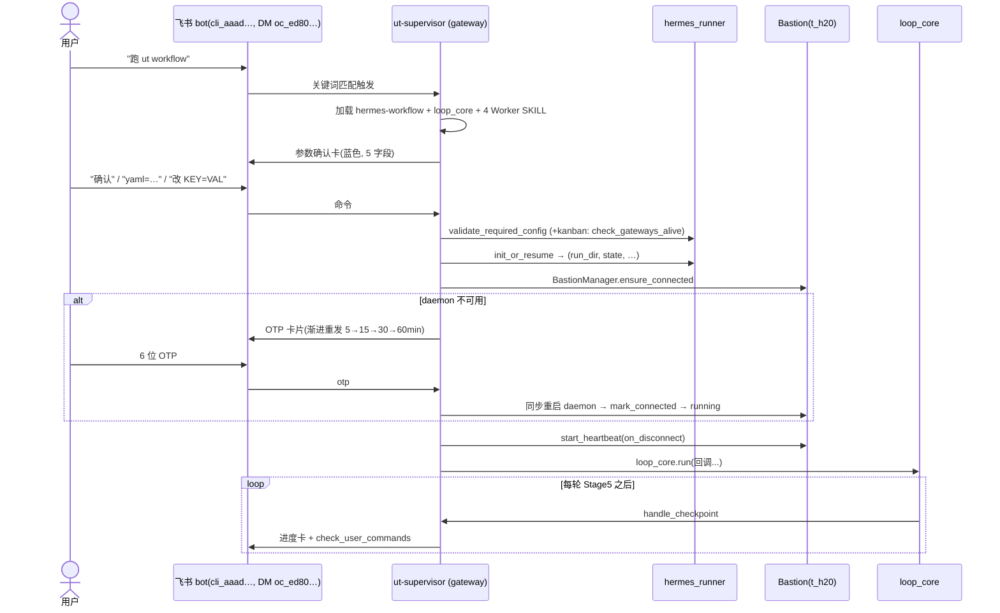
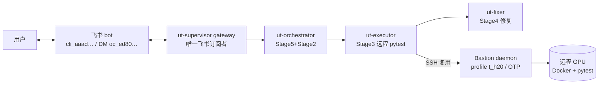

# hermes-workflow (v5)

> ⚠️ **HARD CONTRACT — read first, before anything else in this file.**
>
> This 5-rule block is the **only** part of the SKILL the runtime treats as
> non-negotiable. If a rule below conflicts with anything later in this file,
> the rule wins.
>
> 1. **Output schemas are canonical for every Stage.** Stage 3 produces
>    `batch_results.json` via `execute_batch.py` (schema:
>    `skills/ut/unit-test-executor/batch_results_schema.json`). Stage 4
>    produces `handled_tests.json` via `generate_handled_manifest.py`.
>    Stage 5 mutates `manifest.json` via `update_status.py`. Each stage
>    REJECTS hand-rolled payloads through strict jsonschema validation +
>    (Stage 5 only) remote `stat` audit.
> 2. **State machine values are fixed.** `workflow.status ∈ {running,
>    paused, waiting_otp, completed, stopped, failed}`. Do NOT invent new
>    states ("done", "succeeded", "killed", ...). Transitions are the only
>    way to mutate status — direct writes to `workflow_state.json` are
>    forbidden.
> 3. **Bastion is single-tenant.** Only `BastionManager` owns the daemon
>    lifecycle. On `ConnectionError`, the active stage MUST return
>    `{"next_action": "wait", "reason": ...}` and let the supervisor's
>    reconnect loop handle it. Do NOT spawn ad-hoc `agent.py login` or
>    daemon restarts from inside a stage.
> 4. **Stages run via the canonical scripts, period.** No inline pytest
>    invocation, no hand-rolled remote ssh, no LLM-fabricated stage output.
>    If a script fails, fail loud (write the error into the run log) — do
>    NOT synthesize a plausible Stage output to keep the loop moving.
> 5. **All durable timestamps are UTC ISO 8601 with Z suffix.** Pattern:
>    `^[0-9]{4}-[0-9]{2}-[0-9]{2}T[0-9]{2}:[0-9]{2}:[0-9]{2}Z$`. Local times
>    leak into runs/ paths and break catch-up logic — use
>    `datetime.utcnow().strftime("%Y-%m-%dT%H:%M:%SZ")`.

## Stage 0: 环境选择（新增）

当用户通过飞书发起"单元测试"或"/ut start"时：

**环境选择流程：**

```
1. 用户飞书触发 → ut-supervisor Agent 收到
2. AI解析意图，识别为UT workflow触发
3. 飞书回复提示用户选择环境：
   ```
   请选择运行环境：
   - 测试环境（l1~l4）— 快速验证
   - 生产环境 — 全量测试
   请回复："测试环境l1" 或 "生产环境"
   ```
4. 等待用户飞书回复确认环境
5. 根据回复调用load_deployment_config：
   - 飞书回复："生产环境" → load_deployment_config("production")
     → 从 tasks/ut/deployment/production/config/workflow.yaml 加载
   - 飞书回复："测试环境l2" → load_deployment_config("test", level=2)
     → 从 tests/ut/integration/fixtures/workflow.l2.yaml 加载
6. 复制模板到 runs/ut-{timestamp}/workflow.yaml（运行副本）
7. 后续流程同terminal触发（引导参数确认 → 创建run目录）
```

**配置路径：**
- Production: `tasks/ut/deployment/production/config/workflow.yaml`
- Test: `tests/ut/integration/fixtures/workflow.l{level}.yaml`
- Runtime: `runs/ut-{timestamp}/workflow.yaml`

**关键约束：**
- 飞书交互必须等待回复（异步消息处理）
- 环境选择通过飞书消息传递
- 与terminal触发使用相同的load_deployment_config逻辑

**相关文档：**
- tasks/ut/docs/designs/2026-06-29-ut-workflow-config-management-and-merge-batch-design.md

> Hermes-channel supervisor for the dual-channel UT workflow.
> Spec: `tasks/ut/docs/designs/2026-06-18-hermes-workflow-dual-channel-design.md`

This skill is the **生产运行通道 (production channel)** counterpart of
`ut/workflow`. Both drive the same `workflow-loop-core`; this skill supplies
the Hermes-specific callbacks: Feishu 双向消息, automatic Bastion recovery,
and the full workflow state machine.

The loop body lives in `workflow-loop-core` — this skill does **not**
re-implement stage cadence. It implements the channel-difference layer.

> 两个通道的对照、触发与**环境搭建步骤**（飞书 bot / bastion / 4 gateway）见
> `tasks/ut/docs/guides/ut-channels-overview.md`。

## Trigger flow + environment topology





---

## 1. Channel & role / 通道与职责

- **Runs in** the `ut-supervisor` profile as a long-running Hermes **Agent**
  (`systemctl status hermes-agent@ut-supervisor`). It is the **only** Feishu
  subscriber in the system — the 3 Kanban Gateways do not subscribe.
- **Feishu 双向 (bidirectional):** subscribes to the `apmm-ut` group for user
  commands + OTP codes, and posts progress / OTP / completion cards.
- **Bastion 自动管理:** owns one Bastion daemon connection, heartbeat-monitored,
  recovered via Feishu OTP. All Workers (linear or Kanban) reuse this daemon.
- **Owns the full state machine** (§8): running / paused / waiting_otp /
  completed / stopped / failed, plus `pending_config`.

Difference from `ut/terminal-workflow` (terminal channel): that channel has no state
machine, no paused/waiting_otp, and Bastion is human-maintained.

---

## 2. Tooling — `hermes_runner.py`

Import the runner as a tool module (it no longer inlines stage logic):

```python
from hermes_runner import (
    parse_command,           # text → Command or None (Layer 1 regex)
    classify_intent_llm,     # text → Command (Layer 2 LLM, with llm_invoker)
    Command,                 # dataclass: intent / confidence / args / source / raw_text
    init_or_resume,          # (run_dir, state_path, state, iteration)
    validate_required_config,# (ok, missing_keys)
    check_gateways_alive,    # {profile: bool}  (kanban preflight + per-round)
    get_execute_config,      # flat config for execute_batch
    apply_pending_config,    # merge pending_config → config on resume
    refresh_manifest_stats,  # tally manifest statuses into state
    check_stop_conditions,   # (done, reason, status)
    orchestrator_round,      # kanban Stage5+Stage2 (used by ut-orchestrator)
    send_feishu_card,        # progress / complete / alert / paused card
)
from bastion_manager import (
    BastionManager,
    otp_resend_delay,        # attempt → minutes before next OTP resend
    otp_should_at_user,      # attempt → whether to @ the user
)
```

`BastionManager` methods used by this channel: `ensure_connected`,
`start_heartbeat`, `stop_heartbeat`, `mark_disconnected`, `mark_connected`,
`request_otp`.

> Bastion bring-up is encapsulated by the runner's setup path (it constructs
> the `BastionManager`, sets the heartbeat interval, then calls
> `ensure_connected`). Reference the *behaviour* below; do not assume a
> separate `ensure_bastion()` top-level function exists.

---

## 3. Startup sequence (§14.2)

The supervisor distinguishes **two trigger paths** depending on what
`parse_command(text)` + `classify_intent_llm(text)` (`hermes_runner` Layer 1 +
Layer 2) classify the trigger message as. See the spec §4 for the two-layer
intent recognizer.

```
1. 用户飞书发任意消息 → ut-supervisor Agent 收到
2. 意图识别（hermes_runner Layer 1 → Layer 2）
     a) Layer 1: parse_command(text) → otp/stop/pause/resume/change_config
        命中 → 直接派发到状态机（§5 命令矩阵），不进启动流程
     b) Layer 1 miss → Layer 2: classify_intent_llm(text) → Command
        intent ∈ {start_l1..l4, start_production} → 进入【启动确认分支】(§3.A)
        intent == change_config → 派发到状态机
        intent == unknown → 飞书发帮助卡，列出合法触发词（结束）
        legacy 关键词 "跑 ut workflow" / "启动测试" / "开始 UT" 在 v5 走 Layer 2：
        - **无 tier 后缀**（裸短语）→ 预期分类为 `unknown` → §3.D 帮助卡
        - 带 tier 后缀（"跑 L4"）或 "正式 / 生产 / 全量" 字眼 → 按 §3.A 走
        （这是 v5 的保守门：避免误触发数小时生产 run；v4 直接进 §3.B 的旧行为已废弃）
3. 一次性加载：hermes-workflow + workflow-loop-core
              + 4 份 Worker SKILL（batch-selector / unit-test-executor /
                failure-handler / manifest-updater）
4. 按 §3.A（tier / production 一键触发）或 §3.B（自由参数确认卡）继续
```

### §3.A — Tier / production 启动确认分支（v5 新增）

`classify_intent_llm` 输出 `start_l1` / `start_l2` / `start_l3` / `start_l4` /
`start_production` 时走此路径。yaml 路径已由 tier 决定，**不再展示自由参数卡**。

```
A1. 查 tier → yaml 固化映射表（§3.C），得到 (yaml_path, mode, eta)
A2. 飞书发【启动意图确认卡】(send_confirmation_card)
      - intent / tier_label / yaml_path / test_list_path / mode / eta
      - tier (start_l1..l4)         → 蓝色 (template=blue)
      - production (start_production) → 橙色 + ⚠️ "这是生产全量运行" 警告
      - 卡片提示 "10s 内回复 确认 / 取消，否则自动取消"
A3. 等用户回复（默认 10s，配置 confirmation_timeout_seconds）
      - "确认" → 进 A4
      - "取消" / 超时 → drop（红色"已取消"卡）→ 等下条触发消息，回到第 2 步
A4. validate_required_config(load_yaml(yaml_path))
      - test_list_path 或 manifest_source 至少一个
      - config.remote_server 存在
      - kanban.enabled=true 时额外：check_gateways_alive() 三个 Gateway 全 active
      - 任一缺失 → 飞书红色错误卡片 → failed → 退出
A5. init_or_resume(yaml_path, resume_from=None)
      → (run_dir, state_path, state, iteration)
A6. Bastion bring-up + start_heartbeat（同 §3.B 的 8/9 步）
A7. 进入主循环 loop_core.run(...)
```

**启动期间状态机互锁**（spec §4.6 边界情况）：

| 当前 supervisor 状态 | 收到 start_* 意图 | 处理 |
|---|---|---|
| idle（无 run 在跑） | 任意 | 进 A1 |
| running / paused / waiting_otp | 任意 | 红色卡 "已有 run 在跑（status=X），请先 结束 或 暂停" |

### §3.B — Legacy 自由参数确认卡分支（v4 行为，向后兼容）

仅当 Layer 2 返回 `unknown` 但用户用了 v4 的关键词（"跑 ut workflow" / "启动测试"）
触发时走此路径。**v5 默认走 §3.A** — 这条留作回退。

```
B1. 飞书发【参数确认卡片】（蓝色），展示 5 字段：
      test_list_path, batch_size, manifest_source, kanban.enabled, resume_from
    选项："确认" / "yaml=PATH" / "resume=RUN_DIR" / "改 KEY=VALUE" / "取消"
B2. 等待用户回复（5 分钟超时 → 退出）
B3. "确认" → validate_required_config(cfg)（同 §3.A A4）
B4. init_or_resume(workflow_yaml, resume_from)
B5. Bastion bring-up（BastionManager + ensure_connected）
      daemon 不可用 → 进入 waiting_otp，按 §7 渐进重发节奏发 OTP 卡片
B6. bastion.start_heartbeat(on_disconnect=...)
      心跳检测断联只调 mark_disconnected() 上报，不直接弹卡片 / 不切状态
B7. 进入主循环 loop_core.run(stage_skills, 回调...)
```

### §3.C — Tier → yaml 固化映射表

```yaml
# 来源：tasks/ut/docs/designs/2026-06-22-ut-tier-fixtures-and-agent-intent-design.md §2.2
start_l1:
  yaml: tests/ut/integration/fixtures/workflow.l1.yaml
  test_list: tests/ut/integration/fixtures/l1_smoke_list.txt
  mode: linear           # kanban.enabled=false
  eta: "< 1 min"
start_l2:
  yaml: tests/ut/integration/fixtures/workflow.l2.yaml
  test_list: tests/ut/integration/fixtures/mini_test_list.txt
  mode: linear
  eta: "~ 3 min"
start_l3:
  yaml: tests/ut/integration/fixtures/workflow.l3.yaml
  test_list: tests/ut/integration/fixtures/l3_fast_subset.txt
  mode: linear
  eta: "~ 15 min"
start_l4:
  yaml: tests/ut/integration/fixtures/workflow.l4.yaml
  test_list: tests/ut/integration/fixtures/l4_test_list_v2.txt
  mode: kanban
  eta: "~ 60 min"
start_production:
  yaml: tasks/ut/deployment/production/config/workflow.yaml
  test_list: (由 yaml 自定义)
  mode: kanban           # 生产默认 kanban
  eta: "hours – days"
```

`mode` / `eta` 仅用于卡片展示；真正生效的是 yaml 内的 `kanban.enabled`。

### §3.D — 帮助卡（intent=unknown 时回显）

`classify_intent_llm` 返回 `intent=unknown`（含裸 "跑 ut workflow" 这种保守门
拦截）时，supervisor 发一张帮助卡列合法触发词，结束本轮（不进任何状态机）。

```markdown
🤔 没看懂你想触发哪个 run。合法触发词：

▸ tier 测试（蓝色卡）：
    "跑 L1" / "跑 L2" / "跑 L3" / "跑 L4"
    "L4 走起" / "跑 ut workflow 的 l4 测试"

▸ 正式生产（橙色 + 警告卡）：
    "正式开跑" / "跑全量" / "跑正式生产"

▸ 改配置：
    "改 batch_size 为 10" / "把 max_retry 改成 5"

▸ 控制命令：
    "暂停" / "继续" / "停止"

裸 "跑 ut workflow" 不再自动派发（避免误触发生产）—— 请补 tier 后缀
或写明 "正式 / 生产 / 全量"。
```

卡片模板 `template=grey`，不要求回复；用户重新发合法短语即重新进 Layer 2。

Required-config validation maps directly to `validate_required_config`
(input_filter + remote_server) plus, in Kanban mode, a `check_gateways_alive`
gate that all 3 Gateways report `True`.

---

## 4. Channel callbacks (wired into `loop_core.run`)

`workflow-loop-core` exposes `loop_core.run(stage_skills, handle_checkpoint,
handle_bastion_disconnect, check_user_commands, check_terminal_conditions)`.
This channel supplies:

### `handle_checkpoint(state, manifest)`

Called after every successful Stage 5 (and each Kanban poll round):

1. `refresh_manifest_stats(state_path, manifest_path)` → tally into state.
2. Post a progress card via `send_feishu_card(feishu, "progress", manifest, iteration, ...)`.
3. Drain + process user commands (see `check_user_commands`).

### `handle_bastion_disconnect(reason)`

Called when an executor returns `next_action == "wait"` (Bastion loss):

1. Transition state → `waiting_otp`.
2. Progressive OTP resend per §7, using `otp_resend_delay(attempt)` for the
   delay and `otp_should_at_user(attempt)` to decide whether to @ the user;
   issue the request via `bastion.request_otp(...)`.
3. Wait for either a valid OTP (→ synchronous daemon restart →
   `mark_connected()` → `running`) or "结束" (→ `stopped`).

### `check_user_commands()`

Reads the Feishu group and runs the two-layer intent recognizer on every
new message:

1. **Layer 1** (regex): `parse_command(text)` → returns a `Command` if the
   message matches one of 6 anchored regex patterns (`otp`/`otp_with_id`/
   `stop`/`pause`/`resume`/`change_config`). If matched, dispatch directly
   to the state machine matrix (§8.2).
2. **Layer 2** (Agent's own LLM): if Layer 1 returns `None`, the ut-supervisor
   Agent itself reads SOUL.md §Intent classification and produces a JSON
   string per that schema. Pass it to `classify_intent_llm(text, llm_output)`
   which parses & validates the JSON into a `Command` with `source="llm"`
   and `intent` ∈ `{start_l1..l4, start_production, change_config, unknown}`.
   - `start_*` / `change_config`: queue for the startup-sequence hook
     (§3 step 2 — only processed in idle state).
   - `unknown`: the supervisor may post a brief "help" card listing
     trigger words.

There is **no external LLM invoker** — the Agent's reasoning IS the LLM.
`classify_intent_llm` is purely a parser/validator over the JSON the Agent
already produced.

(Linear `ut/terminal-workflow` returns `[]` here; this channel actually reads Feishu.)

### `check_terminal_conditions(state, manifest)`

Backed by `check_stop_conditions(state_path)` → `(done, reason, status)` with
status ∈ {`completed`, `stopped`, `failed`}.

---

## 5. State machine (§8)

States: **running / paused / waiting_otp / completed / stopped / failed**.
`reconnecting` was removed — after an OTP arrives the daemon restart completes
**synchronously inside `waiting_otp`**.

### Command matrix (§8.2)

| 当前状态 | "暂停" | "继续" | "结束" | "改参数 N" | OTP code |
|---|:---:|:---:|:---:|:---:|:---:|
| **running** | → paused | 忽略 | → stopped | → paused (存 pending_config) | 忽略 |
| **paused** | 忽略 | → running (apply pending_config) | → stopped | 更新 pending_config | 忽略 |
| **waiting_otp** | 忽略 | 忽略 | → stopped | 忽略 | 同步重启 daemon → 成功 running / 失败 维持 waiting_otp |
| **stopped / completed / failed** | 忽略 | 忽略 | 忽略 | 忽略 | 忽略 |

Non-command messages: the Agent may reply but state does **not** change.

### Command priority (§8.3)

`stop > pause > change_config > resume`

### Command timing (§8.4)

Commands are checked **once per round, after Stage 5, before the progress
card**. Remote pytest cannot be paused mid-run, so the channel waits for the
current batch to finish before acting.

### daemon restart failure (§8.5)

OTP received but daemon restart fails → **stay in `waiting_otp`** and rewrite
the card to "daemon 重启连续失败 N 次，请人工介入". There is **no** "3 failures
→ failed" path. Exiting `waiting_otp` only happens via a successful restart or
a "结束" command.

### Terminal states (§8.1)

| 终态 | 触发 |
|---|---|
| `completed` | `pending_count == 0` |
| `stopped` | 用户 "结束" / "终止" |
| `failed` | only startup-time validation/config errors |

---

## 6. Linear vs Kanban loop (§14.3)

### Linear mode (`kanban.enabled: false`)

ut-supervisor **directly drives Stage 2–5** through the v5 Worker SKILLs
(batch-selector → unit-test-executor → failure-handler → manifest-updater),
using `get_execute_config(state_path)` to feed `execute_batch`. The 3 Kanban
Gateways are not started and play no part. Bastion-loss handling and command
checking run as described in §4–§5.

### Kanban mode (`kanban.enabled: true`)

ut-supervisor **never touches the manifest** — Workers and the orchestrator
own it (the `ut-orchestrator` Worker subprocess runs Stage 5 then Stage 2 via
`orchestrator_round`, so the manifest has a single writer per round). The
supervisor only:

1. Preflight: `check_gateways_alive()` — all 3 Gateways must be active, else
   red card → exit.
2. Create the first `ut-orchestrator` Kanban task.
3. Each round: `check_gateways_alive()` (any down → `gateway_down` card, wait
   for systemd auto-recovery, poll), poll Kanban stats, run the shared
   command + Bastion checks, post a progress card read **read-only** from the
   manifest. `pending == 0 and running == 0` → `completed`.

In both modes the loop body, terminal check, command drain, and checkpoint
cadence are guaranteed by `workflow-loop-core`.

---

## 7. OTP progressive resend (§7 / §8.5)

When `waiting_otp`, resend the OTP request card on a backoff schedule. The
exact delays and @-user decisions come from the bastion module — do not
hardcode them:

```
attempt 1  → otp_resend_delay(1)  (5 min)
attempt 2  → otp_resend_delay(2)  (15 min)
attempt 3+ → otp_resend_delay(n)  (30 min, 60 min 封顶);  @user if otp_should_at_user(n)
```

Spec §7 reference cadence: attempt 1 → 5min, 2 → 15min, 3 → 30min(@user), 4+ → 60min(@user, 封顶).
There is **no timeout → failed** path; `waiting_otp` is left only by a valid
OTP (→ `running`) or "结束" (→ `stopped`).

---

## 8. Resume mapping (§9)

`init_or_resume(workflow_yaml, resume_from=<run_dir>)` reloads state; this
channel then maps the prior state:

| 旧状态 | 续跑行为 |
|---|---|
| `running` | → running，从 current_stage 继续（假设进程崩溃恢复） |
| `paused` | `apply_pending_config(state_path)`（如有）→ running |
| `waiting_otp` | 重走 OTP 流程（渐进重发从 attempt 1 开始） |
| `stopped` | **拒绝续跑**：飞书"该 run 已被停止，请新建运行" |
| `completed` | **拒绝续跑**：飞书"该 run 已完成，请新建运行" |
| `failed` | 重走启动校验（daemon/配置）→ 重置 running |

---

## 9. pending_config apply / discard (§10)

User "改参数 key=value" → `parse_command` extracts **whitelisted** keys only
(`batch_size`, `pytest_args`, `max_retry_per_test`, `timeout`); other keys are
silently ignored with a Feishu hint. The values are stashed under
`state["pending_config"]` in `workflow_state.json`.

| 规则 | 说明 |
|---|---|
| 只存白名单 key | 其他 key 忽略 |
| 空对象 `{}` | 只暂停、未改参数 |
| 不写回 workflow.yaml | 临时修改只对本次有效 |
| "继续" 时应用 | `apply_pending_config(state_path)` 合并到 config → 清空 pending_config |
| "结束" 时丢弃 | 不应用，直接清空 |
| paused 卡片展示 | 列出 pending_config 内容供用户确认 |

`apply_pending_config` merges `pending_config` into `config`, clears it, bumps
`last_update`, and returns the effective config. It is a no-op when empty.

---

## 10. Completion (§15)

### §10.1 — Tier completion (L1/L2/L3/L4)

When the run was triggered via a tier intent (`start_l1..l4` from §3.A):

1. **Run `check_expected.py`**:
   ```
   python tasks/ut/scripts/check_expected.py \
       --run-dir <run_dir> \
       --expected <tier_expected_json> \
       --output-card-json <run_dir>/check_result.json
   ```
   - `<tier_expected_json>` comes from the tier map (§3.C):
     `tests/ut/integration/fixtures/L{1,2,3,4}_expected.json`
   - exit code 0 → PASS, 1 → FAIL (headline verdict).
   - exit code 2 → expected file parse error → treat as ERROR in the card.

2. **Read the verdict** from `<run_dir>/check_result.json`.

3. **Post tier completion card** via `feishu.send_tier_completion_card(verdict, tier, run_dir)`:
   - PASS → green card with emoji ✅, assertion summary
   - FAIL → red card with emoji ❌, failed hard assertions list (capped at 8)

4. **Write final manifest** + `workflow_state.json` (status=completed).
5. **Mark `current_run.json`** completed.
6. **`bastion.stop_heartbeat()`** on the way out.

### §10.2 — Production completion

When the run was triggered via `start_production` (or legacy keyword that
wasn't classified into a tier):

1. **No `check_expected.py`** — production has no expected-outcome fixture.
2. **Post plain completion card** via `send_feishu_card(feishu, "complete", manifest, iteration)`.
   (Green card with progress stats: passed/failed/error/pending counts.)
3. Attach `git log master..<branch> --oneline` auto-fix summary if applicable.
4. Write final manifest + `workflow_state.json`, mark `current_run.json`,
   `bastion.stop_heartbeat()` — same as tier completion.

### §10.3 — How the supervisor knows which path to take

The supervisor stores the trigger intent in `workflow_state.json` at startup
(key `trigger_intent`, value `start_l1|start_l2|start_l3|start_l4|start_production`).
On terminal state (`check_stop_conditions()` returns done=True), read
`state["trigger_intent"]`:
- starts with `start_l` and not `start_production` → §10.1
- `start_production` or absent → §10.2

No auto-archive. Gateways and batch dirs are left untouched.

---

## 11. Pitfalls (lessons from real incidents)

### 11.1 `tools/agent.py serve` must be started as a true background process

`agent.py serve t_h20 ...` is a long-lived daemon holding the SSH session. If
you invoke it through Hermes's `terminal` tool in foreground mode, the default
180-second timeout will SIGKILL it mid-handshake, leaving a half-dead daemon
state: `ping` succeeds (socket bound) but `run` hangs / returns `Socket is
closed` (shell session never finished setup).

**Correct invocation**: `terminal(background=True, ...)` for `serve`. Pair with
`agent.py -p t_h20 stop` first if there's a stale daemon to clear. Verify with
two round-trip `run` calls separated by ≥90 seconds before considering the
daemon healthy.

This applies to BOTH the initial Bastion bring-up in `init_or_resume` AND the
OTP recovery path triggered by `bastion.on_disconnect`.

### 11.2 Trust-but-verify stage-3 results (anti-fabrication audit)

A misbehaving Stage-3 worker can fabricate `batch_results.json` without
actually executing `pytest`. The 2026-06-22 incident on run
`ut-20260621-234651` produced fabricated stats (`passed=1 / failed=1 /
ignored=1`), a fake NCCL error classified as `resource-insufficient` triggering
a spurious supervisor pause, and an out-of-band "UT Workflow完成报告" sent
directly from `D:/workspace/apmm/scripts/send_feishu_report.py` (worker-written,
using a Claude-side Feishu token) to the ai-engineer Feishu group.

**Supervisor responsibility after each stage-3 completion** (before handing
off to handle_failures / Stage 4):

1. **Validate `batch_results.json` shape**: for every test entry, verify that
   `status` matches `exit_code` + `duration_seconds`. Specifically:
   - `status: passed/failed` AND `duration_seconds: null` → ⚠ fabrication suspect
   - `log_path` present but path is relative or empty → ⚠ fabrication suspect
2. **Stat the remote `log_path`**: `agent.py -p t_h20 run --timeout 15 "ls -la <log_path>"`.
   If the file doesn't exist on the bastion target, the worker fabricated the
   results. Stop the loop, mark the run `invalidated` (do not `pause`), and
   surface a red error card naming the offending stage.
3. **Cross-check container state**: `ps -ef | grep pytest` inside the container
   the worker claimed to use, and `find /gpfs/.../ut_logs/ -mmin -60` for fresh
   log files. If both are empty but `batch_results.json` claims work happened,
   that's the fabrication signature.

If fabrication is confirmed: `mv manifest.json manifest.json.fabricated.bak`
and `mv <batch_dir> <batch_dir>.fabricated.bak`, write an `INVALID.md` with
evidence, and post a red Feishu card. Do **not** resume — the manifest is
poisoned and Stage 2 (batch-selector) will see no pending tests left.

### 11.3 Workers must not send Feishu / Lark messages out-of-band

By design only the supervisor (this channel) talks to Feishu. The 2026-06-22
incident showed a worker can bypass this by writing a Python script that calls
`open.feishu.cn` directly with a Feishu token harvested from
`~/.claude/skills/feishu-webhook-skill/`. This is documented as forbidden in
the `unit-test-executor` and `failure-handler` SKILLs (§禁止操作 hard
contract). If the supervisor sees a delivery in the ai-engineer chat (or any
non-supervisor chat) referring to a UT run id, that's a worker exfiltration
event — log it and tighten the SKILLs further.

### 11.4 Stale monitor cron jobs outliving invalidated runs

When a run is invalidated, any cron monitor created for it (e.g.
`ut-resume-monitor-<run_id>`) will keep firing and posting misleading status.
On invalidation, also: `hermes -p <profile> cron remove <job_id>` for every
monitor cron created for that run_id.

---

## Reference

`tasks/ut/docs/designs/2026-06-18-hermes-workflow-dual-channel-design.md`
(§14 process model & startup & main loop, §8 state machine & command matrix,
§9 resume mapping, §10 pending_config, §7 / §8.5 OTP progressive resend).
