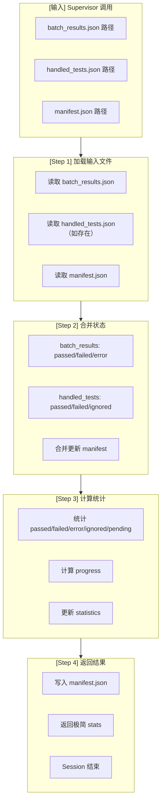

# Manifest Updater (Worker Agent v3.2)

> ⚠️ **HARD CONTRACT — read first, before anything else in this file.**
>
> This 5-rule block is the **only** part of the SKILL the runtime treats as
> non-negotiable. If a rule below conflicts with anything later in this file,
> the rule wins.
>
> 1. **Output schema is canonical.** `manifest.json` MUST be written through
>    `skills/ut/manifest-updater/scripts/update_status.py` (which calls
>    `skills.ut.shared.validate_and_write`) and MUST validate against
>    `skills/ut/shared/manifest_schema.json` (additionalProperties:false on
>    the relevant subtrees). The schema is the contract; the script is one
>    sanctioned writer that enforces it. Manual edits, hand-rolled JSON, or
>    LLM-generated copies that drift from `manifest_schema.json` are
>    rejected by the writer before reaching disk.
> 2. **Run the stat audit, do not skip it.** Before consuming
>    `batch_results.tests`, `update_from_workflow_state()` runs
>    `audit_batch_results()` which stat-checks the remote pytest log. If
>    the audit returns `{"error":"audit_failed", "reason": ...}`, the
>    manifest MUST NOT be mutated — return the audit error upstream and
>    let the Supervisor decide. This is the Type-B fabrication backstop.
> 3. **`batch_results.json` is read-only here.** Stage 5 never re-classifies
>    tests, never re-runs pytest, never edits `batch_results.json`. The only
>    permitted mutation is to `manifest.json` (status + statistics +
>    `last_batch_id` + `retry_count`).
> 4. **`handled_tests.json` overrides `batch_results.json`.** When both
>    files exist for a batch, `handled_tests.tests[*]` is applied AFTER the
>    `batch_results` merge so a fixer-confirmed verdict (e.g. `ignored`
>    with `ignore_reason`) wins.
> 5. **Statistics are recomputed, never copied.** After the merge,
>    `calculate_statistics()` recounts from `manifest.tests[*].status` — do
>    NOT copy `batch_results.statistics` into `manifest.statistics`; they
>    measure different things (one batch vs. full run).

---

## Worker 角色

```
┌─────────────────────────────────────────────────────────────┐
│  Worker Agent Session (临时，执行后释放)                     │
│                                                             │
│  职责：                                                      │
│  • 读取 batch_results.json + handled_tests.json             │
│  • 更新 manifest.json 状态                                   │
│  • 计算统计数据                                              │
│  • 返回极简结果给 Supervisor                                │
│                                                             │
│  输入：batch_results.json + handled_tests.json               │
│  输出：manifest.json + 极简 stats                            │
│  Session 结束后：Context 释放                                │
└─────────────────────────────────────────────────────────────┘
```

---

## 流程图



---

## 输入输出

### 输入（从 Supervisor context 获取）

| 字段 | 来源 | 说明 |
|------|------|------|
| `workflow_state_path` | Supervisor context | 状态文件路径 |
| `batch_results_path` | workflow.yaml | 测试结果路径 |
| `handled_tests_path` | workflow.yaml | 处理结果路径 |
| `manifest_path` | workflow.yaml | manifest 路径 |

### 输出

| 类型 | 内容 | 说明 |
|------|------|------|
| **文件** | manifest.json | 更新后的状态文件 |
| **返回** | stats (极简) | 给 Supervisor 的返回值 |

---

## Behavior (v5)

### Inputs

- **`batch_results.json`** — written by Stage 3 (executor). Shape:
  ```json
  {
    "batch_id": "b001",
    "tests": [
      {"test_id": "t1", "status": "passed"},
      {"test_id": "t2", "status": "retriable_error", "error_type": "oom"}
    ]
  }
  ```
- **`handled_tests.json`** — written by Stage 4 (failure-handler). Optional. Shape:
  ```json
  { "tests": [ {"test_id": "t9", "status": "ignored", "ignore_reason": "manual triage"} ] }
  ```

### Per-test merge rules

For every test in `batch_results["tests"]`:

1. Set `last_batch_id = batch_results["batch_id"]`.
2. Copy `error_type` if present in the result.
3. If new status ∈ {`failed`, `retriable_error`, `error`}, increment `retry_count` by 1.
4. If new status == `retriable_error` AND `retry_count >= max_retry`:
   - flip `status` to `"ignored"`
   - set `ignore_reason = f"max retry exceeded for {error_type}"`
   Otherwise set `status = new_status`.

For every test in `handled["tests"]` (Stage 4 overrides):

- Apply `status` override.
- Set `ignore_reason` if present.

### Statistics

After all merges, recompute `manifest["statistics"]` by counting tests per status (`passed`, `failed`, `error`, `retriable_error`, `pending`, `ignored`, `fixed_pending_verify`, …) and add derived fields `total`, `executed`, `progress`.

### Reference

```python
from update_manifest import update_manifest

manifest = update_manifest(manifest, batch_results, handled_tests)
```

---

## 执行流程

### Step 1: 加载输入文件

```python
import json
from pathlib import Path

# 从 workflow_state.json 读取路径配置（不硬编码）
from shared.config_loader import get_paths
paths = get_paths(workflow_state_path)

# 读取输入文件
batch_results_path = paths["batch_results"]
handled_tests_path = paths["handled_tests"]
manifest_path = paths["manifest"]

batch_results = json.loads(Path(batch_results_path).read_text())
handled_tests = json.loads(Path(handled_tests_path).read_text()) if Path(handled_tests_path).exists() else None
manifest = json.loads(Path(manifest_path).read_text())
```

### Step 2: 合并状态

```python
# batch_results: Stage 3 输出
for test in batch_results["tests"]:
    update_manifest_test(manifest, test)

# handled_tests: Stage 4 输出（如存在）
if handled_tests:
    for test in handled_tests["tests"]:
        # handled_tests 包含处理后的 final_status
        update_manifest_test(manifest, test)
    
    # 更新 resolved 索引（errors/failures 聚合）
    update_resolved_index(manifest, handled_tests)

def update_manifest_test(manifest, test_result):
    """更新 manifest 中的单个测试"""
    test_node = test_result["test_node"]
    
    # 找到对应测试
    for test in manifest["tests"]:
        if test["test_node"] == test_node:
            # 状态更新
            test["status"] = test_result.get("final_status") or test_result.get("status")
            test["error_message"] = test_result.get("error_message")
            test["ignored_reason"] = test_result.get("ignored_reason")
            test["log_file"] = test_result.get("log_file")
            
            # 执行追踪字段（schema 定义）
            test["run_count"] = test.get("run_count", 0) + 1
            test["last_run_at"] = datetime.now().isoformat()
            test["last_duration_ms"] = test_result.get("duration_ms")
            test["last_exit_code"] = test_result.get("exit_code")
            
            # 处理 errors[]（从 handled_tests 合并）
            if test_result.get("errors"):
                test["errors"] = test_result["errors"]
            
            # 处理 failures[]（从 handled_tests 合并）
            if test_result.get("failures"):
                test["failures"] = test_result["failures"]
            
            # 处理 retry_count（阈值追踪）
            if test_result.get("retry_count"):
                test["retry_count"] = test_result["retry_count"]
            
            # 处理 commit（修复记录）
            if test_result.get("commit"):
                test["commit"] = test_result["commit"]
            
            break

def update_resolved_index(manifest, handled_tests):
    """更新 resolved_errors/resolved_failures 聚合索引"""
    
    # 确保 resolved 字段存在
    if "resolved_errors" not in manifest:
        manifest["resolved_errors"] = {}
    if "resolved_failures" not in manifest:
        manifest["resolved_failures"] = {}
    
    for test in handled_tests["tests"]:
        # 只有 fixed_pending_verify 或 passed 才更新索引
        final_status = test.get("final_status")
        if final_status not in ["fixed_pending_verify", "passed"]:
            continue
        
        # 更新 resolved_errors 索引
        for error in test.get("errors", []):
            if error.get("status") == "resolved" and error.get("error_key"):
                manifest["resolved_errors"][error["error_key"]] = {
                    "type": error.get("error_type"),
                    "resolved_at": datetime.now().isoformat()
                }
        
        # 更新 resolved_failures 索引
        for failure in test.get("failures", []):
            if failure.get("status") == "resolved" and failure.get("failure_key"):
                manifest["resolved_failures"][failure["failure_key"]] = {
                    "type": failure.get("failure_type", "assertion"),
                    "resolved_at": datetime.now().isoformat(),
                    "commit": test.get("commit")
                }
```

### Step 3: 计算统计

```python
# 计算统计
passed = len([t for t in manifest["tests"] if t["status"] == "passed"])
failed = len([t for t in manifest["tests"] if t["status"] == "failed"])
error = len([t for t in manifest["tests"] if t["status"] == "error"])
ignored = len([t for t in manifest["tests"] if t["status"] == "ignored"])
pending = len([t for t in manifest["tests"] if t["status"] == "pending"])

total = len(manifest["tests"])
executed = passed + failed + error + ignored
progress = round(executed / total * 100, 2)
pass_rate = round(passed / executed * 100, 2) if executed > 0 else 0

# 更新 statistics
manifest["statistics"] = {
    "total": total,
    "executed": executed,
    "progress": progress,
    "pass_rate": pass_rate,
    "passed": passed,
    "failed": failed,
    "error": error,
    "ignored": ignored,
    "pending": pending
}
```

### Step 4: 写入文件并返回

```python
# 写入 manifest.json
Path(manifest_path).write_text(json.dumps(manifest, indent=2))

# 返回极简结果给 Supervisor（统一格式）
return {
    "stats": {
        "passed": passed,
        "failed": failed,
        "ignored": ignored,
        "error": error,
        "pending": pending
    },
    "next_action": "continue",
    "error": None,
    "blocked_reason": None
}
```

---

## 返回格式规范（统一）

```json
{
  "stats": {
    "passed": 500,
    "failed": 50,
    "ignored": 16,
    "error": 0,
    "pending": 12599
  },
  "next_action": "continue",
  "error": null,
  "blocked_reason": null
}
```

**注意：只返回统一字段，不返回 batch_id、details_file、progress 等额外字段**

---

## 状态定义

| 状态 | 说明 | 设置条件 |
|------|------|----------|
| `passed` | 测试通过 | pytest PASSED |
| `failed` | 测试失败（断言错误） | pytest FAILED |
| `error` | 测试错误（收集/执行错误） | pytest ERROR |
| `pending` | 待执行 | 默认状态 |
| `ignored` | 忽略（不解决） | 重试失败/不需要解决 |

---

## 前置/后置任务

| 类型 | 任务 | 说明 |
|------|------|------|
| **前置** | Supervisor 调用 | delegate_task 触发 |
| **前置** | batch_results.json 存在 | Stage 3 输出 |
| **前置** | handled_tests.json 存在 | Stage 4 输出 |
| **后置** | manifest.json 更新 | 输出文件 |
| **后置** | 返回 stats | 极简返回值 |
| **后置** | Supervisor 检查 stop_condition | pending_count == 0 |

---

## 注意事项

1. **必须合并 handled_tests**：Stage 4 的处理结果必须合并到 manifest
2. **statistics 自动计算**：不手动计算，由脚本更新
3. **极简返回**：只返回 stats 数字，不返回 manifest 内容
4. **ignored_reason 必填**：所有 ignored 测试必须有原因

---

## 禁止操作

- ❌ 不手动计算统计数据
- ❌ 不直接编辑 manifest.json（通过脚本）
- ❌ 不返回 manifest 详细内容（只返回 stats）
- ❌ 不发送飞书通知（让 Supervisor 发送）

---

## 相关文档

- **workflow.yaml** - Workflow 配置路径已迁移（见下方说明）

  > **配置路径：** workflow.yaml路径是动态的（`runs/ut-{timestamp}/workflow.yaml`），
  > 由terminal-workflow或hermes-workflow在Stage 0环境选择后确定。
  > 模板位于：`tasks/ut/deployment/production/config/workflow.yaml`（production）
  > 或 `tests/ut/integration/fixtures/workflow.l{1-4}.yaml`（test）
- [workflow/SKILL.md](../workflow/SKILL.md) - Supervisor 调度逻辑
- [failure-handler/SKILL.md](../failure-handler/SKILL.md) - 上游 Stage

---

*创建日期: 2026-06-09*
*更新日期: 2026-06-13*
*版本: 3.2.0*
*版本: 3.0.0*