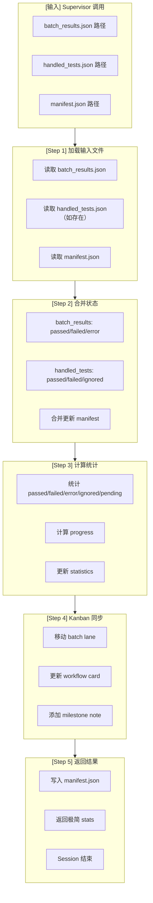

# Manifest Updater (Worker Agent v3.0)

---

## Worker 角色

```
┌─────────────────────────────────────────────────────────────┐
│  Worker Agent Session (临时，执行后释放)                     │
│                                                             │
│  职责：                                                      │
│  • 读取 batch_results.json + handled_tests.json             │
│  • 更新 manifest.json 状态                                   │
│  • 计算统计数据                                              │
│  • 同步 Kanban（可选）                                       │
│  • 返回极简结果给 Supervisor                                │
│                                                             │
│  输入：batch_results.json + handled_tests.json               │
│  输出：manifest.json + 极简 stats                            │
│  Session 结束后：Context 释放                                │
└─────────────────────────────────────────────────────────────┘
```

---

## 流程图



---

## 输入输出

### 输入（从 Supervisor context 获取）

| 字段 | 来源 | 说明 |
|------|------|------|
| `workflow_state_path` | Supervisor context | 状态文件路径 |
| `batch_results_path` | workflow.yaml | 测试结果路径 |
| `handled_tests_path` | workflow.yaml | 处理结果路径 |
| `manifest_path` | workflow.yaml | manifest 路径 |

### 输出

| 类型 | 内容 | 说明 |
|------|------|------|
| **文件** | manifest.json | 更新后的状态文件 |
| **Kanban** | lane/card 更新 | 进度同步 |
| **返回** | stats (极简) | 给 Supervisor 的返回值 |

---

## 执行流程

### Step 1: 加载输入文件

```python
import json
import yaml
from pathlib import Path

# 从 workflow.yaml 读取路径配置（不硬编码）
workflow_config = yaml.safe_load(Path(".agents/workflow.yaml").read_text())
paths = workflow_config["config"]

# 读取输入文件（路径从 workflow.yaml 读取）
batch_results_path = paths["batch_results_path"]
handled_tests_path = paths["handled_tests_path"]
manifest_path = paths["manifest_path"]

batch_results = json.loads(Path(batch_results_path).read_text())
handled_tests = json.loads(Path(handled_tests_path).read_text()) if Path(handled_tests_path).exists() else None
manifest = json.loads(Path(manifest_path).read_text())
```

### Step 2: 合并状态

```python
# batch_results: Stage 3 输出
for test in batch_results["tests"]:
    update_manifest_test(manifest, test)

# handled_tests: Stage 4 输出（如存在）
if handled_tests:
    for test in handled_tests["tests"]:
        # handled_tests 包含处理后的 final_status
        update_manifest_test(manifest, test)

def update_manifest_test(manifest, test_result):
    """更新 manifest 中的单个测试"""
    test_node = test_result["test_node"]
    
    # 找到对应测试
    for test in manifest["tests"]:
        if test["test_node"] == test_node:
            test["status"] = test_result.get("final_status") or test_result.get("status")
            test["error_message"] = test_result.get("error_message")
            test["ignored_reason"] = test_result.get("ignored_reason")
            test["run_at"] = datetime.now().isoformat()
            test["duration_ms"] = test_result.get("duration_ms")
            test["log_file"] = test_result.get("log_file")
            break
```

### Step 3: 计算统计

```python
# 计算统计
passed = len([t for t in manifest["tests"] if t["status"] == "passed"])
failed = len([t for t in manifest["tests"] if t["status"] == "failed"])
error = len([t for t in manifest["tests"] if t["status"] == "error"])
ignored = len([t for t in manifest["tests"] if t["status"] == "ignored"])
pending = len([t for t in manifest["tests"] if t["status"] == "pending"])

total = len(manifest["tests"])
executed = passed + failed + error + ignored
progress = round(executed / total * 100, 2)

# 更新 statistics
manifest["statistics"] = {
    "total": total,
    "executed": executed,
    "progress": progress,
    "passed": passed,
    "failed": failed,
    "error": error,
    "ignored": ignored,
    "pending": pending
}
```

### Step 4: Kanban 同步（可选）

```python
from hermes import kanban

batch_id = batch_results["batch_id"]

# 决定目标 lane
if handled_tests["stats"]["passed"] > 0:
    target_lane = "Passed"
else:
    target_lane = "Failed"

# 移动 batch lane
kanban.move_lane(
    board="UT Test Progress",
    from_lane=f"batch_{batch_id}",
    to_lane=target_lane,
    summary=f"{passed}/{batch_results['stats']['total']} passed"
)

# 更新 workflow card
kanban.update_card(
    board="UT Test Progress",
    lane="Workflow Status",
    progress=f"{passed}/{total} ({progress}%)"
)

# milestone note
if passed % 100 == 0:
    kanban.add_note(
        board="UT Test Progress",
        lane="Workflow Status",
        note=f"Milestone: {passed} tests passed!"
    )
```

### Step 5: 写入文件并返回

```python
# 写入 manifest.json
Path(manifest_path).write_text(json.dumps(manifest, indent=2))

# 返回极简结果给 Supervisor（统一格式）
return {
    "stats": {
        "passed": passed,
        "failed": failed,
        "ignored": ignored,
        "error": error,
        "pending": pending
    },
    "next_action": "continue",
    "error": None,
    "blocked_reason": None
}
```

---

## 返回格式规范（统一）

```json
{
  "stats": {
    "passed": 500,
    "failed": 50,
    "ignored": 16,
    "error": 0,
    "pending": 12599
  },
  "next_action": "continue",
  "error": null,
  "blocked_reason": null
}
```

**注意：只返回统一字段，不返回 batch_id、details_file、progress 等额外字段**

---

## 状态定义

| 状态 | 说明 | 设置条件 |
|------|------|----------|
| `passed` | 测试通过 | pytest PASSED |
| `failed` | 测试失败（断言错误） | pytest FAILED |
| `error` | 测试错误（收集/执行错误） | pytest ERROR |
| `pending` | 待执行 | 默认状态 |
| `ignored` | 忽略（不解决） | 重试失败/不需要解决 |

---

## 前置/后置任务

| 类型 | 任务 | 说明 |
|------|------|------|
| **前置** | Supervisor 调用 | delegate_task 触发 |
| **前置** | batch_results.json 存在 | Stage 3 输出 |
| **前置** | handled_tests.json 存在 | Stage 4 输出 |
| **后置** | manifest.json 更新 | 输出文件 |
| **后置** | Kanban 同步 | 进度可视化 |
| **后置** | 返回 stats + progress | 极简返回值 |
| **后置** | Supervisor 检查 stop_condition | pending_count == 0 |

---

## 注意事项

1. **必须合并 handled_tests**：Stage 4 的处理结果必须合并到 manifest
2. **statistics 自动计算**：不手动计算，由脚本更新
3. **Kanban 同步时机**：每批次完成后同步
4. **极简返回**：只返回 stats 数字，不返回 manifest 内容
5. **ignored_reason 必填**：所有 ignored 测试必须有原因

---

## 禁止操作

- ❌ 不手动计算统计数据
- ❌ 不直接编辑 manifest.json（通过脚本）
- ❌ 不返回 manifest 详细内容（只返回 stats）
- ❌ 不发送飞书通知（让 Supervisor 发送）
- ❌ 不跳过 Kanban 同步

---

## 相关文档

- [workflow.yaml](../../.agents/workflow.yaml) - Workflow 配置
- [workflow/SKILL.md](../workflow/SKILL.md) - Supervisor 调度逻辑
- [failure-handler/SKILL.md](../failure-handler/SKILL.md) - 上游 Stage

---

*创建日期: 2026-06-09*
*更新日期: 2026-06-10*
*版本: 3.0.0*