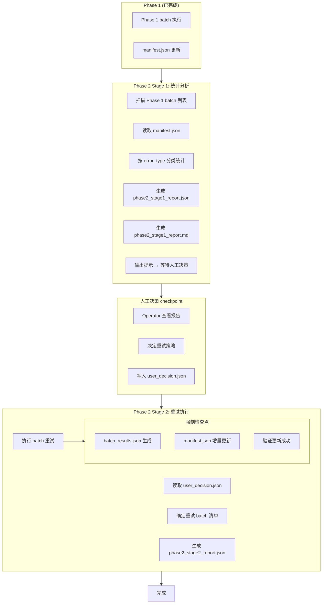

# Two-phase Handler (Worker Agent v1.0)

> **Infrastructure Dependency Note**
>
> This skill assumes existing batch-executor infrastructure from the UT workflow.
> Phase 2 Stage 2 retry execution relies on:
> - `skills/ut/unit-test-executor/scripts/execute_batch.py` - Batch execution script
> - `skills/ut/unit-test-executor/scripts/update_manifest.py` - Manifest incremental update
> - `manifest.json` schema defined in `skills/ut/shared/manifest_schema.json`
>
> Ensure these dependencies are available before invoking Stage 2.

> **HARD CONTRACT — read first, before anything else in this file.**
>
> This 4-rule block is the **only** part of the SKILL the runtime treats as
> non-negotiable. If a rule below conflicts with anything later in this file,
> the rule wins.
>
> 1. **Phase separation is mandatory.** Stage 1 (统计分析) and Stage 2 (重试执行)
>    are **separate invocations** — never combine them in one agent session.
>    Stage 1 outputs `phase2_stage1_report.json` + `phase2_stage1_report.md`;
>    Stage 2 outputs `phase2_stage2_report.json`. Each stage must complete fully
>    before the next stage can be invoked.
> 2. **Human decision checkpoint is immutable.** Between Stage 1 and Stage 2,
>    Supervisor MUST pause and wait for human input via `user_decision.json`.
>    No agent may auto-proceed to Stage 2 without explicit human approval.
>    Skipping this checkpoint is a hard violation that invalidates the run.
> 3. **Manifest is the single source of truth.** All error classifications come
>    from `manifest.json` — never fabricate error_type based on test names or
>    heuristics alone. If a test lacks `error_type`, classify as `other`.
>    Stats MUST be computed from manifest data, not from batch_results alone.
> 4. **Retry execution follows manifest contract.** Each retry batch MUST produce
>    `batch_results.json` + incrementally update `manifest.json`. The Stage 2
>    executor MUST call `execute_batch_script(batch_id)` which internally
>    enforces manifest update. Bypassing this contract breaks Phase 1/Phase 2
>    data flow.

---

## Worker Role

```
┌─────────────────────────────────────────────────────────────┐
│  Worker Agent Session (Phase 2 - 两阶段)                    │
│                                                             │
│  Stage 1 职责（统计分析）：                                  │
│  • 扫描 Phase 1 所有 batch                                  │
│  • 从 manifest 读取 test 结果                               │
│  • 按 error_type 分类统计                                   │
│  • 生成 JSON + Markdown 报告                                │
│  • 输出提示 → 等待人工决策                                   │
│                                                             │
│  Stage 2 职责（重试执行）：                                  │
│  • 读取 user_decision.json                                 │
│  • 确定重试 batch 清单                                      │
│  • 执行 batch 重试                                          │
│  • 强制检查点：结果文件 + Manifest 更新                     │
│  • 生成重试报告                                             │
│                                                             │
│  ⚠️ 两阶段分离，人工决策 checkpoint                         │
│  ⚠️ Manifest 单一数据源                                     │
└─────────────────────────────────────────────────────────────┘
```

---

## Flowchart



---

## Error_type Classification (11 types)

| Error_type | 描述 | 优先级建议 | 处理策略 |
|-----------|------|-----------|---------|
| `dependency` | 依赖缺失 | P1 | 检查环境，安装依赖 |
| `network` | 网络错误 | P0 | 重试，检查网络配置 |
| `resource` | 资源不足 | P1 | 检查 GPU/CPU/Memory |
| `version` | 版本兼容问题 | P1 | 更新代码/API |
| `functional` | 功能错误 | P2 | 分析测试逻辑 |
| `download_error` | 模型下载失败 | P1 | 检查模型路径/权限 |
| `oom` | GPU显存不足 | P0 | 调整 batch size/模型 |
| `timeout` | pytest执行超时 | P0 | 检查测试复杂度/依赖 |
| `collection` | pytest collection错误 | P2 | 检查测试定义 |
| `assertion` | 断言失败 | P2 | 分析预期/实际差异 |
| `other` | 其他未分类错误 | P2 | 人工分析 |

---

## Inputs & Outputs

### Stage 1 Inputs

| 字段 | 来源 | 说明 |
|------|------|------|
| `manifest_path` | Supervisor context | manifest.json 路径 |
| `run_dir` | Supervisor context | 运行目录 |
| `phase1_batch_list` | run_dir | Phase 1 batch ID 列表 |

### Stage 1 Outputs

| 文件 | 说明 |
|------|------|
| `phase2_stage1_report.json` | 统计数据（JSON 格式） |
| `phase2_stage1_report.md` | 统计报告（Markdown 格式） |

### Stage 2 Inputs

| 字段 | 来源 | 说明 |
|------|------|------|
| `user_decision.json` | Human checkpoint | 人工决策 |
| `phase2_stage1_report.json` | Stage 1 output | 统计数据 |
| `manifest_path` | Supervisor context | manifest.json 路径 |

### Stage 2 Outputs

| 文件 | 说明 |
|------|------|
| `batch_results.json` (每个 batch) | 重试结果 |
| `manifest.json` (更新) | 增量更新 |
| `phase2_stage2_report.json` | 重试总结 |

---

## Stage 1: Statistical Analysis

### Execution Steps

#### Step 1: Scan Phase 1 batches

```python
import json
from pathlib import Path

# 从 run_dir 获取 Phase 1 batch 列表
run_dir_path = Path(run_dir)
phase1_batch_list = []

# 扫描 batch_results.json 文件
for batch_file in run_dir_path.glob("batch_*_results.json"):
    batch_id = extract_batch_id(batch_file)
    phase1_batch_list.append(batch_id)
```

#### Step 2: Load manifest

```python
manifest = json.loads(Path(manifest_path).read_text())
```

#### Step 3: Classify by error_type

```python
def get_error_type_suggestion(error_type):
    """获取 error_type 的处理建议"""
    suggestions = {
        'dependency': '检查环境，安装缺失的依赖包',
        'network': '重试 batch，检查网络配置和代理设置',
        'resource': '检查 GPU/CPU/Memory 资源是否充足',
        'version': '更新代码以适配 API 变化',
        'functional': '分析测试逻辑，定位功能缺陷',
        'download_error': '检查模型路径、权限和 HuggingFace token',
        'oom': '调整 batch size 或使用更小的模型',
        'timeout': '检查测试复杂度，优化依赖下载流程',
        'collection': '检查测试定义和 pytest 配置',
        'assertion': '分析预期输出与实际输出的差异',
        'other': '需要人工分析具体错误日志'
    }
    return suggestions.get(error_type, '需要人工分析')

def get_error_type_priority(error_type):
    """获取 error_type 的优先级"""
    priorities = {
        'network': 'P0',
        'oom': 'P0',
        'timeout': 'P0',
        'dependency': 'P1',
        'resource': 'P1',
        'version': 'P1',
        'download_error': 'P1',
        'functional': 'P2',
        'collection': 'P2',
        'assertion': 'P2',
        'other': 'P2'
    }
    return priorities.get(error_type, 'P2')

def get_tests_by_batch_id(manifest, batch_id):
    """从 manifest 获取指定 batch 的测试"""
    return [
        test for test in manifest['tests']
        if test.get('last_batch_id') == batch_id
    ]

# 统计逻辑
error_stats = {}

for batch_id in phase1_batch_list:
    batch_tests = get_tests_by_batch_id(manifest, batch_id)

    for test in batch_tests:
        if test['status'] in ['failed', 'error']:
            error_type = test.get('error_type') or 'other'

            # 初始化该 error_type 的统计项
            if error_type not in error_stats:
                error_stats[error_type] = {
                    'batch_count': 0,
                    'test_count': 0,
                    'batch_list': [],
                    'test_list': [],
                    'affected_test_files': [],
                    'suggestion': get_error_type_suggestion(error_type),
                    'priority': get_error_type_priority(error_type)
                }

            # 累加统计
            error_stats[error_type]['batch_count'] += 1
            error_stats[error_type]['test_count'] += 1

            # 记录 batch_id（避免重复）
            if batch_id not in error_stats[error_type]['batch_list']:
                error_stats[error_type]['batch_list'].append(batch_id)

            # 记录 test_node
            error_stats[error_type]['test_list'].append(test['test_node'])

            # 记录 test_file（避免重复）
            test_file = test.get('test_file')
            if test_file and test_file not in error_stats[error_type]['affected_test_files']:
                error_stats[error_type]['affected_test_files'].append(test_file)
```

#### Step 4: Generate reports

```python
def generate_report(error_stats):
    """生成统计报告"""
    report = {
        'stage': 'phase2_stage1',
        'generated_at': datetime.now().isoformat(),
        'total_batches': len(phase1_batch_list),
        'error_statistics': error_stats,
        'summary': {
            'total_failed_tests': sum(s['test_count'] for s in error_stats.values()),
            'error_type_count': len(error_stats),
            'priority_breakdown': {
                'P0': sum(1 for s in error_stats.values() if s['priority'] == 'P0'),
                'P1': sum(1 for s in error_stats.values() if s['priority'] == 'P1'),
                'P2': sum(1 for s in error_stats.values() if s['priority'] == 'P2')
            }
        }
    }
    return report

def write_json_report(report, filename):
    """写入 JSON 报告"""
    Path(run_dir / filename).write_text(
        json.dumps(report, indent=2, ensure_ascii=False)
    )

def write_markdown_report(report, filename):
    """写入 Markdown 报告"""
    md_content = generate_markdown(report)
    Path(run_dir / filename).write_text(md_content)

def generate_markdown(report):
    """生成 Markdown 内容"""
    lines = [
        "# Phase 2 Stage 1 统计分析报告",
        "",
        f"生成时间: {report['generated_at']}",
        f"Phase 1 总 batch 数: {report['total_batches']}",
        "",
        "## 概览",
        "",
        f"- 总失败测试数: {report['summary']['total_failed_tests']}",
        f"- error_type 分类数: {report['summary']['error_type_count']}",
        "",
        "### 优先级分布",
        "",
        f"- P0 (立即处理): {report['summary']['priority_breakdown']['P0']}",
        f"- P1 (高优先级): {report['summary']['priority_breakdown']['P1']}",
        f"- P2 (中优先级): {report['summary']['priority_breakdown']['P2']}",
        "",
        "## Error_type 分类详情",
        ""
    ]

    # 按优先级排序
    sorted_stats = sorted(
        report['error_statistics'].items(),
        key=lambda x: (x[1]['priority'], -x[1]['test_count'])
    )

    for error_type, stats in sorted_stats:
        lines.extend([
            f"### {error_type} ({stats['priority']})",
            "",
            f"- 影响测试数: {stats['test_count']}",
            f"- 影响 batch 数: {stats['batch_count']}",
            f"- 影响 test_file 数: {len(stats['affected_test_files'])}",
            "",
            "**处理建议:**",
            f"{stats['suggestion']}",
            "",
            "**受影响的 batch:**",
            ""
        ])
        for batch_id in stats['batch_list']:
            lines.append(f"- {batch_id}")

        lines.extend([
            "",
            "**受影响的 test_file:**",
            ""
        ])
        for test_file in stats['affected_test_files']:
            lines.append(f"- `{test_file}`")

        lines.append("")

    lines.extend([
        "---",
        "",
        "**下一步:** 请 Operator 查看报告，决定重试策略",
        "",
        "可选决策方式:",
        "1. 按 error_type 批量重试（推荐）",
        "2. 指定特定 batch 重试",
        "3. 重试所有失败 batch（不推荐）"
    ])

    return "\n".join(lines)

# 执行
report = generate_report(error_stats)
write_json_report(report, 'phase2_stage1_report.json')
write_markdown_report(report, 'phase2_stage1_report.md')
```

#### Step 5: Output checkpoint

```python
print("Phase 2 Stage 1 完成，统计报告已生成")
print("请查看 phase2_stage1_report.md，决定重试哪些 batch")

# 返回给 Supervisor
return {
    "stage": "phase2_stage1_complete",
    "report_path": "phase2_stage1_report.md",
    "next_action": "wait",
    "reason": "等待人工决策 checkpoint"
}
```

---

## Human Decision Checkpoint

### user_decision.json Schema

```json
{
  "$schema": "http://json-schema.org/draft-07/schema#",
  "type": "object",
  "required": ["decision_method", "timestamp"],
  "properties": {
    "decision_method": {
      "type": "string",
      "enum": ["retry_error_types", "retry_specific_batches", "retry_all"]
    },
    "retry_error_types": {
      "type": "array",
      "items": {"type": "string"},
      "description": "按 error_type 批量重试（推荐）"
    },
    "retry_specific_batches": {
      "type": "array",
      "items": {"type": "string"},
      "description": "指定特定 batch 重试"
    },
    "retry_all": {
      "type": "boolean",
      "description": "重试所有失败 batch（不推荐）"
    },
    "timestamp": {
      "type": "string",
      "format": "date-time"
    },
    "operator_notes": {
      "type": "string",
      "description": "Operator 备注"
    }
  }
}
```

### Example decisions

**决策 1: 按 error_type 批量重试（推荐）**

```json
{
  "decision_method": "retry_error_types",
  "retry_error_types": ["network", "timeout"],
  "timestamp": "2026-07-07T10:30:00Z",
  "operator_notes": "网络和超时问题最常见，优先批量重试"
}
```

**决策 2: 指定特定 batch 重试**

```json
{
  "decision_method": "retry_specific_batches",
  "retry_specific_batches": ["batch_001", "batch_005", "batch_010"],
  "timestamp": "2026-07-07T10:30:00Z",
  "operator_notes": "只重试这三个关键 batch"
}
```

**决策 3: 重试所有失败 batch（不推荐）**

```json
{
  "decision_method": "retry_all",
  "retry_all": true,
  "timestamp": "2026-07-07T10:30:00Z",
  "operator_notes": "全面重试所有失败 batch（谨慎使用）"
}
```

---

## Stage 2: Agent-assisted Retry

### Execution Steps

#### Step 1: Read user decision

```python
user_decision = json.loads(Path(run_dir / 'user_decision.json').read_text())
```

#### Step 2: Determine batch list

```python
batches_to_retry = []

# 方式 1: 按 error_type 批量重试（推荐）
if user_decision['decision_method'] == 'retry_error_types':
    report = json.loads(Path(run_dir / 'phase2_stage1_report.json').read_text())
    for error_type in user_decision.get('retry_error_types', []):
        batch_list = report['error_statistics'].get(error_type, {}).get('batch_list', [])
        batches_to_retry.extend(batch_list)

# 方式 2: 指定特定 batch 重试
elif user_decision['decision_method'] == 'retry_specific_batches':
    batches_to_retry.extend(user_decision.get('retry_specific_batches', []))

# 方式 3: 重试所有失败 batch（不推荐）
elif user_decision['decision_method'] == 'retry_all':
    report = json.loads(Path(run_dir / 'phase2_stage1_report.json').read_text())
    for error_type, stats in report['error_statistics'].items():
        batches_to_retry.extend(stats['batch_list'])

# 去重
batches_to_retry = list(set(batches_to_retry))
```

#### Step 3: Execute retry batches

```python
print(f"Phase 2 Stage 2 开始，准备重试 {len(batches_to_retry)} 个 batch")

retry_results = []

for batch_id in batches_to_retry:
    # 重新执行 batch（调用 execute_batch_script）
    result = execute_batch_script(batch_id)

    # ✅ 强制检查点 1: 结果文件生成
    result_path = run_dir / f"{batch_id}_results.json"
    assert result_path.exists(), f"{batch_id} 结果文件未生成"

    # ✅ 强制检查点 2: Manifest 增量更新
    # execute_batch_script 内部调用 manifest-updater，这里只验证
    assert verify_manifest_updated(manifest_path, batch_id), \
        f"{batch_id} manifest 未更新"

    retry_results.append({
        'batch_id': batch_id,
        'status': 'success' if result['exit_code'] == 0 else 'failed',
        'tests_passed': result['stats']['passed'],
        'tests_failed': result['stats']['failed'],
        'tests_error': result['stats']['error']
    })
```

#### Step 4: Generate retry summary

```python
def generate_retry_summary(retry_results):
    """生成重试总结"""
    successful = [r for r in retry_results if r['status'] == 'success']
    failed = [r for r in retry_results if r['status'] == 'failed']

    summary = {
        'stage': 'phase2_stage2',
        'generated_at': datetime.now().isoformat(),
        'total_retries': len(retry_results),
        'successful_retries': len(successful),
        'failed_retries': len(failed),
        'batch_results': retry_results,
        'summary_stats': {
            'total_tests_passed': sum(r['tests_passed'] for r in retry_results),
            'total_tests_failed': sum(r['tests_failed'] for r in retry_results),
            'total_tests_error': sum(r['tests_error'] for r in retry_results)
        }
    }
    return summary

retry_report = generate_retry_summary(retry_results)
Path(run_dir / 'phase2_stage2_report.json').write_text(
    json.dumps(retry_report, indent=2, ensure_ascii=False)
)
```

#### Step 5: Return to Supervisor

```python
return {
    "stage": "phase2_stage2_complete",
    "stats": retry_report['summary_stats'],
    "next_action": "continue",
    "report_path": "phase2_stage2_report.json"
}
```

---

## Helper Functions

### execute_batch_script(batch_id)

```python
def execute_batch_script(batch_id):
    """执行单个 batch（调用 batch-executor）"""

    # 读取 batch 配置
    batch_config_path = run_dir / f"{batch_id}_config.json"
    batch_config = json.loads(Path(batch_config_path).read_text())

    # 调用 batch-executor（Phase 1 的执行逻辑）
    from skills.ut.batch_executor import execute_batch

    result = execute_batch(
        batch_id=batch_id,
        test_list=batch_config['tests'],
        run_dir=run_dir,
        manifest_path=manifest_path
    )

    return result
```

### verify_manifest_updated(manifest_path, batch_id)

```python
def verify_manifest_updated(manifest_path, batch_id):
    """验证 manifest 已更新（检查点 2）"""

    manifest = json.loads(Path(manifest_path).read_text())

    # 检查该 batch 的测试状态已更新
    batch_tests = [
        t for t in manifest['tests']
        if t.get('last_batch_id') == batch_id
    ]

    # 至少有一个测试状态改变
    updated = any(
        t['status'] != 'pending' for t in batch_tests
    )

    return updated
```

---

## Return Format

### Stage 1 Return

```json
{
  "stage": "phase2_stage1_complete",
  "report_path": "phase2_stage1_report.md",
  "next_action": "wait",
  "reason": "等待人工决策 checkpoint"
}
```

### Stage 2 Return

```json
{
  "stage": "phase2_stage2_complete",
  "stats": {
    "total_tests_passed": 15,
    "total_tests_failed": 3,
    "total_tests_error": 1
  },
  "next_action": "continue",
  "report_path": "phase2_stage2_report.json"
}
```

---

## Usage Examples

### Example 1: Stage 1 Execution

```python
# Supervisor invokes Stage 1
result = invoke_skill('two-phase-handler', {
    'stage': 'phase2_stage1',
    'manifest_path': '/path/to/manifest.json',
    'run_dir': '/path/to/run_dir'
})

# Stage 1 完成，等待人工决策
# Operator 查看 phase2_stage1_report.md
# Operator 写入 user_decision.json
```

### Example 2: Stage 2 Execution (按 error_type)

```python
# Operator 决策
user_decision = {
    "decision_method": "retry_error_types",
    "retry_error_types": ["network", "timeout"]
}

# Supervisor invokes Stage 2
result = invoke_skill('two-phase-handler', {
    'stage': 'phase2_stage2',
    'user_decision': user_decision,
    'manifest_path': '/path/to/manifest.json',
    'run_dir': '/path/to/run_dir'
})
```

---

## Prohibited Operations

### Data Integrity Prohibitions

- **Absolute prohibition on fabrication**: Stats MUST come from manifest.json.
  - Never fabricate error_type based on test names alone.
  - Never fabricate batch_count/test_count without reading manifest.
  - All affected_test_files MUST be extracted from manifest.

- **Absolute prohibition on skipping checkpoint**: Human decision checkpoint between Stage 1 and Stage 2 is mandatory.
  - Never auto-proceed to Stage 2 without user_decision.json.
  - Never combine Stage 1 and Stage 2 in one session.

- **Absolute prohibition on modifying manifest directly**: Stage 2 calls execute_batch_script which internally updates manifest. The handler only verifies.

### Behavior Prohibitions

- Do not retry batch without verifying manifest update.
- Do not read batch_results.json to compute stats (use manifest).
- Do not skip the forced checkpoints in Stage 2.
- Do not return incomplete retry results.

---

## Related Documents

- [Two-phase Strategy Design](../../tasks/ut/docs/designs/2026-07-06-two-phase-strategy-design.md) — 设计文档 §7
- [manifest_schema.json](../manifest_schema.json) — error_type 定义
- [batch-executor/SKILL.md](../batch-executor/SKILL.md) — execute_batch_script 实现

---

*创建日期: 2026-07-07*
*版本: 1.0.0*