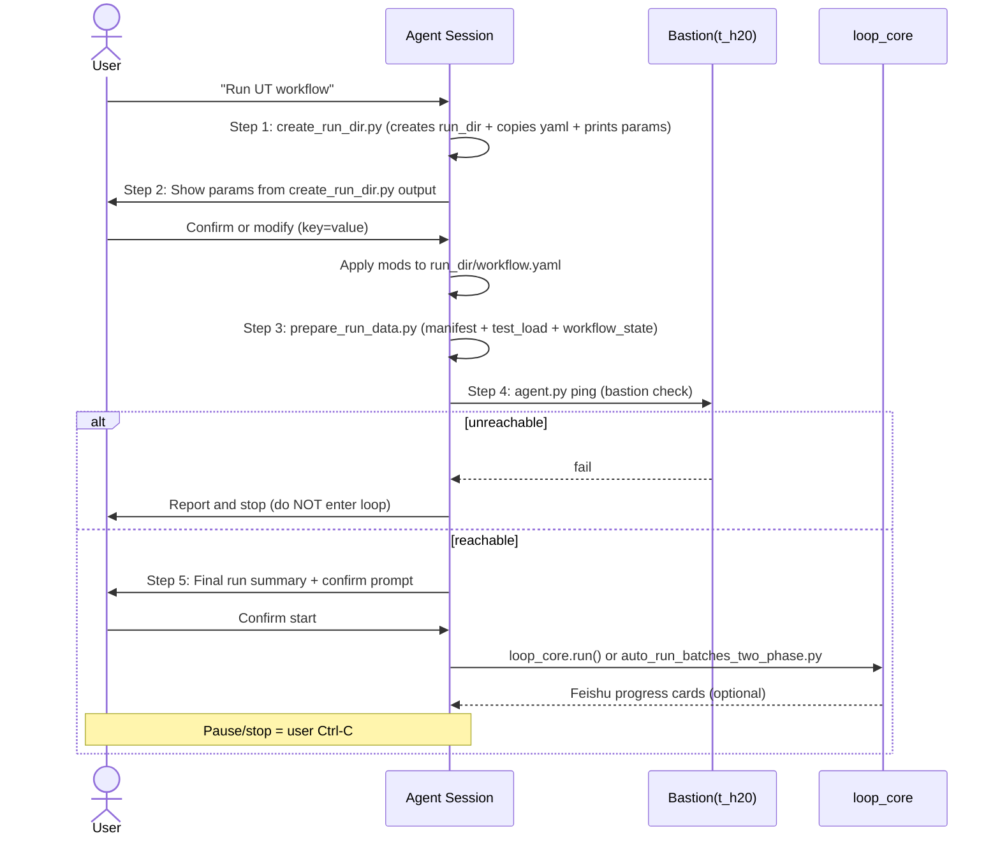

# UT Workflow Skill (v5 — linear supervisor channel)

## Data Flow: test_load = working dataset, manifest = master record

test_load_xxx.json is the **working dataset** for the current run. All stages
(2-4.5) read and write test_load during the loop. manifest.json is the **master
record**, updated only once when test_load is fully processed (pending == 0).

This avoids polluting manifest.json with intermediate failure states and
keeps statistics stable until the run completes.

### Pipeline overview

```
Init: collect (manifest from test_list or manifest_source)
  |
  v
Stage 1: generate test_load (extract N tests from manifest)
  |
  v
[Loop] Stage 2: select_batch -> Stage 3: execute (remote pytest) 
       -> Stage 4: handle_failures -> Stage 4.5: update_test_load
       Loop Stage 2-4.5 until test_load pending == 0
  |
  v
Stage 5: sync test_load -> manifest (update_manifest_from_test_load.py)
```

### Stage 1: test_load generation

1. Call generate_test_load.py to extract a subset from manifest
2. Generates test_load_{count}_{timestamp}.json
3. Updates workflow_state.json with the test_load path
4. All subsequent stages operate on test_load

```bash
python tasks/ut/scripts/generate_test_load.py \
    --manifest-path runs/ut-{timestamp}/manifest.json \
    --count 1000 \
    --output-dir runs/ut-{timestamp} \
    --workflow-state runs/ut-{timestamp}/workflow_state.json
```

### Stage 2: batch selection (generate_batch.py)

Reads test_load, selects next batch of pending tests. Normal tests first,
distributed tests when no normal tests remain.

### Stage 3: batch execution (execute_batch.py)

Runs pytest remotely on GPU server. Normal batch: 1 GPU/test. Distributed
batch: torchrun with gpu_per_test GPUs/test.

### Stage 4: failure handling (failure-handler)

Reads batch_results.json, classifies failures, produces handled_tests.json
with retry/ignore/fix decisions.

### Stage 4.5: test_load update (update_test_load_two_phase.py)

Applies v5 merge to test_load: retry_count++, retriable_error->ignored,
handled overrides. Updates workflow_state.json batch status.

### Stage 5: post-loop manifest sync

When test_load pending == 0, sync results back to manifest.json:

```bash
python skills/ut/manifest-updater/scripts/update_manifest_from_test_load.py \
    --manifest-path <run_dir>/manifest.json \
    --test-load-path <run_dir>/test_load_xxx.json
```

### State updates during the loop

- **Per-batch**: update_test_load_two_phase.py updates test_load (v5 merge: retry_count,
  retriable_error->ignored, handled_tests overrides) + workflow_state.json
  (batch status -> completed).
- **Post-loop**: update_manifest_from_test_load.py syncs test_load -> manifest.json
  (requires pending == 0 in test_load).

### Retry / Resume

- Input: workflow_state.json + test_load_xxx.json (NOT manifest.json)
- Phase 2 operates within test_load scope

## Startup Flow - 5-Step Script-Driven Sequence

> **HARD REQUIREMENT**: Each step below runs a DEDICATED script.
> Do NOT improvise, merge, or skip steps. The entire flow is designed so that
> the Agent only orchestrates and presents information - the scripts handle all
> file creation, copy, and generation.

---

### Step 1: Create Run Dir + Copy workflow.yaml (scripted)

Run the dedicated creation script **before** showing any params to the user:

```bash
python skills/ut/terminal-workflow/scripts/create_run_dir.py \
    --workflow-yaml <source_workflow_yaml> \
    --mode terminal
```

This script:
1. Creates `runs/ut-{timestamp}/` (run_dir)
2. Copies `workflow.yaml` to `run_dir/workflow.yaml` (original NEVER modified)
3. Creates `batches/`, `logs/`, `reports/` subdirs
4. Updates `.agents/current_run.json` pointer
5. Prints a YAML block with RUN_DIR path + key parameter summary

**Output format** (agent reads this to show to user):
```
---
run_dir: runs/ut-20260715-123456
params:
  test_list_path: /path/to/test_list.txt
  manifest_source: null
  execution_strategy: two-phase
  test_load_count: 1000
  batch_size: 8
  max_retry: 3
  resume_from: null
...
```

> For resume (`resume_from` is set): SKIP this step, use existing run_dir.
> The script does NOT create manifest.json, workflow_state.json, or test_load yet.

---

### Step 2: Parameter Confirmation (Agent interaction)

Read config from `run_dir/workflow.yaml` (the copy, NOT the original), display to user:

| Parameter | yaml key | Source | Description |
|-----------|----------|--------|-------------|
| test_list path | input_filter.test_list_path | Step 1 output | test_list.txt (read-only reference) |
| manifest source | input_filter.manifest_source | Step 1 output | manifest.json (read-only reference) |
| execution strategy | workflow.execution_strategy | Step 1 output | single-phase / two-phase |
| test_load count | workflow.test_load.count | Step 1 output | tests to extract from manifest |
| batch_size | config.batch_size | Step 1 output | tests per batch |
| max_retry | config.max_retry_per_test | Step 1 output | max retries per test |
| resume | config.resume_from | Step 1 output | empty=new, path=resume |

**AI behavior (deterministic - no improvisation):**
1. Read `run_dir/workflow.yaml` (or use the YAML block from Step 1)
2. Render the parameter table to user
3. Wait for user: "confirm" or "<key>=<value>"
4. Apply modifications to `run_dir/workflow.yaml` using yaml.safe_load + write back
5. If user changed `test_list_path` or `manifest_source`, note this for Step 3

> Do NOT call prepare_run_data.py yet. Do NOT call generate_test_load.py yet.
> The data files are created in Step 3 after all params are final.

---

### Step 3: Prepare Data Files - manifest + test_load + workflow_state (scripted)

After user confirms all params, run the unified data preparation script:

```bash
python skills/ut/terminal-workflow/scripts/prepare_run_data.py \
    --run-dir <run_dir> \
    [--test-list <override_path>] \
    [--manifest-source <override_path>] \
    [--test-load-count <N>] \
    --mode terminal
```

This single script REPLACES the old multi-step dance (manifest copy/gen, init_workflow_state, generate_test_load):

1. Reads final config from `run_dir/workflow.yaml`
2. Copies `manifest_source` into `run_dir/manifest.json`, OR
   copies `test_list.txt` to `run_dir/` and generates `manifest.json` from it
3. Creates `workflow_state.json` with schema validation
4. Calls `tasks/ut/scripts/generate_test_load.py` to generate test_load
5. Updates workflow_state.json with test_load path
6. Prints a YAML summary of all created files

**Output format:**
```
---
run_dir: runs/ut-20260715-123456
manifest: runs/ut-20260715-123456/manifest.json
test_list: runs/ut-20260715-123456/test_list.txt
workflow_state: runs/ut-20260715-123456/workflow_state.json
test_load: runs/ut-20260715-123456/test_load_1000_20260715_123456.json
total_tests: 1000
test_load_count: 1000
batch_size: 8
execution_strategy: two-phase
resume_from: null
...
```

> If user overrode `test_list_path` or `manifest_source` in Step 2, pass
> `--test-list` or `--manifest-source` accordingly. The script handles the rest.
> For resume: SKIP this step entirely (data files already exist in run_dir).

---

### Step 4: Bastion Check (scripted)

> **terminal-workflow does NOT use Feishu OTP.** `_setup_bastion()` triggers Feishu-based
> OTP flow which is inappropriate here. Instead, verify the agent.py SSH daemon is alive.

The agent.py daemon must be running on the Windows host (started via `serve`). Check it:

```bash
python tools/agent.py --profile t_h20 ping
```

On success (Daemon is running), optionally verify the remote is reachable:

```bash
python tools/agent.py --profile t_h20 run "hostname"
```

On Permission denied or SSH errors, ask the user to re-authenticate the bastion daemon
and retry. Do NOT enter the loop if unreachable.

**Note for future runs:** The daemon persists across runs on the same machine. Only check
once per session; skip if already verified.

---

### Step 5: Final User Confirmation + Strategy Branch (Agent interaction + strategy)

Present a final summary to the user and wait for explicit confirmation:

```text
=== Run Summary ===
  run_dir:        <run_dir>
  manifest:       <manifest_path>  (N tests)
  test_load:      <test_load_path> (M tests)
  strategy:       <execution_strategy>
  batch_size:     <batch_size>
  bastion:        connected / unreachable

Start execution? (y/N):
```

**On user confirms:** enter the strategy branch:

- single-phase: Enter loop_core.run() with the 4 Worker SKILLs:
  - Stage 2: generate_batch.py reads test_load, selects batch
  - Stage 3: execute_batch.py runs remote pytest
  - Stage 4: failure-handler produces handled_tests.json
  - Stage 4.5: update_test_load.py applies v5 merge to test_load
  - Repeat until test_load pending == 0

- two-phase:
```bash
python tasks/ut/scripts/auto_run_batches_two_phase.py \
    --workflow-yaml <run_dir>/workflow.yaml \
    --run-dir <run_dir>
```
Phase 1 completes, then invoke two-phase-handler SKILL for Phase 2
(statistical analysis + human decision + retry).

**On user declines:** exit without starting the loop.

## Trigger flow (this channel)



## Summary: What changed

| Old (Agent improvised) | New (Script-driven) |
|------------------------|---------------------|
| init_workflow_state.py does everything at once | create_run_dir.py (dir only) + prepare_run_data.py (data files) split at param confirmation boundary |
| generate_test_load.py called manually by agent | prepare_run_data.py calls it internally |
| Params shown ad-hoc from yaml | create_run_dir.py prints structured YAML block for agent to display |
| Bastion check separate, no final confirm | Step 5: run summary + explicit user confirmation before starting loop |
## Channel guarantees (v5 simplifications)

- **One-way Feishu.** Progress / completion / alert cards only. No
  subscribe, no callback server, no remote command intake.
- **No automatic Bastion recovery.** If the executor returns
  `next_action == "wait"`, this channel logs + alerts and polls
  `ssh ping` until the user re-authenticates manually.
- **No state machine.** `current_stage` is a breadcrumb in
  `workflow_state.json`, not a guard. The loop body owns ordering.
- **No user-command channel.** `check_user_commands()` returns `[]`.
  Pause/stop is the user pressing Ctrl-C in this session.

---


### Step 6: Post-loop (sync test_load to manifest)

When test_load pending == 0:
```bash
python skills/ut/manifest-updater/scripts/update_manifest_from_test_load.py \
    --manifest-path <run_dir>/manifest.json \
    --test-load-path <run_dir>/test_load_xxx.json
```
Syncs test_load results back to manifest.json (master record).

## Channel callbacks (passed to `loop_core.run`)

### `handle_checkpoint(state, test_load)`
Send a Feishu progress card via `ut_runner.send_feishu_card(
feishu, "progress", test_load, iteration, batch_id=batch_id, mode="linear")`.
On high error rate, switch to event `"alert"`. Bump `iteration` and
`last_update` on `state_path` while you're here.

### `handle_bastion_disconnect(reason)`
1. Log `"[ut-workflow] bastion disconnect: {reason}"` to console.
2. Send Feishu `"alert"` card with the reason.
3. Poll `bastion.ensure_connected()` every `bastion.heartbeat_interval`
   seconds. **Do not auto-reconnect** — the user re-authenticates the
   daemon out-of-band.
4. When `ensure_connected()` returns `True`, return control to the loop
   (do NOT mutate `state.flags`).

### `check_user_commands()`
Returns `[]`. Linear OpenCode has no out-of-band command channel — the
user interacts via this Claude session, and Ctrl-C is the pause/stop
signal handled by `loop_core`'s `KeyboardInterrupt` path.

### `check_terminal_conditions(state, test_load)`
Delegate to `ut_runner.check_stop_conditions(state_path)`:
- `pending == 0 and running == 0` → `(True, "pending_count == 0", "completed")`
- otherwise `(False, "", "")`

---

## Fallback: missing Worker SKILL

If `loop_core` reports that a Worker SKILL reference was missing and it
had to reload from disk, accept it silently and continue. No restart, no
state mutation. The user is told only if the reload itself fails.

---

## What this SKILL deliberately does NOT do

- Does not start the Bastion daemon (only `ensure_connected`).
- Does not call `stage_select_batch / stage_execute / stage_handle_failures
  / stage_update_status`. Those functions were deleted in Phase 8 — the
  Worker SKILLs (loaded above) own the per-stage logic, invoked by
  `loop_core`.
- Does not write to the Hermes Kanban board. Kanban is `hermes-workflow`'s
  responsibility.
- Does not consume Feishu webhooks / OTP callbacks.

---

## When to switch channels

If the user asks for any of the following, route them to
`hermes-workflow` instead:
- Unattended / overnight runs.
- Parallel executor / fixer workers.
- Kanban progress board.
- OTP-driven Bastion auto-recovery.

Those features live in Plan 2 and require the Hermes Agent + Gateway
profiles documented in `tasks/ut/docs/guides/ut-runner.md`, with
systemd deployment covered by `tasks/ut/docs/guides/hermes-supervisor-service.md`
(ut-supervisor agent) and `tasks/ut/docs/guides/hermes-gateway-service.md`
(3 gateway instances).

---

## Workflow-level Retry（整批重跑）

当workflow停止后（完成/人工停止/错误超阈值），重新执行failed/error batches：

**输入文件：**
- `workflow_state.json` — batch执行状态
- test_load_xxx.json - 测试清单（工作数据集，非manifest.json）

**调用SKILL：** `two-phase-handler`
- **Phase 2 Stage 1**: 统计分析失败batch
- **Phase 2 Stage 2**: 执行重试（需人工决策）

**触发条件：**
- Workflow状态为 `stopped` 或 `completed` 且有failed/error tests
- 用户请求"重跑失败的batch"

**相关文档：** `skills/ut/shared/two-phase-handler/SKILL.md`

---

## 硬性约束（不可违反）

### ⚠️ Agent 必须逐 stage 执行

**terminal-workflow Agent 必须逐 stage 执行，不得编写批量自动化脚本！**

正确流程：
1. 执行一个 stage（如 generate_batch）
2. 检查 STAGE COMPLETED 输出
3. 检查 workflow_state.json 状态
4. 输出状态报告给用户
5. 根据状态决策下一步

错误流程：
❌ 编写 Python 脚本批量执行多个 stage
❌ 使用循环自动化整个 workflow
❌ 跳过状态检查步骤

### ⚠️ 自检补救机制

**terminal-workflow 在每个 stage 后应自检 workflow_state.json 是否更新！**

如果发现未更新，应：
1. 输出警告：[WARN] Workflow State NOT UPDATED
2. 手动调用 update_workflow_state() 补救
3. 输出补救后的状态

**建议使用 loop_executor.py 工具**，它已内置自检补救逻辑。

### ⚠️ 用户中断检查点

**Agent 每执行 10 个 batch 后，必须暂停并输出检查报告！**

用户可随时输入 "pause" 或 "stop" 中断执行。

---

*版本: 5.1.0*
