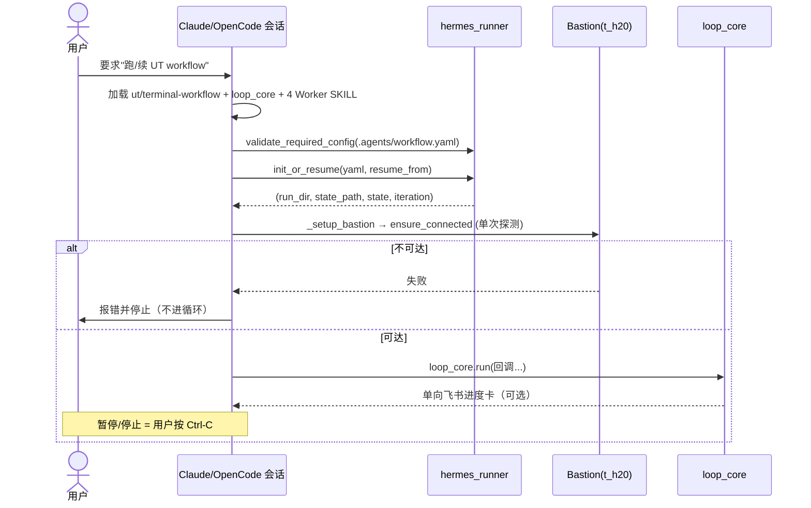

# UT Workflow Skill (v5 — linear supervisor channel)

## Stage 0: 环境选择（新增）

当用户触发"开始运行单元测试"：

**AI行为：**
1. 提示用户选择运行环境：
   - 测试环境（l1~l4）
   - 生产环境
2. 等待用户确认
3. 根据确认调用load_deployment_config
4. 复制模板到runs/ut-{timestamp}/workflow.yaml

**相关文档：**
- tasks/ut/docs/designs/2026-06-29-ut-workflow-config-management-and-merge-batch-design.md

> Channel: OpenCode / Claude Code, **linear mode** (one supervisor session
> drives Stages 2–5 in-process).
> For production / unattended / multi-worker runs, use the `hermes-workflow`
> channel (Plan 2: Hermes Agent + Kanban + 3 Worker profiles).
>
> Design spec: `tasks/ut/docs/designs/2026-06-18-hermes-workflow-dual-channel-design.md`

This SKILL is one of two channels that share the same loop body
(`skills/ut/workflow-loop-core/SKILL.md`). It supplies the channel-specific
callbacks; it does NOT re-implement the loop.

> 两个通道的对照、触发与环境总览见
> `tasks/ut/docs/guides/ut-channels-overview.md`。

## Trigger flow (this channel)

---

## Channel guarantees (v5 simplifications)

- **One-way Feishu.** Progress / completion / alert cards only. No
  subscribe, no callback server, no remote command intake.
- **No automatic Bastion recovery.** If the executor returns
  `next_action == "wait"`, this channel logs + alerts and polls
  `ssh ping` until the user re-authenticates manually.
- **No state machine.** `current_stage` is a breadcrumb in
  `workflow_state.json`, not a guard. The loop body owns ordering.
- **No user-command channel.** `check_user_commands()` returns `[]`.
  Pause/stop is the user pressing Ctrl-C in this Claude session.

---

## Startup (Agent runs these in order, once)

1. **Load SKILLs (once per session):**
   - this SKILL (`skills/ut/terminal-workflow/SKILL.md`)
   - `skills/ut/workflow-loop-core/SKILL.md`
   - the 4 Worker SKILLs:
     - `skills/ut/batch-selector/SKILL.md`
     - `skills/ut/unit-test-executor/SKILL.md`
     - `skills/ut/failure-handler/SKILL.md`
     - `skills/ut/manifest-updater/SKILL.md`

2. **Read config:** `.agents/workflow.yaml` (path may be overridden).
   Validate with `hermes_runner.validate_required_config(cfg, channel="linear")`.

3. **Init or resume the run:**
   - New run → `hermes_runner._init_or_resume(workflow_yaml, None)`
   - Resume → `hermes_runner._init_or_resume(workflow_yaml, resume_from)`
   Both return `(run_dir, state_path, state, iteration)`.

4. **Verify bastion ping** (single, blocking probe — no daemon spawn):
   - `hermes_runner._setup_bastion(...)` performs `ensure_connected`.
   - If unreachable, surface the failure to the user and stop. Do NOT
     enter the loop.

5. **Enter the loop:** call `loop_core.run(...)` with the callbacks
   defined below.

---

## Channel callbacks (passed to `loop_core.run`)

### `handle_checkpoint(state, manifest)`
Send a Feishu progress card via `hermes_runner.send_feishu_card(
feishu, "progress", manifest, iteration, batch_id=batch_id, mode="linear")`.
On high error rate, switch to event `"alert"`. Bump `iteration` and
`last_update` on `state_path` while you're here.

### `handle_bastion_disconnect(reason)`
1. Log `"[ut-workflow] bastion disconnect: {reason}"` to console.
2. Send Feishu `"alert"` card with the reason.
3. Poll `bastion.ensure_connected()` every `bastion.heartbeat_interval`
   seconds. **Do not auto-reconnect** — the user re-authenticates the
   daemon out-of-band.
4. When `ensure_connected()` returns `True`, return control to the loop
   (do NOT mutate `state.flags`).

### `check_user_commands()`
Returns `[]`. Linear OpenCode has no out-of-band command channel — the
user interacts via this Claude session, and Ctrl-C is the pause/stop
signal handled by `loop_core`'s `KeyboardInterrupt` path.

### `check_terminal_conditions(state, manifest)`
Delegate to `hermes_runner.check_stop_conditions(state_path)`:
- `pending == 0 and running == 0` → `(True, "pending_count == 0", "completed")`
- otherwise `(False, "", "")`

---

## Fallback: missing Worker SKILL

If `loop_core` reports that a Worker SKILL reference was missing and it
had to reload from disk, accept it silently and continue. No restart, no
state mutation. The user is told only if the reload itself fails.

---

## What this SKILL deliberately does NOT do

- Does not start the Bastion daemon (only `ensure_connected`).
- Does not call `stage_select_batch / stage_execute / stage_handle_failures
  / stage_update_status`. Those functions were deleted in Phase 8 — the
  Worker SKILLs (loaded above) own the per-stage logic, invoked by
  `loop_core`.
- Does not write to the Hermes Kanban board. Kanban is `hermes-workflow`'s
  responsibility.
- Does not consume Feishu webhooks / OTP callbacks.

---

## When to switch channels

If the user asks for any of the following, route them to
`hermes-workflow` instead:
- Unattended / overnight runs.
- Parallel executor / fixer workers.
- Kanban progress board.
- OTP-driven Bastion auto-recovery.

Those features live in Plan 2 and require the Hermes Agent + Gateway
profiles documented in `tasks/ut/docs/guides/hermes-runner.md`, with
systemd deployment covered by `tasks/ut/docs/guides/hermes-supervisor-service.md`
(ut-supervisor agent) and `tasks/ut/docs/guides/hermes-gateway-service.md`
(3 gateway instances).
