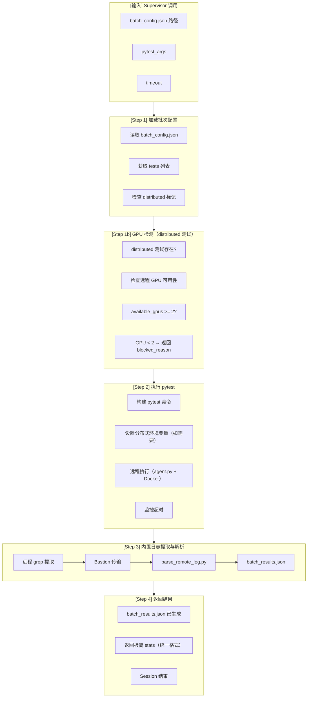

# Unit Test Executor (Worker Agent v3.2)

---

## Worker 角色

```
┌─────────────────────────────────────────────────────────────┐
│  Worker Agent Session (临时，执行后释放)                     │
│                                                             │
│  职责：                                                      │
│  • 读取 batch_config.json                                   │
│  • 检测 distributed 测试和 GPU 可用性                        │
│  • 远程执行 pytest 测试                                      │
│  • 解析测试结果                                              │
│  • 写入 batch_results.json                                  │
│  • 返回极简结果给 Supervisor                                │
│                                                             │
│  输入：batch_config.json                                     │
│  输出：batch_results.json + 极简 stats                       │
│  Session 结束后：Context 释放                                │
│                                                             │
│  ⚠️ GPU 检测职责已从 batch-selector 移至本 Stage            │
└─────────────────────────────────────────────────────────────┘
```

---

## 流程图



> **v3.2**: Step 3 日志提取已内置为 stage 核心行为，不再是可选的 post_action

---

## 输入输出

### 输入（从 Supervisor context 获取）

| 字段 | 来源 | 说明 |
|------|------|------|
| `workflow_state_path` | Supervisor context | 状态文件路径 |
| `batch_config_path` | workflow.yaml | 批次配置路径 |
| `pytest_args` | workflow.yaml | pytest 参数 |
| `timeout` | workflow.yaml | 超时时间（秒） |

### 输出

| 类型 | 内容 | 说明 |
|------|------|------|
| **文件** | batch_results.json | 测试结果文件 |
| **返回** | stats (极简) | 给 Supervisor 的返回值 |

---

## 执行流程

### Step 1: 加载批次配置

```python
import json
import yaml
from pathlib import Path

# 从 workflow.yaml 读取路径配置（不硬编码）
workflow_config = yaml.safe_load(Path(".agents/workflow.yaml").read_text())
paths = workflow_config["config"]

# 读取 batch_config
batch_config_path = paths["batch_config_path"]
batch_config = json.loads(Path(batch_config_path).read_text())

tests = batch_config["tests"]
batch_id = batch_config["batch_id"]
distributed_count = batch_config.get("distributed_count", 0)

# 判断是否有 distributed 测试
has_distributed = distributed_count > 0
```

### Step 1b: GPU 检测（distributed 测试需要）

```bash
# 仅当 distributed 测试存在时检测 GPU
if has_distributed:
    # 通过 agent.py 检查远程 GPU
    python agent.py -p t_h20 run --timeout 30 "
        sudo docker exec v0.13.0_torch2.5.1_compile bash -c '
            nvidia-smi --query-gpu=index,memory.used,memory.total --format csv,noheader |
            awk -F, \"{usage=\$2/\$3; if (usage < 0.1) print GPU \$1: available}\" 
        '
    "
```

```python
# 解析 GPU 可用性
def parse_gpu_output(output):
    available = len([line for line in output.splitlines() if "available" in line])
    return available

available_gpus = parse_gpu_output(gpu_output) if has_distributed else 999  # normal 测试不需要 GPU

# GPU 不足时返回 blocked_reason
if has_distributed and available_gpus < 2:
    return {
        "stats": {"passed": 0, "failed": 0, "ignored": 0, "error": 0, "pending": 0},
        "next_action": "wait",
        "error": None,
        "blocked_reason": f"distributed 测试需要 2+ GPU，当前可用 {available_gpus} 个"
    }
```

### Step 2: 执行 pytest（远程）

```bash
# 构建 pytest 命令
test_nodes = [t["test_node"] for t in tests]
pytest_cmd = f"pytest {' '.join(test_nodes)} -q --tb=long"

# distributed 测试环境变量（GPU 检测已通过）
if has_distributed and available_gpus >= 2:
    env_vars = "MASTER_ADDR=localhost MASTER_PORT=29500 WORLD_SIZE=2"
    pytest_cmd = f"{env_vars} {pytest_cmd}"

# 通过 agent.py 远程执行
python agent.py -p t_h20 run --timeout 3600 "
    sudo docker exec v0.13.0_torch2.5.1_compile bash -c '
        cd /gpfs/gcsp/M2.7_verify/vllm &&
        {pytest_cmd} 2>&1 | tee ut_logs/{batch_id}.log
    '
"
```

### Step 3: 解析 pytest 输出（远程日志提取）

**v3.2 新增功能**：通过 bastion 远程 grep 提取结果，本地解析生成 batch_results.json


**执行方式**：

```bash
# 方式 1：使用 run_batch.py --with-results（推荐）
python run_batch.py --tests ... --with-results --output-dir ./results

# 方式 2：仅提取已有日志
python run_batch.py --extract-only /gpfs/.../ut_logs/phase1/batch_001.log

# 方式 3：手动调用 parse_remote_log.py
python agent.py -p t_h20 run "grep -E '(PASSED|FAILED|ERROR)' {log_file}" |
    python parse_remote_log.py --stdin --batch-id {batch_id} --output batch_results.json
```

**核心脚本**：

| 脚本 | 功能 |
|------|------|
| `run_batch.py` | 新增 `--with-results`, `--extract-only` 选项 |
| `parse_remote_log.py` | 解析 grep 输出，生成 batch_results.json |
| `agent.py` | Bastion SSH daemon，远程执行 grep |

**错误分类映射**：

| C/E/D/P/M/S | batch_results error_type |
|-------------|--------------------------|
| C (Code Bug) | `functional` |
| E (Environment) | `other` |
| D (Dependency) | `dependency` |
| P (Platform) | `resource` |
| M (Model) | `download_error` |

**Bastion 传输限制**：
- recv buffer: 65535 bytes (~65KB)
- 建议单批次传输 (<50KB)，避免全量传输

### Step 4: 写入文件并返回

```python
# batch_results 结构
batch_results = {
    "batch_id": batch_id,
    "executed_at": datetime.now().isoformat(),
    "tests": results["passed"] + results["failed"] + results["error"],
    "stats": {
        "passed": len(results["passed"]),
        "failed": len(results["failed"]),
        "error": len(results["error"]),
        "total": len(tests)
    },
    "log_file": f"/gpfs/gcsp/M2.7_verify/vllm/ut_logs/{batch_id}.log"
}

# 写入 batch_results.json（路径从 workflow.yaml 读取）
batch_results_path = paths["batch_results_path"]
Path(batch_results_path).write_text(json.dumps(batch_results, indent=2))

# 返回极简结果给 Supervisor（统一格式）
return {
    "stats": {
        "passed": len(results["passed"]),
        "failed": len(results["failed"]),
        "ignored": 0,
        "error": len(results["error"]),
        "pending": 0
    },
    "next_action": "continue",
    "error": None,
    "blocked_reason": None
}
```

---

## 返回格式规范（统一）

```json
{
  "stats": {
    "passed": 40,
    "failed": 8,
    "ignored": 0,
    "error": 2,
    "pending": 0
  },
  "next_action": "continue",
  "error": null,
  "blocked_reason": null
}
```

**注意：只返回统一字段，不返回 batch_id、log_file、details_file 等额外字段**

---

## distributed 测试处理

|| 场景 | GPU 可用 | 动作 |
||------|:--------:|------|
|| distributed + GPU ≥ 2 | ≥ 2 | 设置分布式环境变量执行 |
|| distributed + GPU < 2 | < 2 | **返回 blocked_reason**，next_action="wait" |
|| normal tests | - | 直接执行（无需 GPU 检测） |

**注意：GPU 检测职责已从 batch-selector 移至本 Stage**

---

## 错误分类概览

| 类别 | 说明 | 处理策略 |
|------|------|----------|
| **dependency** | Python 包缺失 | 由 Stage 4 处理 |
| **network** | 网络超时 | 由 Stage 4 处理 |
| **resource** | GPU/内存不足 | 由 Stage 4 处理 |
| **version** | PyTorch API 缺失 | 由 Stage 4 处理 |
| **functional** | 代码逻辑失败 | 由 Stage 4 处理 |
| **other** | 其他错误 | 由 Stage 4 处理 |

> Stage 3 只负责执行和分类，**不处理错误**（由 Stage 4 failure-handler 处理）

---

## 前置/后置任务

| 类型 | 任务 | 说明 |
|------|------|------|
| **前置** | Supervisor 调用 | delegate_task 触发 |
| **前置** | batch_config.json 存在 | Stage 2 输出 |
| **前置** | 远程容器可用 | t_h20 + Docker |
| **后置** | batch_results.json 写入 | 输出文件 |
| **后置** | 返回 stats + batch_id | 极简返回值 |
| **后置** | Supervisor 继续 Stage 4 | handle_failures |

---

## Pitfalls（关键陷阱）

| # | 问题 | 说明 | 解决方案 |
|---|------|------|----------|
| 1 | **容器选择错误** | 使用错误容器 | 使用 `v0.13.0_torch2.5.1_compile` |
| 2 | **distributed GPU** | 单 GPU 执行 distributed | 检测 GPU ≥ 2 才执行 |
| 3 | **SSH 超时** | agent.py foreground 最大 300s | 长测试用 background |
| 4 | **pytest 参数** | `-v` 输出太多 | 用 `-q --tb=long` |
| 5 | **路径前缀重复** | `tests/tests/...` | 检查路径前缀 |

---

## 注意事项

1. **容器版本固定**：必须使用 `v0.13.0_torch2.5.1_compile`
2. **distributed GPU 检测**：执行前检测 GPU 可用性（已从 batch-selector 移至本 Stage）
3. **GPU 不足时返回 blocked_reason**：不跳过批次，而是返回 blocked_reason 让 Supervisor 处理
4. **超时管理**：单批次最大 3600 秒
5. **极简返回**：只返回 stats 数字，不返回详细错误
6. **错误不处理**：Stage 3 只分类，Stage 4 处理

---

## 禁止操作

- ❌ 不返回详细错误信息（只返回 stats）
- ❌ 不处理错误（让 Stage 4 处理）
- ❌ 不发送飞书通知（让 Supervisor 发送）
- ❌ 不修改 manifest.json（让 Stage 5 修改）
- ❌ 不下载依赖/模型
- ❌ 不在本地执行 pytest
- ❌ 不返回 batch_id/log_file/details_file 等额外字段（只返回统一格式）

---

## 相关文档

- [workflow.yaml](../../.agents/workflow.yaml) - Workflow 配置
- [workflow/SKILL.md](../workflow/SKILL.md) - Supervisor 调度逻辑
- [batch-selector/SKILL.md](../batch-selector/SKILL.md) - 上游 Stage（已移除 GPU 检测）
- [failure-handler/SKILL.md](../failure-handler/SKILL.md) - 下游 Stage
- [parse_remote_log.py](scripts/parse_remote_log.py) - **新增**: 远程日志解析脚本
- [run_batch.py](scripts/run_batch.py) - **更新**: 新增 `--with-results`, `--extract-only`
- [agent.py](../../tools/agent.py) - Bastion SSH daemon

---

*创建日期: 2026-06-09*
*更新日期: 2026-06-11*
*版本: 3.2.0*