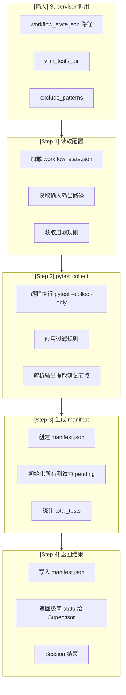

# UT Test Collector (Worker Agent v2.1)

---

## Worker 角色

```
┌─────────────────────────────────────────────────────────────┐
│  Worker Agent Session (临时，执行后释放)                     │
│                                                             │
│  职责：                                                      │
│  • 收集 vLLM 单元测试列表                                    │
│  • 应用过滤规则                                              │
│  • 生成 manifest.json                                       │
│  • 返回极简结果给 Supervisor                                │
│                                                             │
│  输入：从 workflow_state.json 获取路径                       │
│  输出：写入 manifest.json + 返回极简 stats                   │
│  Session 结束后：Context 释放                                │
└─────────────────────────────────────────────────────────────┘
```

---

## 流程图



---

## 输入输出

### 输入（从 Supervisor context 获取）

| 字段 | 来源 | 说明 |
|------|------|------|
| `workflow_state_path` | Supervisor context | 状态文件路径 |
| `vllm_tests_dir` | workflow.yaml | 测试目录路径 |
| `exclude_patterns` | workflow.yaml | 过滤规则列表 |
| `manifest_path` | workflow.yaml | 输出文件路径 |

### 输出

| 类型 | 内容 | 说明 |
|------|------|------|
| **文件** | manifest.json | 测试状态文件 |
| **返回** | stats (极简) | 给 Supervisor 的返回值 |

---

## 执行流程

### Step 1: 读取配置

```python
import json
from pathlib import Path

# 从 workflow_state.json 读取路径配置（不硬编码）
from shared.config_loader import get_paths
paths = get_paths(workflow_state_path)

# 获取配置
manifest_path = paths["manifest"]
```

### Step 2: pytest collect（远程执行）

```bash
# 在 t_h20 容器内执行
python agent.py -p t_h20 run "
    sudo docker exec v0.13.0_torch2.5.1_compile bash -c '
        cd /gpfs/gcsp/M2.7_verify/vllm &&
        pytest tests/ \
            --ignore-glob=\"tests/**/rocm*\" \
            --ignore-glob=\"tests/**/tpu*\" \
            --ignore-glob=\"tests/**/multimodal*\" \
            --ignore-glob=\"tests/**/nixl*\" \
            --ignore-glob=\"tests/**/ec_connector*\" \
            --ignore-glob=\"tests/**/*image*.py\" \
            --ignore-glob=\"tests/**/*video*.py\" \
            --ignore-glob=\"tests/**/*audio*\" \
            --ignore-glob=\"tests/**/encoder*\" \
            --ignore-glob=\"tests/**/prithvi*\" \
            --collect-only -q 2>&1
    '
"
```

### Step 3: 解析输出生成 manifest

```python
def parse_pytest_output(output):
    """解析 pytest --collect-only 输出"""
    tests = []
    for line in output.split('\n'):
        if line.startswith('tests/'):
            # 解析测试节点
            test_node = line.strip()
            test_file = test_node.split('::')[0] if '::' in test_node else test_node
            tests.append({
                "id": len(tests) + 1,
                "test_node": test_node,
                "test_file": test_file,
                "test_name": test_node.split("::")[-1] if "::" in test_node else "",
                "status": "pending",
                "priority": "P2",
                "batch_id": None,
                "run_count": 0,
                "last_run_at": None,
                "last_duration_ms": None,
                "last_exit_code": None,
                "error_type": None,
                "error_message": None,
                "ignored_reason": None,
                "fix_applied": False,
                "fix_details": None,
                "log_file": None,
                "errors": [],      # 错误历史追踪
                "failures": []     # 断言失败历史
            })
    return tests

# 生成 manifest
manifest = {
    "version": "2.0",
    "generated_at": datetime.now().isoformat(),
    "source": "pytest_collect",
    "filter_rules": exclude_patterns,
    "tests": tests,
    "resolved_errors": {},      # 已解决错误聚合索引
    "resolved_failures": {},    # 已解决失败聚合索引
    "statistics": {
        "total": len(tests),
        "executed": 0,
        "progress": 0,
        "pass_rate": 0,
        "pending": len(tests),
        "passed": 0,
        "failed": 0,
        "error": 0,
        "ignored": 0
    }
}
```

### Step 4: 写入文件并返回

```python
# 写入 manifest.json
Path(manifest_path).write_text(json.dumps(manifest, indent=2))

# 返回极简结果给 Supervisor（统一格式）
return {
    "stats": {
        "passed": 0,
        "failed": 0,
        "ignored": 0,
        "error": 0,
        "pending": len(tests)
    },
    "next_action": "continue",
    "error": None,
    "blocked_reason": None
}
```

---

## 返回格式规范（统一）

```json
{
  "stats": {
    "passed": 0,
    "failed": 0,
    "ignored": 0,
    "error": 0,
    "pending": 13165
  },
  "next_action": "continue",
  "error": null,
  "blocked_reason": null
}
```

**注意：只返回统一字段，不返回 details_file 等额外字段**

---

## 前置/后置任务

| 类型 | 任务 | 说明 |
|------|------|------|
| **前置** | Supervisor 调用 | delegate_task 触发 |
| **前置** | 远程容器可用 | t_h20 + Docker 容器 |
| **前置** | Bastion 连接 | agent.py 可用 |
| **后置** | manifest.json 写入 | 输出文件 |
| **后置** | 返回 stats 给 Supervisor | 极简返回值 |
| **后置** | Supervisor 继续 Stage 2 | select_batch |

---

## 注意事项

1. **只执行一次**：collect Stage 不在循环中，只执行一次
2. **远程执行**：pytest collect 在 t_h20 容器内执行
3. **极简返回**：只返回 stats 数字，不返回 manifest 内容
4. **路径标准化**：使用 workflow.yaml 中定义的路径

---

## 禁止操作

- ❌ 不返回 manifest 详细内容（只返回 stats）
- ❌ 不发送飞书通知（让 Supervisor 发送）
- ❌ 不在本地执行 pytest collect
- ❌ 不创建 workspace 目录（由其他 Stage 负责）
- ❌ 不修改 workflow_state.json（让 Supervisor 修改）

---

## 相关文档

- [workflow.yaml](../../.agents/workflow.yaml) - Workflow 配置
- [workflow/SKILL.md](../workflow/SKILL.md) - Supervisor 调度逻辑

---

*创建日期: 2026-06-09*
*更新日期: 2026-06-13*
*版本: 2.1.0*
*版本: 2.0.0*