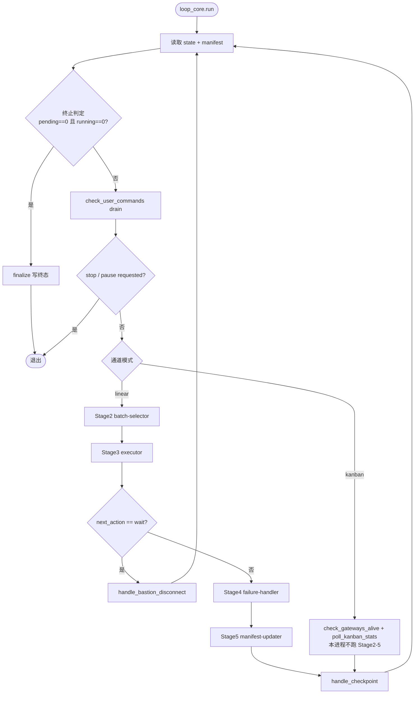

# workflow-loop-core (v5)

> Shared loop body for the dual-channel UT workflow.
> Spec: `tasks/ut/docs/designs/2026-06-18-hermes-workflow-dual-channel-design.md`

The loop body is intentionally channel-agnostic. Channel skills inject
behaviour through callbacks; the core only drives the stage cadence and
terminal conditions.

> 两个通道如何调用本内核、各自如何触发，见
> `tasks/ut/docs/guides/ut-channels-overview.md`。

## Loop at a glance (linear + kanban)



---

## Interface — `loop_core.run(...)`

| Arg | Type | Purpose |
|---|---|---|
| `stage_skills` | `dict[str, SkillRef]` | The 4 Worker SKILLs already loaded by the channel: `batch_selector`, `unit_test_executor`, `failure_handler`, `manifest_updater`. |
| `state_path` | `Path` | `workflow_state.json` for this run. |
| `manifest_path` | `Path` | `manifest.json` for this run. |
| `run_dir` | `Path` | Run root (`runs/<test_name>-<ts>`). |
| `handle_checkpoint` | `callable(state, manifest)` | Called after every successful Stage 5. Channel-specific (Feishu card / kanban update / no-op). |
| `handle_bastion_disconnect` | `callable(reason: str)` | Called when an executor returns `next_action == "wait"` due to bastion loss. Linear-mode: log + Feishu alert + poll until ping recovers. Kanban-mode: no-op (Gateway has its own daemon). |
| `check_user_commands` | `callable() -> list[Command]` | Returns user-initiated commands (pause/resume/stop/reconfigure). Linear OpenCode: returns `[]`. Hermes channel: drains a control queue. |
| `check_terminal_conditions` | `callable(state, manifest) -> (bool, reason, status)` | Returns `(True, reason, "completed"|"stopped"|"failed")` or `(False, "", "")`. |

The callbacks are the **only** channel hooks. No global state, no
implicit Feishu/Kanban knowledge leaks into the core.

---

## Linear-mode algorithm (OpenCode / Claude Code supervisor)

```
while True:
    state, manifest = read(state_path), read(manifest_path)

    # Terminal check first — never start a stage if we're already done
    done, reason, status = check_terminal_conditions(state, manifest)
    if done:
        finalize(state_path, status, reason)
        break

    # Drain user commands (pause / stop / reconfigure)
    for cmd in check_user_commands():
        apply_command(cmd, state_path)
    if state.flags.stop_requested or state.flags.pause_requested:
        break

    # Stage 2 — batch-selector
    batch = run_skill(stage_skills.batch_selector, ...)
    if batch is None:
        continue  # terminal check on next loop will close out

    # Stage 3 — unit-test-executor
    result = run_skill(stage_skills.unit_test_executor, batch, ...)
    if result.next_action == "wait":
        # Executor signalled bastion / resource loss
        handle_bastion_disconnect(result.blocked_reason or "wait")
        continue

    # Stage 4 — failure-handler (branch-aware, skips non-retriable)
    handled = run_skill(stage_skills.failure_handler, result, ...)

    # Stage 5 — manifest-updater
    run_skill(stage_skills.manifest_updater, handled, ...)

    # Checkpoint (channel-specific: Feishu card, kanban tile, log, …)
    handle_checkpoint(read(state_path), read(manifest_path))
```

Iteration counter and `last_update` are bumped after each successful
Stage 5 by the channel's checkpoint or the core (channel decides — both
implementations bump in `handle_checkpoint`).

---

## Kanban-mode algorithm (Hermes channel)

```
while True:
    state, manifest = read(state_path), read(manifest_path)

    done, reason, status = check_terminal_conditions(state, manifest)
    if done:
        finalize(state_path, status, reason)
        break

    for cmd in check_user_commands():
        apply_command(cmd, state_path)
    if state.flags.stop_requested or state.flags.pause_requested:
        break

    # No Stage 2-5 calls here. Workers are running under Hermes Gateway
    # and write their progress into the Kanban board + manifest.
    gateway_status = check_gateways_alive()   # supplied by ut_runner
    kanban_stats   = poll_kanban_stats()      # supplied by ut_runner

    handle_checkpoint(state, manifest)        # channel emits its update
    sleep(poll_interval)
```

The core does not own gateway/board polling — the channel callbacks do.
What this loop guarantees is the terminal check, the user-command drain,
and the checkpoint cadence, in lockstep with linear mode.

---

## Fallback: SKILL reference missing → reload on demand

If `stage_skills[<name>]` is absent (e.g. the channel forgot to wire one
of the four Worker SKILLs, or a hot-reload dropped it), the core MUST:

1. Log a warning naming the missing skill.
2. Re-resolve from disk (`skills/ut/<skill>/SKILL.md`).
3. Insert the resolved reference back into `stage_skills` and continue.

This keeps the loop alive across SKILL hot-edits and guarantees that a
channel can recover from a partial load without restarting the run.

---

## Non-goals

- No state machine. `current_stage` is a breadcrumb, not a guard.
- No Bastion auto-recovery. The core surfaces the symptom via
  `handle_bastion_disconnect`; recovery is a channel concern.
- No retries. `failure-handler` is the only retry policy holder.
