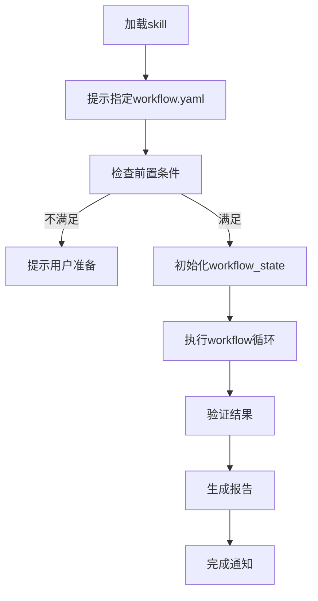

# UT Workflow Skill (v4.0)

---

## 🚀 自主执行流程

### 触发方式

用户加载skill：
```
加载 ut/workflow skill
```

skill自动执行以下流程：

---

### 执行步骤

**Step 1: 提示用户指定workflow.yaml**

skill加载后，立即提示：
> "UT Workflow已加载。请指定workflow.yaml路径（或使用默认路径：.agents/workflow.yaml）"

等待用户提供路径或确认默认。

---

**Step 2: 检查前置条件**

自动检查：
1. Bastion连接状态（agent.py serve t_h20）
2. workflow.yaml文件存在
3. test_list文件存在（根据配置）

如果前置条件不满足：
- Bastion未连接 → 提示用户启动：`python agent.py serve t_h20`
- 文件不存在 → 提示用户准备相应文件

---

**Step 3: 初始化workflow_state.json**

调用初始化脚本：
```bash
python skills/ut/workflow/scripts/init_workflow_state.py \
  --workflow-yaml WORKFLOW_YAML_PATH \
  --test-list TEST_LIST_PATH
```

生成运行目录和初始状态文件。

---

**Step 4: 执行workflow循环**

调用supervisor循环：
```bash
python skills/ut/workflow/scripts/supervisor_loop.py \
  --workflow-yaml WORKFLOW_YAML_PATH \
  --workflow-state WORKFLOW_STATE_PATH
```

自动执行5个Stage循环，直到pending_count == 0。

---

**Step 5: 验证结果并生成报告**

执行完成后，调用验证脚本：
```bash
python tasks/ut/workflow_tests/verify_workflow_test.py \
  --run-dir RUN_DIR \
  --test-list TEST_LIST_NAME
```

生成验证报告，显示通过/失败状态。

---

**Step 6: 完成通知**

通知用户：
> "UT Workflow执行完成。验证报告已生成：{run_dir}/verification_report.json"

---

### 执行流程图



---

### 错误处理

| 错误类型 | 处理方式 |
|---------|---------|
| Bastion未连接 | 提示用户启动agent.py serve |
| workflow.yaml不存在 | 提示用户检查路径 |
| test_list不存在 | 提示用户准备文件或检查配置 |
| workflow执行失败 | 生成失败报告，提示检查日志 |
| 验证失败 | 显示失败详情，建议检查 |

---

## 核心架构

```
┌─────────────────────────────────────────────────────────────┐
│  Supervisor Agent Session (持久)                             │
│                                                             │
│  双重职责：                                                  │
│  ┌─────────────────────┐  ┌─────────────────────┐          │
│  │ Workflow 调度       │  │ Agent 监控          │          │
│  │ • delegate_task     │  │ • 消息路由          │          │
│  │ • state.json管理    │  │ • 心跳检查          │          │
│  │ • Kanban同步        │  │ • 飞书通知          │          │
│  └─────────────────────┘  └─────────────────────┘          │
│                                                             │
│  Context: workflow.yaml + state.json (~10K tokens)          │
└─────────────────────────────────────────────────────────────┘
                          │
                          │ delegate_task (每次 Stage)
                          ▼
┌─────────────────────────────────────────────────────────────┐
│  Worker Agent Session (临时，执行后释放)                     │
│                                                             │
│  • 加载 SKILL.md                                            │
│  • 执行单个 Stage                                           │
│  • 调用脚本 + 判断逻辑 + 修复代码                            │
│  • 返回极简结果给 Supervisor                                │
│  • Session 结束，Context 释放                                │
└─────────────────────────────────────────────────────────────┘
```

---

## 流程图

```mermaid
flowchart TD
    subgraph Supervisor["Supervisor Agent"]
        A["[启动] 用户触发 / 脚本启动"]
        B["[初始化] 读取 workflow.yaml + init_state.json"]
        C["[Stage 1] collect (一次性)"]
        
        subgraph WorkflowLoop["Workflow 循环"]
            D["[判断] pending_count > 0?"]
            E["[Stage 2] select_batch → Worker"]
            F["[Stage 3] execute → Worker"]
            G["[Stage 4] handle_failures → Worker (Agent核心)"]
            H["[Stage 5] update_status → Worker"]
            I["[同步] Kanban + 飞书通知"]
            J["[更新] state.json"]
        end
        
        subgraph MonitorLoop["监控循环（并行）"]
            K["每5秒: Agent状态检查"]
            L["每10秒: 消息轮询路由"]
            M["每30秒: 飞书监听"]
        end
        
        N["[完成] 发送飞书完成通知"]
    end
    
    A --> B --> C --> D
    D -->|是| E --> F --> G --> H --> I --> J --> D
    D -->|否| N
    J -.->|并行| K --> L --> M
```



---

## 职责一：Workflow 调度

### 执行流程

```
Step 1: 初始化
├── 读取 workflow.yaml (配置)
├── 初始化 workflow_state.json
├── 创建 Kanban Board (如果启用)
│
Step 2: 执行 Stage 1 (collect，一次性)
├── delegate_task 启动 Worker
├── Worker: ut-test-collector SKILL.md
├── 收集极简返回值: {pending: N}
├── 更新 state.json
│
Step 3: Workflow 循环
├── while pending_count > 0:
│   ├── 检查 break_conditions
│   │
│   ├── Stage 2: select_batch
│   │   └── delegate_task → batch-selector Worker
│   │   └── 返回: {batch_id, batch_size}
│   │
│   ├── Stage 3: execute
│   │   └── delegate_task → unit-test-executor Worker
│   │   └── 返回: {passed, failed, error} (原始执行结果，不累加)
│   │
│   ├── Stage 4: handle_failures
│   │   └── delegate_task → failure-handler Worker
│   │   └── Worker执行复杂判断 + 代码修复
│   │   └── 返回: {passed, failed, ignored} (修复后结果，不累加)
│   │
│   ├── Stage 5: update_status
│   │   └── delegate_task → manifest-updater Worker
│   │   └── Worker更新 manifest.json
│   │
│   ├── [关键] 从 manifest.json 统一读取 stats（不累加）
│   ├── 同步 Kanban
│   ├── 发送飞书通知 (里程碑/完成)
│   ├── 更新 state.json
│   └── iteration += 1
│
Step 4: 完成
├── 发送飞书完成通知
├── 更新 Kanban (workflow完成)
└── 退出
```

### delegate_task 调用规范

```python
# Supervisor 调用 Worker 的标准方式

from hermes import delegate_task
import yaml
import json
from pathlib import Path

# 从 workflow.yaml 读取路径配置（不硬编码）
workflow_config = yaml.safe_load(Path(".agents/workflow.yaml").read_text())
paths = workflow_config["config"]

# 只传递路径，不传递文件内容
result = delegate_task(
    goal="执行 handle_failures Stage，分析 batch_results.json 中的失败",
    skills=["failure-handler"],
    context=f"""
    workflow_state_path: {paths['workflow_state_path']}
    batch_results_path: {paths['batch_results_path']}
    handled_tests_path: {paths['handled_tests_path']}
    
    iteration: {state['iteration']}
    batch_id: {state['current_batch']['batch_id']}
    """
)

# 只提取必要信息（不累加 stats）
# 注意：stats 在 Stage 5 完成后从 manifest.json 统一读取，此处不累加
next_action = result.get("next_action", "continue")
error = result.get("error")
blocked_reason = result.get("blocked_reason")

# Worker 报错或阻塞时处理
if error or blocked_reason:
    state["flags"]["pause_requested"] = True
    send_feishu(f"Worker问题: {error or blocked_reason}")
```

### Worker 返回格式规范

```json
// Worker 返回给 Supervisor（极简，统一格式）

{
  "stats": {
    "passed": 3,
    "failed": 2,
    "ignored": 1,
    "error": 0,
    "pending": 12599
  },
  "next_action": "continue",  // continue | pause | stop | wait
  "error": null,              // 错误信息（需要人工介入时设置）
  "blocked_reason": null,     // 阻塞原因（resource不足时设置）
  "kanban_update": null       // 可选的 Kanban 更新建议
}
```

**注意：各 Worker 只返回上述统一字段，不返回额外字段（如 batch_id, log_file 等）**

### Context 管理策略

| 操作 | Context 影响 |
|------|-------------|
| 读取 workflow.yaml | 一次性加载，固定大小 |
| 读取 workflow_state.json | 每次循环重读，不累积 |
| delegate_task 返回值 | 只提取 stats，不保留 details |
| 更新 workflow_state.json | 写入文件，不留在 context |

**目标：Supervisor Context 保持 ~10K tokens，稳定不累积**

---

## 职责二：Agent 监控

### 消息轮询（每10秒）

执行流程：

1. **读取各Agent消息队列**
   ```bash
   python scripts/supervisor_message_poll.py
   ```
   输出JSON:
   ```json
   {"processed": 3, "messages": ["bastion_disconnect", ...]}
   ```

2. **路由消息**
   - bastion_disconnect → 发送飞书OTP请求
   - gpu_occupied → 转发给Runner
   - dependency_request → 转发给Environment
   - progress_milestone → 发送飞书进度通知
   - phase_complete → 发送飞书完成通知

### 状态检查（每5秒）

执行流程：

1. **检查各Agent心跳**
   ```bash
   python scripts/supervisor_status_check.py
   ```

2. **检测失联Agent**
   - 心跳超过30秒 → 发送agent_timeout消息
   - 飞书通知用户Agent失联

### 飞书监听（每60秒）

执行流程：

1. **监听飞书群消息**
   ```bash
   python scripts/supervisor_feishu_listen.py
   ```

2. **解析用户指令**
   - `otp 123456` → 转发OTP给Bastion
   - `pause` → 设置 pause_requested = true
   - `resume` → 设置 pause_requested = false
   - `check status` → 发送当前状态

---

## Kanban 同步

### 同步时机

| 触发条件 | 动作 |
|---------|------|
| Stage 5 完成 | 移动 batch lane (Running → Passed/Failed) |
| iteration % 10 == 0 | 更新 workflow card 进度 |
| stats.passed % 100 == 0 | 添加 milestone note |

### Kanban 操作

```python
from hermes import kanban

# 移动 batch lane
kanban.move_lane(
    board="UT Test Progress",
    from_lane=f"batch_{batch_id}",
    to_lane="Passed",
    summary=f"{passed}/{total} passed"
)

# 更新 workflow card
kanban.update_card(
    board="UT Test Progress",
    lane="Workflow Status",
    progress=f"{passed}/{total} ({progress_rate}%)"
)

# 添加 milestone note
kanban.add_note(
    board="UT Test Progress",
    lane="Workflow Status",
    note=f"Milestone: {passed} tests passed!"
)
```

---

## 飞书通知

### 通知场景

| 类型 | 优先级 | 触发条件 | 消息模板 |
|------|:------:|---------|---------|
| batch_completed | P2 | Stage 5 完成 | Batch {batch_id}: {passed}/{total} passed |
| milestone | P1 | passed % 100 == 0 | Milestone: {passed} tests passed! |
| workflow_completed | P0 | pending_count == 0 | Workflow完成: {passed} passed, {failed} failed |
| paused | P0 | break_condition触发 | Workflow暂停: {reason} |
| worker_error | P0 | Worker返回error | Worker错误 ({stage}): {error} |
| bastion_disconnect | P0 | SSH断连 | SSH连接断开，需要OTP |

---

## 循环伪代码

```python
import yaml
import json
from pathlib import Path
from hermes import delegate_task, kanban

# === 初始化 ===
workflow_config = yaml.safe_load(Path(".agents/workflow.yaml").read_text())
state_path = Path(".agents/workflow_state.json")
state = init_workflow_state()

# === Stage 1: collect (一次性) ===
if state["iteration"] == 0:
    result = delegate_task(
        goal="执行 collect Stage",
        skills=["ut-test-collector"],
        context=f"state_path: {state_path}"
    )
    state["stats"]["pending"] = result["stats"]["pending"]
    save_json(state_path, state)

# === Workflow 循环 ===
loop_stages = ["select_batch", "execute", "handle_failures", "update_status"]

while True:
    # 每次循环重新读取 state（避免 context 累积）
    state = load_json(state_path)
    
    # 检查 stop_condition
    if state["stats"]["pending"] <= 0:
        break
    
    # 检查 break_conditions
    for bc in workflow_config["loop"]["break_conditions"]:
        if evaluate_condition(bc["condition"], state):
            if bc["action"] == "pause":
                send_feishu(f"Workflow暂停: {bc['kanban_note']}")
                state["flags"]["pause_requested"] = True
                save_json(state_path, state)
                wait_for_resume_signal()
    
    # 检查暂停标志
    if state["flags"]["pause_requested"]:
        wait_for_resume_signal()
    
    # 执行各 Stage
    for stage_id in loop_stages:
        stage_config = get_stage_config(stage_id, workflow_config)
        
        result = delegate_task(
            goal=f"执行 {stage_id} Stage",
            skills=[stage_config["skill"]],
            context=f"state_path: {state_path}"
        )
        
        # 只提取极简结果
        state["last_worker_result"] = {
            "stats": result.get("stats", {}),
            "next_action": result.get("next_action", "continue"),
            "error": result.get("error"),
            "blocked_reason": result.get("blocked_reason")
        }
        
        # Worker 报错或阻塞时暂停
        if result.get("error"):
            send_feishu(f"Worker错误 ({stage_id}): {result['error']}")
            state["flags"]["pause_requested"] = True
            save_json(state_path, state)
            wait_for_resume_signal()
        
        if result.get("blocked_reason"):
            send_feishu(f"Worker阻塞 ({stage_id}): {result['blocked_reason']}")
            state["flags"]["pause_requested"] = True
            save_json(state_path, state)
            wait_for_resume_signal()
    
    # Stage 5 完成后统一更新 stats（从 manifest.json 读取）
    # stats 不在每个 stage 后累加，而是 Stage 5 完成后从 manifest.json 统一读取
    manifest = load_json(manifest_path)
    state["stats"] = manifest.get("statistics", {
        "passed": 0,
        "failed": 0,
        "ignored": 0,
        "error": 0,
        "pending": 0
    })
    
    # 更新 iteration
    state["iteration"] += 1
    save_json(state_path, state)
    
    # 同步 Kanban
    sync_kanban(state, workflow_config)
    
    # 里程碑通知
    if state["stats"]["passed"] % 100 == 0:
        send_feishu(f"Milestone: {state['stats']['passed']} tests passed!")

# === 完成 ===
send_feishu(f"Workflow完成: {state['stats']['passed']} passed, {state['stats']['failed']} failed")
kanban.update_card(board="UT Test Progress", lane="Workflow Status", status="completed")
```

---

## 输入输出

| 类型 | 内容 | 格式 | 说明 |
|------|------|------|------|
| **输入** | workflow.yaml | YAML | Workflow配置 |
| **输入** | workflow_state.json | JSON | 当前状态 |
| **输入** | inbox.jsonl | JSON Lines | 各Agent消息 |
| **输出** | workflow_state.json | JSON | 更新状态 |
| **输出** | Kanban | Hermes Kanban | 进度同步 |
| **输出** | 飞书通知 | Markdown | 进度/告警 |

---

## 前置/后置任务

| 类型 | 任务 | 说明 |
|------|------|------|
| **前置** | workflow.yaml 存在 | 读取配置 |
| **前置** | manifest.json 存在 | 读取测试列表 |
| **前置** | Kanban 配置 | 如果启用 |
| **后置** | Worker 完成通知 | delegate_task 返回 |
| **后置** | Kanban 同步 | 进度更新 |
| **后置** | 飞书通知 | 里程碑/完成 |

---

## 禁止操作

- ❌ 不执行具体任务（让 Worker 执行）
- ❌ 不读取 batch_results.json 详细内容
- ❌ 不分析错误细节（让 Worker 分析）
- ❌ 不修复代码（让 Worker 修复）
- ❌ 不保留 Worker 返回的详细描述
- ❌ 不在 context 中累积历史状态

---

## 关键设计原则

### 为什么选择 Hierarchical Agent

| 方案 | 问题 |
|------|------|
| **Single Agent** | ❌ Context 随 batch 累积超限 |
| **Supervisor + Runner** | ❌ Runner 仍会累积，消息通信复杂 |
| **Hierarchical Agent** | ✅ Supervisor 只调度不执行，Context 稳定；Worker 执行后释放 |

**核心优势**：
- Stage 4 (failure-handler) 需要 LLM 判断力（修复代码、决策策略）
- Supervisor 不执行，不累积，Context 稳定 (~10K tokens)
- Worker 临时执行，完成后释放 Context

### Stats 更新原则

**错误做法**：
```python
# 每个 Stage 后累加 stats ❌
stats = result.get("stats", {})
state["stats"]["passed"] += stats.get("passed", 0)
```

**正确做法**：
```python
# 只在 Stage 5 完成后统一读取 stats ✅
manifest = load_json(manifest_path)
state["stats"] = manifest.get("statistics", {...})
```

**原因**：
- Stage 3 返回原始执行结果
- Stage 4 会修改部分测试状态（修复后 passed/ignored）
- 如果 Supervisor 在 Stage 3 后累加，会重复计数

### GPU 检测职责归属

| Skill | GPU 检测 |
|-------|:--------:|
| batch-selector | ❌ 不检测，只标记 `distributed_count` |
| unit-test-executor | ✅ 检测 GPU 可用性，决定是否执行 distributed |

### Worker 返回 Schema 统一

**统一格式**（所有 Worker）：
```json
{
  "stats": {"passed": int, "failed": int, "error": int, "ignored": int, "pending": int},
  "next_action": "continue",
  "error": null,
  "blocked_reason": null
}
```

**不返回额外字段**：batch_id、log_file、details_file、kanban_update

---

## ⚠️ 重要约束（避免超时）

### 执行约束
- **每次只执行一个 Stage**：delegate_task 调用 Worker 时，一次只执行一个 Stage 的任务
- **不并行执行多个 Stage**：避免 context 累积导致超时

### 批次大小约束
- **batch_size ≤ 100**：每个批次测试数量控制在 100 以内
- **避免 delegate_task 超时**：大批次会导致 Worker 执行时间过长

---

## 用户配置提醒

**用户需先配置workflow.yaml再加载skill**：
1. 阅读 tasks/ut/README.md 了解概念
2. 填写 workflow.yaml（test_list_path等）
3. 加载 ut/workflow skill
4. 指定workflow.yaml路径

---

## 相关文档

- [workflow.yaml](../../.agents/workflow.yaml) - Workflow 配置
- [message-routing.md](./references/message-routing.md) - 消息路由规则
- [kanban-integration.md](./references/kanban-integration.md) - Kanban 集成

---

*创建日期: 2026-06-06*
*更新日期: 2026-06-10*
*版本: 2.0.0*