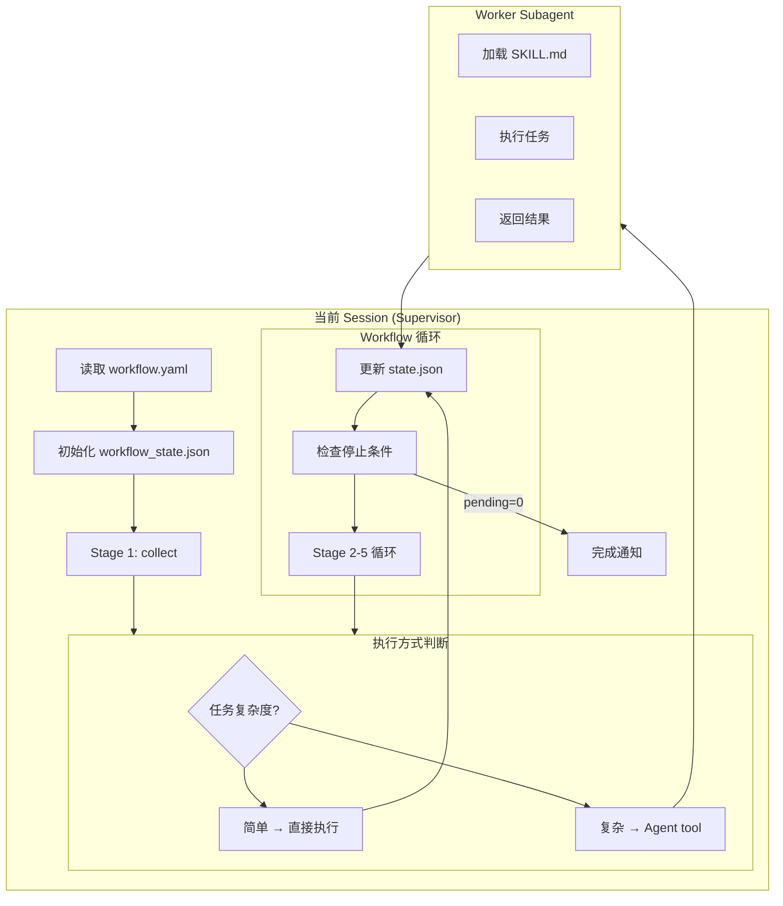

# UT Workflow Skill (v5.0)

> **v5.0 更新**: 改为内联执行模式，使用 Agent tool spawn subagent 执行各 Stage，不再依赖 supervisor_loop.py。

---

## 🚀 自主执行流程

### 触发方式

用户加载skill：
```
加载 ut/workflow skill
```

skill自动执行以下流程：

---

### 执行步骤

**Step 1: 提示用户指定workflow.yaml**

skill加载后，立即提示：
> "UT Workflow已加载。请指定workflow.yaml路径（或使用默认路径：.agents/workflow.yaml）"

等待用户提供路径或确认默认。

---

**Step 2: 检查前置条件**

自动检查：
1. Bastion连接状态（agent.py serve t_h20）
2. workflow.yaml文件存在
3. test_list文件存在（根据配置）

如果前置条件不满足：
- Bastion未连接 → 提示用户启动：`python agent.py serve t_h20`
- 文件不存在 → 提示用户准备相应文件

---

**Step 3: 初始化workflow_state.json**

调用初始化脚本：
```bash
python skills/ut/workflow/scripts/init_workflow_state.py \
  --workflow-yaml WORKFLOW_YAML_PATH
```

生成运行目录 `{runs_dir}/{test_name}-{timestamp}` 和初始状态文件。

读取生成的 workflow_state.json，获取 `run_dir` 和 `workflow_state_path`。

---

**Step 4: 执行 Stage 1 (collect，一次性)**

执行方式根据 `delegate_to` 配置：

- `delegate_to: self`（默认）→ Agent 自主决定执行方式
- 简单操作 → 当前 session 直接执行 Bash/Read/Write
- 需要判断 → 使用 Agent tool spawn subagent

**对于 Stage 1 (collect)**:

使用 Agent tool 执行：
```
Agent(
    subagent_type="general-purpose",
    description="Execute collect Stage",
    prompt="加载 skill ut/ut-test-collector 并执行。

Context:
{
  "workflow_state_path": "{workflow_state_path}",
  "manifest_path": "{run_dir}/manifest.json",
  "test_list_path": "{test_list_path}"
}

返回统一格式 JSON:
{
  "stats": {"passed": 0, "failed": 0, "error": 0, "ignored": 0, "pending": N},
  "next_action": "continue",
  "error": null,
  "blocked_reason": null
}"
)
```

等待 subagent 完成，解析返回结果，更新 workflow_state.json：

```bash
# 更新 pending count
python -c "
import json
from pathlib import Path
state = json.loads(Path('{workflow_state_path}').read_text())
state['stats']['pending'] = {pending_count}
state['current_stage'] = 'select_batch'
Path('{workflow_state_path}').write_text(json.dumps(state, indent=2))
"
```

---

**Step 5: 执行 Workflow 循环 (Stage 2-5)**

读取 workflow.yaml 的 stages 配置（**注意：stages 是顶级字段**）：
```bash
# 正确路径：stages 是顶级字段
cat {workflow_yaml_path} | python -c "import yaml,sys; c=yaml.safe_load(sys.stdin); print([s['id'] for s in c.get('stages',[])])"
```

循环执行直到 `pending_count == 0`：

```
while pending_count > 0:
    iteration += 1
    
    # 检查 break_conditions
    if error_rate > 0.8 or consecutive_failures > 50:
        发送飞书通知暂停
        break
    
    # Stage 2: select_batch
    Agent(
        subagent_type="general-purpose",
        description="Execute select_batch Stage",
        prompt="加载 skill ut/batch-selector 并执行。
        Context: {workflow_state_path, manifest_path, batch_size}
        返回统一格式 JSON。"
    )
    
    # 解析返回，创建批次目录，更新 state
    
    # Stage 3: execute
    Agent(
        subagent_type="general-purpose",
        description="Execute execute Stage",
        prompt="加载 skill ut/unit-test-executor 并执行。
        Context: {batch_config_path, remote_server, pytest_args}
        返回统一格式 JSON。"
    )
    
    # Stage 4: handle_failures
    Agent(
        subagent_type="general-purpose",
        description="Execute handle_failures Stage (Agent核心)",
        prompt="加载 skill ut/failure-handler 并执行。
        Context: {batch_results_path, handled_tests_path}
        这是需要 LLM 判断力的 Stage，分析错误类型，尝试修复代码。
        返回统一格式 JSON。"
    )
    
    # Stage 5: update_status
    Agent(
        subagent_type="general-purpose",
        description="Execute update_status Stage",
        prompt="加载 skill ut/manifest-updater 并执行。
        Context: {batch_results_path, handled_tests_path, manifest_path}
        更新 manifest.json 状态。
        返回统一格式 JSON。"
    )
    
    # 从 manifest.json 统一读取 stats（不累加）
    Read manifest.json statistics
    
    # 更新 workflow_state.json
    Write workflow_state.json with new stats
    
    # 里程碑通知
    if stats.passed % 100 == 0:
        send_feishu("Milestone: {passed} tests passed!")
```

---

**Step 6: 验证结果并生成报告**

执行完成后，调用验证脚本：
```bash
python tasks/ut/workflow_tests/verify_workflow_test.py \
  --run-dir RUN_DIR \
  --test-list TEST_LIST_NAME
```

---

**Step 7: 完成通知**

发送飞书通知：
> "UT Workflow执行完成。验证报告已生成：{run_dir}/verification_report.json"

---

## 核心架构

```
┌─────────────────────────────────────────────────────────────┐
│  Supervisor Agent Session (当前 session)                     │
│                                                             │
│  执行 workflow/SKILL.md 内联流程：                            │
│  • 读取 workflow.yaml 配置                                   │
│  • 管理 workflow_state.json                                  │
│  • 使用 Agent tool 执行各 Stage                               │
│  • 判断执行方式（直接 vs subagent）                           │
│                                                             │
│  Context: workflow.yaml + state.json (~10K tokens)          │
└─────────────────────────────────────────────────────────────┘
                          │
                          │ Agent tool (delegate_to: self)
                          ▼
┌─────────────────────────────────────────────────────────────┐
│  Worker Subagent Session (临时，执行后释放)                   │
│                                                             │
│  • 加载 Worker SKILL.md                                      │
│  • 执行单个 Stage                                            │
│  • 调用脚本 + 判断逻辑 + 修复代码                             │
│  • 返回极简结果                                              │
│  • Session 结束，Context 释放                                │
└─────────────────────────────────────────────────────────────┘
```

---

## delegate_to 机制

### 当前支持

**仅支持 `delegate_to: self`**

| 值 | 说明 | 支持状态 |
|---|------|---------|
| `self` | Agent 使用自身能力执行（可 spawn subagent） | ✅ 已支持 |
| `opencode` | 调用 opencode CLI | ❌ TODO |
| `claude-code` | 调用 Claude Code CLI | ❌ TODO |
| `codex` | 调用 Codex CLI | ❌ TODO |

**TODO**: 未来版本支持调用第三方 agent CLI（需配置 agent_path 和调用参数模板）。

### `delegate_to: self`（默认）

Agent 收到 Stage 任务后，自主决定执行方式：

| 任务类型 | 执行方式 | 原因 |
|---------|---------|------|
| 文件读写（Stage 1, 5） | 当前 session 直接执行 Bash/Read/Write | 简单操作，无需 subagent |
| 执行测试（Stage 3） | spawn subagent | 需要远程执行，耗时较长 |
| 失败处理（Stage 4） | spawn subagent | 需要 LLM 判断力 |
| 选择批次（Stage 2） | spawn subagent | 需要读取分析 manifest |

### 执行流程图



---

## Stage 执行详解

### Stage 1: collect

**执行方式**: spawn subagent

**Context 传递**:
```json
{
  "workflow_state_path": "{run_dir}/workflow_state.json",
  "manifest_path": "{run_dir}/manifest.json",
  "test_list_path": "{run_dir}/test_list.txt",
  "manifest_schema_path": "{workspace}/skills/ut/shared/manifest_schema.json"
}
```

**返回格式**:
```json
{
  "stats": {"passed": 0, "failed": 0, "error": 0, "ignored": 0, "pending": 13165},
  "next_action": "continue",
  "error": null,
  "blocked_reason": null
}
```

---

### Stage 2: select_batch

**执行方式**: spawn subagent

**Context 传递**:
```json
{
  "workflow_state_path": "{workflow_state_path}",
  "manifest_path": "{run_dir}/manifest.json",
  "batch_size": 50,
  "batches_dir": "{run_dir}/batches"
}
```

**返回格式**:
```json
{
  "stats": {"passed": 0, "failed": 0, "error": 0, "ignored": 0, "pending": 13115},
  "next_action": "continue",
  "error": null,
  "blocked_reason": null
}
```

**注意**: batch_id 和 batch_dir 在 subagent 执行后，通过读取 batch_config.json 获取。

---

### Stage 3: execute

**执行方式**: spawn subagent

**Context 传递**:
```json
{
  "workflow_state_path": "{workflow_state_path}",
  "batch_config_path": "{run_dir}/batches/{batch_id}/batch_config.json",
  "pytest_args": "-q --tb=long",
  "remote_server": "t_h20",
  "docker_container": "v0.13.0_torch2.5.1_compile",
  "vllm_dir": "/gpfs/gcsp/M2.7_verify/vllm",
  "log_extraction": {
    "enabled": true,
    "grep_pattern": "(PASSED|FAILED|ERROR|SKIPPED)",
    "parse_script": "{workspace}/skills/ut/unit-test-executor/scripts/parse_remote_log.py"
  }
}
```

**返回格式**:
```json
{
  "stats": {"passed": 40, "failed": 8, "error": 2, "ignored": 0, "pending": 0},
  "next_action": "continue",
  "error": null,
  "blocked_reason": null
}
```

---

### Stage 4: handle_failures

**执行方式**: spawn subagent（Agent核心，需要 LLM 判断）

**Context 传递**:
```json
{
  "workflow_state_path": "{workflow_state_path}",
  "batch_results_path": "{run_dir}/batches/{batch_id}/batch_results.json",
  "handled_tests_path": "{run_dir}/batches/{batch_id}/handled_tests.json",
  "iteration": "{iteration}",
  "batch_id": "{batch_id}"
}
```

**返回格式**:
```json
{
  "stats": {"passed": 3, "failed": 2, "ignored": 3, "error": 0, "pending": 0},
  "next_action": "continue",
  "error": null,
  "blocked_reason": null
}
```

---

### Stage 5: update_status

**执行方式**: 当前 session 直接执行（简单文件操作）

**操作**:
1. 读取 batch_results.json 和 handled_tests.json
2. 更新 manifest.json 中对应测试的状态
3. 计算 statistics
4. 写入 manifest.json

```bash
python skills/ut/manifest-updater/scripts/update_status.py \
  --batch-results {batch_results_path} \
  --handled-tests {handled_tests_path} \
  --manifest {manifest_path}
```

---

## Stats 更新原则

**关键**: stats 不累加，每次循环结束后从 manifest.json 统一读取。

```python
# 错误做法 ❌
state["stats"]["passed"] += result["stats"]["passed"]

# 正确做法 ✅
manifest = json.loads(Path(manifest_path).read_text())
state["stats"] = manifest["statistics"]
```

**原因**:
- Stage 3 返回原始执行结果
- Stage 4 会修改部分测试状态（修复后 passed/ignored）
- 累加会导致重复计数

---

## 循环控制

### 停止条件

```yaml
loop:
  stop_condition: "pending_count == 0"
  max_iterations: 1000
```

### 中断条件

```yaml
break_conditions:
  - condition: "consecutive_failures > 50"
    action: pause
    notify: true
    kanban_note: "Paused: consecutive_failures > 50"
    
  - condition: "error_rate > 0.8"
    action: pause
    notify: true
```

**检查方式**:

读取 workflow_state.json 的 stats，计算：
- `error_rate = (failed + error) / (passed + failed + error + ignored)`
- `consecutive_failures` 从 flags 中读取

---

## 飞书通知

使用 feishu-webhook-skill 发送通知：

```
Skill: feishu-webhook-skill
Args: 
  message_type: "batch_completed"
  content: "Batch {batch_id}: {passed}/{total} passed"
```

### 通知场景

| 类型 | 触发条件 | 模板 |
|------|---------|------|
| batch_completed | Stage 5 完成 | Batch {batch_id}: {passed}/{total} passed |
| milestone | passed % 100 == 0 | Milestone: {passed} tests passed! |
| workflow_completed | pending == 0 | Workflow完成: {passed} passed, {failed} failed |
| paused | break_condition触发 | Workflow暂停: {reason} |
| worker_error | Worker返回error | Worker错误 ({stage}): {error} |

---

## 禁止操作

- ❌ 不执行具体测试任务（让 Worker subagent 执行）
- ❌ 不读取 batch_results.json 详细错误内容
- ❌ 不在 context 中累积历史状态
- ❌ 不调用 supervisor_loop.py（已废弃）
- ❌ 不硬编码路径（从 workflow_state.json 读取）

---

## 辅助脚本保留

以下脚本保留用于辅助操作：

| 脚本 | 用途 |
|------|------|
| init_workflow_state.py | 初始化运行目录和状态文件 |
| update_status.py | Stage 5 状态更新 |
| parse_remote_log.py | Stage 3 日志解析 |

---

## 用户配置提醒

**用户需先配置 workflow.yaml 再加载 skill**：
1. 阅读 tasks/ut/README.md 了解概念
2. 填写 workflow.yaml（test_list_path 等）
3. 加载 ut/workflow skill
4. 确认 workflow.yaml 路径

---

## 相关文档

- [workflow.yaml](../../.agents/workflow.yaml) - Workflow 配置
- [workflow_state_schema.json](./workflow_state_schema.json) - 状态文件格式
- [ut-test-collector/SKILL.md](../ut-test-collector/SKILL.md) - Stage 1 Worker
- [batch-selector/SKILL.md](../batch-selector/SKILL.md) - Stage 2 Worker
- [unit-test-executor/SKILL.md](../unit-test-executor/SKILL.md) - Stage 3 Worker
- [failure-handler/SKILL.md](../failure-handler/SKILL.md) - Stage 4 Worker
- [manifest-updater/SKILL.md](../manifest-updater/SKILL.md) - Stage 5 Worker

---

*创建日期: 2026-06-06*
*更新日期: 2026-06-12*
*版本: 5.0.0*