# UT Workflow 设计文档

**日期**: 2026-06-11
**版本**: 1.0
**状态**: 待用户审查

---

## 概述

本设计旨在优化UT Workflow的用户体验，使其更易理解和操作。核心改进：
- tasks/ut/README.md作为最小化导引
- workflow.yaml标记用户需调整的配置项
- SKILL.md支持自主执行（加载skill自动运行）

---

## 用户操作流程

```
阅读tasks/ut/README.md
  ↓ 了解概念和快速开始
填写workflow.yaml配置
  ↓ 配置test_list_path、路径、远程服务器等
加载ut/workflow skill
  ↓ 指定workflow.yaml路径
skill自动执行
  ↓ 检查→初始化→运行→验证→报告
```

**关键变化**：
- 用户需先配置workflow.yaml，再加载skill
- skill自动执行完整流程，无需手动调用脚本
- 4个test list（passed/failed/error/combined）仅为测试用例，实际test list由用户配置

---

## 三文件协同架构

### 1. tasks/ut/README.md（最小化导引）

**内容范围**：
- 简介：简要说明UT Workflow用途
- 快速开始：加载skill步骤
- 核心概念：5阶段流程
- 相关文档：链接到workflow.yaml和SKILL.md

**不包含**：
- workflow.yaml示例（避免冗余）
- 详细执行逻辑（在SKILL.md中）
- 脚本调用说明（skill自动处理）

**示例内容**：
```markdown
# UT Workflow - vLLM单元测试验证流程

## 简介
UT Workflow是一个自动化单元测试验证流程，用于批量执行vLLM单元测试并追踪进度。

## 快速开始
1. 配置workflow.yaml（设置test_list_path等参数）
2. 加载skill：加载 ut/workflow skill
3. 指定workflow.yaml路径
4. skill自动执行并生成报告

## 核心概念
**5阶段流程**：
- Stage 1: collect - 收集测试清单
- Stage 2: select_batch - 选择批次
- Stage 3: execute - 执行测试
- Stage 4: handle_failures - 处理失败
- Stage 5: update_status - 更新状态

## 相关文档
- [workflow.yaml](../../.agents/workflow.yaml) - Workflow配置（需用户调整）
- [workflow SKILL.md](../../skills/ut/terminal-workflow/SKILL.md) - 详细执行逻辑
```

---

### 2. workflow.yaml（配置文件标记）

**标记方式**：
使用 `⚠️ 用户需调整：` 注释块标记用户需修改的配置项。

**标记分组**：

| 分组 | 配置项 | 说明 |
|------|--------|------|
| 测试标识 | test_name | 运行目录命名 |
| 核心路径 | workspace, runs_dir | 本地工作空间和运行目录 |
| 远程执行 | remote_server, docker_container, vllm_dir | 远程服务器配置 |
| pytest参数 | pytest_args, batch_size | 测试执行参数 |
| test_list指定 | test_list_path | 必须指定（主要配置） |
| 可选筛选 | range, filter | 范围截取和筛选条件 |

**示例标记**：
```yaml
config:
  # ⚠️ 用户需调整：核心路径定义
  workspace: &workspace "D:/workspace/apmm"
  runs_dir: &runs_dir "D:/workspace/apmm/runs"

  # ⚠️ 用户需调整：远程执行配置
  remote_server: "t_h20"
  docker_container: "v0.13.0_torch2.5.1_compile"
  vllm_dir: &vllm_dir "/gpfs/gcsp/M2.7_verify/vllm"

input_filter:
  # ⚠️ 用户需调整：test_list路径（必须指定）
  test_list_path: null  # 例如: "D:/workspace/apmm/tasks/ut/test_list.txt"
```

---

### 3. skills/ut/terminal-workflow/SKILL.md（自主执行）

**触发方式**：
用户加载skill：
```
加载 ut/workflow skill
```

**自主执行流程**：

**Step 1: 提示用户指定workflow.yaml**
> "UT Workflow已加载。请指定workflow.yaml路径（或使用默认路径：.agents/workflow.yaml）"

等待用户提供路径或确认默认。

**Step 2: 检查前置条件**
1. Bastion连接状态（agent.py serve t_h20）
2. workflow.yaml文件存在
3. test_list文件存在（根据配置）

不满足时提示用户：
- Bastion未连接 → `python agent.py serve t_h20`
- 文件不存在 → 准备相应文件

**Step 3: 初始化workflow_state.json**
```bash
python skills/ut/terminal-workflow/scripts/init_workflow_state.py \
  --workflow-yaml WORKFLOW_YAML_PATH \
  --test-list TEST_LIST_PATH
```

**Step 4: 执行workflow循环**
```bash
python skills/ut/terminal-workflow/scripts/supervisor_loop.py \
  --workflow-yaml WORKFLOW_YAML_PATH \
  --workflow-state WORKFLOW_STATE_PATH
```

**Step 5: 验证结果并生成报告**
```bash
python tasks/ut/workflow_tests/verify_workflow_test.py \
  --run-dir RUN_DIR \
  --test-list TEST_LIST_NAME
```

**Step 6: 完成通知**
> "UT Workflow执行完成。验证报告已生成：{run_dir}/verification_report.json"

---

## 数据流程

```mermaid
flowchart LR
    subgraph Input["用户输入"]
        A1["workflow.yaml路径"]
        A2["test_list文件"]
    end

    subgraph Init["初始化"]
        B1["创建run_dir"]
        B2["拷贝test_list"]
        B3["生成workflow_state.json"]
    end

    subgraph Execute["执行循环"]
        C1["Stage 1: collect"]
        C2["Stage 2: select_batch"]
        C3["Stage 3: execute"]
        C4["Stage 4: handle_failures"]
        C5["Stage 5: update_status"]
    end

    subgraph Output["输出"]
        D1["manifest.json"]
        D2["batch_results.json"]
        D3["handled_tests.json"]
        D4["verification_report.json"]
    end

    Input --> Init --> Execute --> Output
```



---

## 验证设计

**验证时机**：
- workflow执行完成后（pending_count == 0）

**验证内容**：
1. manifest.json中测试状态是否符合预期
2. batch_results.json是否存在且格式正确
3. 统计信息是否准确

**验证报告格式**：
```json
{
  "status": "done/failed",
  "test_list": "combined",
  "run_dir": "runs/ut-20260611-120000",
  "verification_results": [
    {
      "test_name": "test_async_tp_pass_replace...",
      "expected": "passed",
      "actual": "passed",
      "passed": true,
      "message": "OK"
    }
  ],
  "manifest_statistics": {
    "passed": 1,
    "failed": 0,
    "error": 0,
    "pending": 0,
    "ignored": 0
  },
  "summary": "3 tests verified, 3 passed"
}
```

---

## 错误处理

| 错误类型 | 处理方式 |
|---------|---------|
| Bastion未连接 | 提示用户启动agent.py serve |
| workflow.yaml不存在 | 提示用户检查路径 |
| test_list不存在 | 提示用户准备文件或检查配置 |
| workflow执行失败 | 生成失败报告，提示检查日志 |
| 验证失败 | 显示失败详情，建议检查 |

---

## 测试场景

tasks/ut/workflow_tests/下的4个test list用于验证workflow功能：
- test_list_passed.txt - 验证通过的测试
- test_list_failed.txt - 验证失败的测试
- test_list_error.txt - 验证错误的测试
- test_list_combined.txt - 综合场景测试

**说明**：这些test list仅为测试用例，实际运行时test list由用户在workflow.yaml中配置。

---

## 实现清单

| 文件 | 操作 | 内容 |
|------|------|------|
| tasks/ut/README.md | 创建/修改 | 最小化导引内容 |
| .agents/workflow.yaml | 修改 | 添加用户调整标记注释 |
| skills/ut/terminal-workflow/SKILL.md | 修改 | 自主执行逻辑 |
| verify_workflow_test.py | 无需修改 | 验证报告status改为done/failed |

---

## 风险与限制

**风险**：
- SKILL.md自主执行需要skill加载机制支持（Claude Code Skill tool）
- 用户可能忘记先配置workflow.yaml再加载skill

**限制**：
- 验证脚本仅检查预期状态，不验证执行过程
- 需要bastion连接稳定

---

## v5.0 更新（2026-06-12）

### delegate_to: self 设计

**变更原因**: 简化架构，利用 Agent tool 的 subagent 能力，避免外部 CLI 调用。

**`delegate_to: self` 定义**:
- Agent 收到 Stage 任务后，自主决定执行方式
- 简单操作（文件读写）→ 当前 session 直接执行
- 复杂操作（需要判断）→ 使用 Agent tool spawn subagent

**执行方式判断逻辑**:

| Stage | 执行方式 | 原因 |
|-------|---------|------|
| collect (Stage 1) | subagent | 需要远程 pytest collect |
| select_batch (Stage 2) | subagent | 需要读取分析 manifest |
| execute (Stage 3) | subagent | 远程执行 pytest，耗时长 |
| handle_failures (Stage 4) | subagent | 需要 LLM 判断力 |
| update_status (Stage 5) | 直接执行 | 简单文件操作 |

### Agent tool 使用方式

**SKILL.md 内联执行**:
```
Agent(
    subagent_type="general-purpose",
    description="Execute {stage_id} Stage",
    prompt="加载 skill ut/{skill_id} 并执行。
    Context: {context_json}
    返回统一格式 JSON。"
)
```

**Context 传递**:
- 通过 prompt 参数传递路径和参数
- Worker 读取 workflow_state.json 获取具体路径
- 不硬编码路径，保持灵活性

### supervisor_loop.py 简化

**v5.0 变更**:
- 主循环逻辑移至 SKILL.md
- supervisor_loop.py 改为辅助工具
- 保留功能：状态检查、配置校验、stats 更新

**推荐执行方式**:
- 主要：加载 ut/workflow skill
- 辅助：`python supervisor_loop.py --check`（调试）

---

*创建日期: 2026-06-11*
*更新日期: 2026-06-12*
*作者: Claude*