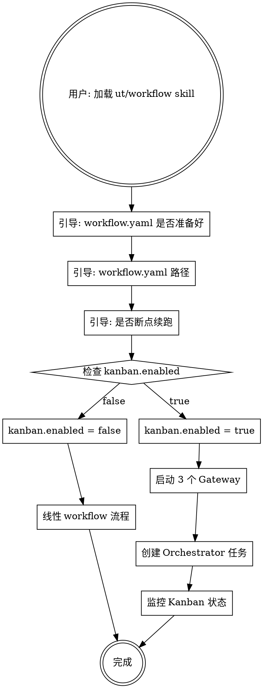

# UT Workflow × Hermes Kanban 集成设计

> **注意：** `.agents/workflow.yaml`已废弃（2026-06-29），配置机制已迁移至`tasks/ut/deployment/production/config/`模板库 + `runs/ut-{timestamp}/`副本机制。

> 方案 A-1：Skill 分支模式 - 单一入口，根据 kanban.enabled 分支执行

**创建日期**: 2026-06-12
**版本**: 1.0
**状态**: 设计已批准

---

## 设计目标

将 Hermes Kanban 集成到 UT Workflow，实现：

1. **双模式统一入口** - workflow.yaml 的 `kanban.enabled` 决定运行模式
2. **Agent 自动启动 Gateway** - Kanban 模式下自动启动 3 个 gateway
3. **保持现有流程** - 线性 workflow 流程无需改动

---

## 触发流程设计



---

## 引导流程

```text
用户: 加载 ut/workflow skill
Agent: UT Workflow v5.2 已加载。
       请提供以下信息：
       1. workflow.yaml 是否已准备好？（test_list、batch_size 等参数已填写）
       2. workflow.yaml 路径（默认: .agents/workflow.yaml）
       3. 是否断点续跑？（提供 run_dir 路径，或留空新建）
```

**说明**：
- workflow.yaml 需预先配置好 `test_list_path`、`batch_size` 等参数
- Agent 从 workflow.yaml 读取所有配置，无需逐项询问
- 只需确认配置已准备好、提供路径、选择是否续跑

---

## workflow.yaml Kanban 配置结构

在现有 `.agents/workflow.yaml` 中更新 kanban 节点：

```yaml
# ============================================================
# Kanban - Hermes Kanban 配置（方案 A-1）
# ============================================================
kanban:
  enabled: false  # ✍️: true 启用 Kanban 模式，false 使用线性 workflow

  # Board 配置
  board:
    name: "apmm-ut"
    slug: "apmm-ut"

  # Worker Profile 配置
  profiles:
    orchestrator: "ut-orchestrator"
    executor: "ut-executor"
    fixer: "ut-fixer"

  # Gateway 启动配置
  gateway:
    auto_start: true           # Agent 自动启动 gateway
    check_interval: 60         # 调度检查间隔（秒）
    startup_timeout: 30        # gateway 启动超时（秒）

  # 熔断器配置
  circuit_breaker:
    failure_limit: 3           # 连续失败 N 次后自动 block
    error_rate_threshold: 0.8  # 错误率阈值

  # 任务创建配置
  task_creation:
    initial_assignee: "ut-orchestrator"
    priority: 1
    body_template: "Orchestrate UT run for {test_list_path}"
```

---

## Gateway 启动流程

Agent 在 Kanban 模式下自动执行：

```bash
# Step 1: 检测 Hermes 是否可用
hermes version  # 检查版本 >= v0.15.1

# Step 2: 切换到目标 board
hermes kanban boards switch apmm-ut

# Step 3: 启动 3 个 Gateway（后台运行）
hermes profile use ut-orchestrator && hermes gateway run &
hermes profile use ut-executor && hermes gateway run &
hermes profile use ut-fixer && hermes gateway run &

# Step 4: 等待 gateway 就绪（检查健康状态）
sleep 10 && hermes gateway status

# Step 5: 创建初始 Orchestrator 任务
hermes kanban create "Orchestrate UT run" \
  --assignee ut-orchestrator \
  --priority 1 \
  --body "Read test_list.txt, decompose into batches, monitor progress."

# Step 6: 监控任务状态（轮询）
while true:
    hermes kanban stats --board apmm-ut
    if all_tasks_done:
        break
    sleep 60
```

---

## SKILL.md 修改内容

在 `skills/ut/terminal-workflow/SKILL.md` 中：

1. **版本更新**: v5.1 → v5.2
2. **引导流程简化**: 移除 test_list 路径询问，改为确认 workflow.yaml 已准备好
3. **增加 Kanban 分支**: 检查 `kanban.enabled` 决定执行路径

修改后的触发方式部分：

```markdown
## 🚀 触发方式

用户加载 skill 后，Agent 自动引导用户完成配置并执行流程：

```
用户: 加载 ut/workflow skill
Agent: UT Workflow v5.2 已加载。
       请提供以下信息：
       1. workflow.yaml 是否已准备好？（test_list、batch_size 等参数已填写）
       2. workflow.yaml 路径（默认: .agents/workflow.yaml）
       3. 是否断点续跑？（提供 run_dir 路径，或留空新建）
```

Agent 检查 workflow.yaml 中 `kanban.enabled`：
- **false** → 执行线性 workflow（现有流程）
- **true** → 执行 Kanban workflow（新流程）

---

## Kanban 模式执行步骤（kanban.enabled = true）

### Step 0: 检查前置条件

1. Hermes Agent v0.15.1+ 已安装
2. Board `apmm-ut` 已创建
3. 3 个 worker profile 已配置（ut-orchestrator/executor/fixer）

### Step 1: 启动 Gateway

Agent 自动启动 3 个 Gateway（后台进程）。

### Step 2: 创建初始任务

创建 Orchestrator 任务，触发依赖链：
- Orchestrator 拆解为 batch 任务 → Executor
- Executor 完成后创建 fixer 任务 → Fixer

### Step 3: 监控进度

轮询 `hermes kanban stats` 直到所有任务完成。

### Step 4: 完成通知

发送飞书通知，Gateway 保持运行（不自动关闭）。
```

---

## 实现文件清单

| 文件 | 修改内容 |
|------|----------|
| `skills/ut/terminal-workflow/SKILL.md` | 版本更新为 v5.2，增加 Kanban 分支逻辑 |
| `.agents/workflow.yaml` | 更新 kanban 节点配置 |
| `skills/ut/terminal-workflow/scripts/start_gateway.py` | 新增 Gateway 启动脚本 |
| `skills/ut/terminal-workflow/scripts/monitor_kanban.py` | 新增 Kanban 监控脚本 |

---

## 前置条件检查

Kanban 模式需要确保：

```bash
# 1. Hermes Agent 版本
hermes version  # >= v0.15.1

# 2. Board 存在
hermes kanban boards list | grep apmm-ut

# 3. Profile 存在
hermes profile list | grep ut-orchestrator
hermes profile list | grep ut-executor
hermes profile list | grep ut-fixer

# 4. Board 已切换
hermes kanban boards switch apmm-ut
```

---

## 相关文档

- [tasks/ut/docs/kanban/README.md](../../../tasks/ut/docs/kanban/README.md) - Hermes Kanban × UT Workflow 集成指南
- [skills/ut/terminal-workflow/SKILL.md](../SKILL.md) - Workflow Skill 文档
- [.agents/workflow.yaml](../../.agents/workflow.yaml) - Workflow 配置
- [tasks/ut/docs/designs/2026-06-11-ut-workflow-design.md](2026-06-11-ut-workflow-design.md) - Workflow v5.1 基础设计

---

*创建日期: 2026-06-12*
*版本: 1.0*