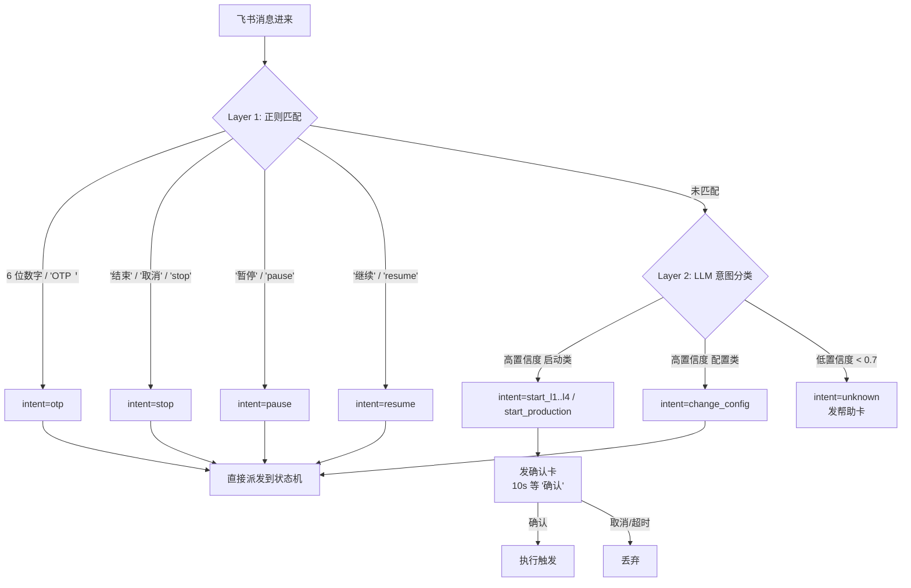

# 2026-06-22 — UT 测试梯度 fixture + Agent 意图识别 设计文档

> **Spec ID**: `2026-06-22-ut-tier-fixtures-and-agent-intent`
> **Status**: Draft v1
> **Owner**: liux
> **关联**:
> - 触发上游：[`tasks/ut/docs/incidents/2026-06-22-l4-fabrication.md`](../incidents/2026-06-22-l4-fabrication.md) §6 / §11.2
> - 通道架构：[`tasks/ut/docs/designs/2026-06-18-hermes-workflow-dual-channel-design.md`](2026-06-18-hermes-workflow-dual-channel-design.md)
> - 通道总览图示：[`tasks/ut/docs/guides/ut-channels-overview.md`](../guides/ut-channels-overview.md)

---

## 1. 目标 (Why)

当前从飞书发起 UT 测试，用户每次都要：
1. 发关键词 "跑 ut workflow"
2. 在参数确认卡上确认 / 选 yaml / 改参数
3. （若需要）输入 bastion OTP

测试场景明明只有有限几类（L1 smoke / L2 mini / L3 fast subset / L4 distributed kanban / 生产 全量），yaml 都已固化在仓库内，**每次让用户在卡片上选 yaml 是过度交互**。

**本设计的两个目标**：

- **G1**：把 L1/L2/L3/L4 四个测试梯度补全为可直接触发的固化套件，每个梯度有自己的 `workflow.<L>.yaml` + 测试清单 + 期望结果 + 验证目标。L1–L4 是**烟囱测试梯度**（递进验证 workflow 框架本身），不是测试覆盖度梯度。
- **G2**：飞书消息进来时，用 **Agent 意图识别层** 区分"高确定性原子命令"（OTP / 暂停 / 继续 / 结束）和"启动类语义化指令"（"跑 L4"、"跑下 mini 测试"、"正式开跑"等），前者走正则、后者走 LLM 分类，**启动类指令仍需要一次确认**作为安全闸口。

**不在范围内**：
- 不改 `workflow_loop_core` 的 5 阶段算法。
- 不改 `hermes_workflow` SKILL 的状态机定义。
- 不改 Bastion / OTP 流程。
- 不动 worker SKILL（不改 batch-selector / executor / fixer / manifest-updater）。

---

## 2. 测试梯度 (L1 → L4) 设计

### 2.1 梯度定位

| Tier | 验证目标 | 测试集 | 模式 | 耗时 | 关键断言 |
|---|---|---|---|---|---|
| **L1** | "workflow 五阶段是否串通" — 最低烟囱 | 1 个稳定 passed pytest | linear | < 1 min | 5 阶段全跑通；passed=1 |
| **L2** | "linear 模式 batch loop" — Stage 2–5 循环正确 | `mini_test_list.txt`（3 行） | linear | ~ 3 min | passed=3，pending=0 |
| **L3** | "batch 调度 + failure-handler retry" | `l3_fast_subset.txt`（~50 row） | linear（kanban 可选） | ~ 15 min | passed+failed+ignored=50；failure-handler 至少 trigger 一次 |
| **L4** | "Kanban 模式 + 防 fabrication" | `l3_retry_subset.txt`（3 个 distributed） | kanban | ~ 60 min | 5 个 dependency_chain_invariants 全 hold + anti-fabrication 三条 |
| **生产** | 完整 UT 验证 | 全量 `test_list.txt`（~2000+） | kanban | hours–days | 无静态断言，跑完 pending=0 |

**梯度逻辑**：递进**验证 workflow 框架本身**，不是测试覆盖度递进。L4 测试数量比 L3 少，但跑 distributed pytest + Kanban 3-Worker 链路，验证目标更深。

### 2.2 Fixture 文件清单

```
tests/ut/integration/fixtures/
├── L1_expected.json                                    [新增]
├── L2_expected.json                                    [新增]
├── L3_expected.json                                    [新增]
├── L4_expected.json                                    [改造：加 anti-fabrication]
├── l1_smoke_list.txt                                   [新增, 1 row]
├── mini_test_list.txt                                  [已有, L2 用]
├── l3_fast_subset.txt                                  [已有, L3 用]
├── l3_retry_subset.txt                                 [已有, L4 用]
├── workflow.l1.yaml                                    [新增]
├── workflow.l2.yaml                                    [新增]
├── workflow.l3.yaml                                    [新增]
├── workflow.l4.yaml                                    [已有]
└── workflow.linear.yaml                                [已有, 改造为 L2 别名 或保留独立]
```

### 2.3 L1 候选 pytest

选定：**`tests/test_inputs.py::test_parse_raw_single_batch_empty`**

理由：
- 已包含在 `mini_test_list.txt`（生产稳定 baseline）
- 纯参数解析（不需要模型、不需要 GPU、不依赖网络），离线环境一定 pass
- 测试本身耗时 < 1s，整个 L1 跑完 < 1 min

`l1_smoke_list.txt` 内容：
```
tests/test_inputs.py::test_parse_raw_single_batch_empty
```

### 2.4 各梯度 expected schema

**所有 expected 文件遵循同一上层结构**，子集字段根据梯度需要存在：

```json5
{
  "_comment": "Layer purpose + how to interpret pass/fail",
  "metadata": {
    "layer": "L1|L2|L3|L4",
    "mode": "linear|kanban",
    "test_list": "<path>",
    "workflow_config": "<path>",
    "batch_size": <int>,
    "max_retry_per_test": <int>,
    "frozen_on": "YYYY-MM-DD"
  },

  // L1/L2: 简单 — 只断言计数
  "terminal_state_distribution": {
    "required": { "passed": N, "failed": M, "ignored": K, "pending": 0 },
    "tolerance": "<可选: 哪些字段允许偏离 + 边界>"
  },

  // L3+: 梯度递增加 stage 行为断言
  "stage_invariants": [
    { "id": "STG-1", "rule": "...", "check": "...", "severity": "hard|soft" }
  ],

  // L4 独有: Kanban dependency chain
  "dependency_chain_invariants": [...],   // 已有, 不变

  // L4 + 任何梯度想防 fabrication
  "anti_fabrication_assertions": [
    {
      "id": "AF-1",
      "rule": "every per-test entry's log_path stat must succeed and be non-empty on remote",
      "check": "agent.py -p <profile> run 'stat <log_path>' returns size > 0",
      "severity": "hard"
    },
    {
      "id": "AF-2",
      "rule": "duration_seconds is non-null iff status in [passed, failed]",
      "check": "for each entry: (status in [passed,failed]) == (duration_seconds != null)",
      "severity": "hard"
    },
    {
      "id": "AF-3",
      "rule": "passed + failed + ignored equals total accounted nodes",
      "check": "passed_count + failed_count + ignored_count == metadata.expected_total",
      "severity": "hard"
    }
  ],

  "per_test": [...],                       // L4 已有, 别的层可选
  "pass_criteria": { "must_all_hold": [...], "record_but_not_fail": [...] },
  "artifacts_to_capture": [...]
}
```

**关键变化 — L4_expected.json 现状 + 改造**：

L4_expected.json 当前有 5 条 `dependency_chain_invariants` 但**没有** `anti_fabrication_assertions`。本 spec 要求追加 §2.4 列出的 **AF-1 / AF-2 / AF-3 三条**，让 L4 跑完就能逮 incident §3.2 描述的 fabrication 模式。

**各层断言矩阵**：

| 断言 | L1 | L2 | L3 | L4 |
|---|:---:|:---:|:---:|:---:|
| terminal_state_distribution | ✅ | ✅ | ✅ | ✅ |
| anti_fabrication AF-1/2/3 | — | — | — | ✅ |
| stage_invariants（待定义） | — | — | ✅ STG-1 | ✅ STG-1 |
| dependency_chain INV-1..5 | — | — | — | ✅ |
| per_test trajectory | — | — | — | ✅ |

L3 的 STG-1 / STG-2 / STG-3（基于 failure-handler SKILL §状态转换 + manifest_schema 实际 enum）：

```json5
"stage_invariants": [
  {
    "id": "STG-1",
    "rule": "failure-handler fired at least once (retry path exercised)",
    "check": "manifest.json 中存在至少 1 条 test 的 retry_count > 0，或 batch_results 中有至少 1 条 final_status == retriable_error 的 trajectory",
    "severity": "hard",
    "rationale": "L3 fixture 选用 l3_fast_subset 已设计为含可重试错误的混合集；若没有一条 test 触发 failure-handler，说明 Stage 4 完全没被走到 — 串路漏掉一环"
  },
  {
    "id": "STG-2",
    "rule": "max_retry boundary enforced — no test executed more than max_retry + 1 times",
    "check": "对每条 manifest entry：retry_count <= config.max_retry_per_test (默认 2 for L3)",
    "severity": "hard",
    "rationale": "防御 failure-handler.py:506-512 的边界 bug；L4 的 INV-5 同义，L3 也要查"
  },
  {
    "id": "STG-3",
    "rule": "retriable_error is a non-terminal transient state — must transition to ignored, passed, or failed by end of run",
    "check": "manifest 终态中没有任何 entry 的 status == retriable_error（必须已被 Stage 5 promoted 至 ignored 或被重试后 passed/failed）",
    "severity": "hard",
    "rationale": "incident 中 worker 把虚构 NCCL 错误打成 retriable_error 触发 supervisor 错误暂停；STG-3 在 L3 就能 catch 这种 'transient state 没有 promote' 的 bug"
  }
]
```

L4 因为继承同样的 stage_invariants 段，**这 3 条也要加进 L4_expected.json**（与 INV/AF 并存）。

**断言矩阵更新**：

| 断言 | L1 | L2 | L3 | L4 |
|---|:---:|:---:|:---:|:---:|
| terminal_state_distribution | ✅ | ✅ | ✅ | ✅ |
| anti_fabrication AF-1/2/3 | — | — | — | ✅ |
| stage_invariants STG-1/2/3 | — | — | ✅ | ✅ |
| dependency_chain INV-1..5 | — | — | — | ✅ |
| per_test trajectory | — | — | — | ✅ |

L1/L2 故意不查 STG-* — L1 测试集 size=1 不会触发 retry；L2 测试集都是 stable passed，也不会 trigger failure-handler。如果 L1/L2 出现 STG 路径活动，本身就是异常。

### 2.5 workflow.<L>.yaml 模板

所有 L-yaml 派生自同一模板，仅以下字段不同：

| 字段 | L1 | L2 | L3 | L4 |
|---|---|---|---|---|
| `input_filter.test_list_path` | `tests/ut/integration/fixtures/l1_smoke_list.txt` | `...mini_test_list.txt` | `...l3_fast_subset.txt` | `...l3_retry_subset.txt` |
| `config.batch_size` | 1 | 3 | 10 | 3 |
| `config.max_retry_per_test` | 0 | 0 | 2 | 3 |
| `kanban.enabled` | false | false | false | true |
| `loop.timeout_seconds` | 120 | 600 | 1800 | 7200 |
| `loop.consecutive_failures_threshold` | 1 | 2 | 5 | 5 |

其它字段（`config.remote_server`、`config.docker_container`、bastion profile、feishu 绑定）从生产 workflow.yaml 复制不变。

---

## 3. 通用断言比对器 — `check_expected.py`

新建 `tasks/ut/scripts/check_expected.py`，被 L1–L4 共用：

```
python tasks/ut/scripts/check_expected.py \
    --run-dir runs/ut-20260622-xxxx \
    --expected tests/ut/integration/fixtures/L4_expected.json \
    [--output-card-json runs/ut-20260622-xxxx/check_result.json]
```

**职责**：
- 读 `<run_dir>/manifest.json` + `<run_dir>/batch_*/batch_results.json`（aggregate）
- 按 expected 文件中存在的断言段（`terminal_state_distribution` / `anti_fabrication_assertions` / `stage_invariants` / `dependency_chain_invariants` / `per_test`）逐项比对
- 输出 JSON：
  ```json
  {
    "overall": "PASS|FAIL",
    "assertions": [
      { "id": "TSD", "result": "PASS", "expected": {...}, "actual": {...} },
      { "id": "AF-1", "result": "FAIL", "detail": "log_path missing for test X" },
      ...
    ],
    "summary": "12/13 hard assertions pass; 1 fail"
  }
  ```
- exit code: 0 = PASS / 1 = FAIL / 2 = expected file 解析错

**anti_fabrication AF-1 实现**：通过 `tools/agent.py -p t_h20 run "stat -c %s <log_path>"`（bastion 已连）检查远端 log_path 真实性。

`check_expected.py` 是**纯函数**（输入 run_dir + expected → 输出 JSON），不依赖 hermes / 飞书，**可在本地 CLI 跑**，也可以被 hermes_workflow 的 completion 回调调用。

---

## 4. Agent 意图识别层 — 设计

### 4.1 两层架构



### 4.2 Layer 1 — Deterministic 正则集

| 模式 | 意图 | 备注 |
|---|---|---|
| `^\d{6}$` | `otp` | 单独 6 位数字 |
| `^OTP\s+(\w+)\s+(\d{6})$` | `otp_with_id` | 显式格式（OTP request_id 6 位数字） |
| `^(?:结束\|取消\|stop\|终止)$` | `stop` | 高频终态指令 |
| `^(?:暂停\|pause)$` | `pause` | |
| `^(?:继续\|resume\|恢复)$` | `resume` | |

匹配命中即返回 `{intent, args, source: "regex"}`，**不走 LLM**。

### 4.3 Layer 2 — LLM 意图分类

**触发条件**：Layer 1 未匹配。

**调用方式**：使用 Hermes Agent 自身的 LLM（不调外部 API），通过 SOUL.md 注入意图分类指令。

**SOUL.md 追加段（ut-supervisor profile）**：

```md
## Intent classification (when free-text msg doesn't match deterministic patterns)

Classify the user's free-text Feishu message into ONE of:
- start_l1 / start_l2 / start_l3 / start_l4 — user wants to trigger that tier of UT smoke test
- start_production — user wants to trigger the full UT run (synonyms: "跑 ut workflow", "正式开跑", "生产", "全量")
- change_config — user wants to modify a single config key (synonyms: "改 batch_size 为 10")
- unknown — message doesn't clearly map to any of the above

Output STRICT JSON (no prose, no markdown fence):
{
  "intent": "<one of the labels above>",
  "confidence": <float 0..1>,
  "args": { ... }       // for change_config, e.g. {"key": "batch_size", "value": 10}
}

Confidence rule:
- "跑 L4" / "跑 ut workflow 的 l4 测试" / "L4 走起" → start_l4, conf >= 0.9
- "正式开跑" / "跑 ut workflow" (no L-suffix) → start_production, conf >= 0.9
- Ambiguous Chinese ("跑测试") → unknown, conf < 0.7
- Anything off-topic → unknown, conf = 0.0

NEVER classify as start_* with conf >= 0.7 unless the user wrote a tier name (L1/L2/L3/L4) or "正式"/"生产"/"全量" explicitly.
```

**为什么是 SOUL.md 而不是 Python prompt**：profile-level SOUL 让所有 LLM 调用统一受约束；ut-supervisor 已经有 SOUL.md，追加段落不需要新文件。

### 4.4 输出 schema（`Command` 升级）

`parse_command()` 当前返回 `{type, payload}`，升级为：

```python
@dataclass
class Command:
    intent: Literal["otp", "stop", "pause", "resume", "change_config",
                    "start_l1", "start_l2", "start_l3", "start_l4",
                    "start_production", "unknown"]
    confidence: float                    # 1.0 for regex hits, 0..1 for LLM
    args: dict                            # tier-specific: e.g. {"yaml": "...", "expected": "..."}
    source: Literal["regex", "llm"]
    raw_text: str
```

兼容性：旧 `{type, payload}` callsite 通过 adapter（`intent` → `type` 映射）保持兼容；新代码用新结构。

### 4.5 启动类指令的确认卡（安全闸口）

LLM 分类有误判风险（哪怕 conf=0.95），且"跑 L4"和"跑生产"代价差量级。即使是高置信度的 start_* 意图，**必须先发蓝色确认卡**：

```
🤖 我理解你想触发 L4 测试。要开始吗？
   配置: workflow.l4.yaml
   测试集: tests/ut/integration/fixtures/l3_retry_subset.txt (3 个 distributed)
   模式: kanban
   预计耗时: ~60 分钟

   [确认] [取消]
```

10 秒（可配置）超时 → 自动当作"取消"。

**与原参数卡的区别**：
- 原参数卡：用户**主动**选 yaml / resume / 改 KEY=VAL（信息密度大）
- 新确认卡：系统**主动**展示"我理解的意图"，用户只确认是不是这个意思（信息密度小）

后者在 happy path 一键放行，error path（LLM 误判）也只多花 1 个 cancel。

`start_production` 走**同样的确认卡**，但展示"全量测试集 + 预计 X 小时"作为提醒。

### 4.6 边界情况

| 场景 | 处理 |
|---|---|
| LLM 返回非合法 JSON | 视作 `intent=unknown, conf=0`，发帮助卡 |
| LLM 输出 `start_l5`（不存在） | 视作 `intent=unknown`，发帮助卡 |
| 用户在确认卡 10s 内既没确认也没取消 | 默认取消，发"超时未确认"卡 |
| 用户在等确认期间又发新启动指令 | 用 newest，旧的丢弃 |
| 状态机已是 `running` 用户发 start_* | 拒绝（"已有 run 在跑"），发现有 run 信息 |
| 状态机是 `paused` 用户发 start_* | 拒绝（"当前 run 未完成，请先发'继续'或'结束'"） |

---

## 5. 实施分解 — P0 到 P5

每个 P 独立可交付、可验证。建议按顺序提交。

### P0 — Anti-fabrication 加固 + 比对器

| Task | 文件 | 工作量 | 验证 |
|---|---|---|---|
| P0a | 改 L4_expected.json 加 AF-1/2/3 三条 anti_fabrication_assertions | 30 min | jq 解析 + 字段 in {hard,soft} |
| P0b | 新建 `tasks/ut/scripts/check_expected.py`（通用比对器）+ unit test | 1.5 h | 用现有 L4_expected + mock manifest 跑通；exit 0/1 正确 |

### P1 — L1/L2/L3 fixture 补全

| Task | 文件 | 工作量 |
|---|---|---|
| P1a | 新建 `l1_smoke_list.txt`、`workflow.l1.yaml`、`L1_expected.json` | 30 min |
| P1b | 新建 `workflow.l2.yaml`、`L2_expected.json`（用现有 mini_test_list） | 20 min |
| P1c | 新建 `workflow.l3.yaml`、`L3_expected.json`（用现有 l3_fast_subset，含 STG-1 待定） | 30 min |
| P1d | ✅ **已完成**：新增 `tasks/ut/scripts/deploy_tier.py`（hermes profile distribution 机制，支持 `--tier L1..L4 [--check] [--profile <name>]`）；旧 `deploy_l4_profiles.py` alias 已删除。详见 `tests/ut/integration/fixtures/profiles/README.md` | 30 min |

### P2 — Layer 1（regex）意图识别

| Task | 文件 | 工作量 |
|---|---|---|
| P2a | 升级 `parse_command()` 为新 `Command` schema；加 Layer 1 5 类正则；旧 callsite 用 adapter | 1 h |
| P2b | unit test：覆盖每个正则 + 异常输入 | 30 min |

### P3 — Layer 2（LLM）意图识别

| Task | 文件 | 工作量 |
|---|---|---|
| P3a | ut-supervisor profile 的 SOUL.md 追加 §4.3 意图分类段 | 15 min |
| P3b | hermes_runner.py 加 `classify_intent_llm(text) -> Command` 函数，调 Hermes Agent LLM；解析 JSON、降级到 unknown | 1 h |
| P3c | unit test：mock LLM 返回，验证各 intent + conf 阈值 | 30 min |
| P3d | 集成 test（手动）：飞书发 "跑 L4" / "正式开跑" / "改 batch_size 为 5" / "跑下测试" 验证识别 | 30 min |

### P4 — 启动确认卡 + 跳过参数卡

| Task | 文件 | 工作量 |
|---|---|---|
| P4a | 飞书 send_card 加 `confirmation_card` 模板（intent + yaml + 摘要 + 确认/取消） | 30 min |
| P4b | hermes_workflow SKILL §3 触发流程加分支：`start_l*` / `start_production` 触发时发 confirmation_card；超时/取消 → drop；确认 → 跳过参数卡直接进 init_or_resume(yaml=固化路径) | 1.5 h |
| P4c | 端到端验收（飞书 → 确认 → run 启动） | 30 min |

### P5 — 完成时执行 check_expected.py + PASS/FAIL 卡

| Task | 文件 | 工作量 |
|---|---|---|
| P5a | hermes_workflow `handle_checkpoint` / 完成路径：tier run 完成后调 `check_expected.py`，结果填入完成卡 | 1 h |
| P5b | 飞书完成卡区分 tier vs 生产：tier 发 PASS（绿）/ FAIL（红）+ 失败断言摘要；生产仍发普通完成卡 | 30 min |

**总计**：~10–11 小时分布式工作量，5 个独立 commit。

---

## 6. 风险与缓解

| 风险 | 影响 | 缓解 |
|---|---|---|
| LLM 误把"跑下生产测试"分类成 `start_l4`（耗时差 100×） | 误触发，浪费机器时间 | §4.5 强制确认卡 + 卡片明确写 "预计耗时" |
| LLM 输出 JSON 不合法 / 输出 free-form | 触发失败 | §4.6 catch → unknown → 帮助卡 |
| L1 选的 stable test 哪天突然变 flaky | L1 假警报 | 选 `test_parse_raw_single_batch_empty`（纯参数解析，不依赖外部）；若失守追加 L1 候选清单 |
| anti_fabrication AF-1 stat 命令把 bastion 打满 | bastion 拥堵 | 限频：每 batch 最多 stat 一次（用 bastion 连接池） |
| check_expected.py 漏算某种 expected schema 字段 | 误判 PASS | 用 schemа checker（jsonschema lib）严格校验 expected 文件结构 |
| 改 `parse_command` 破坏老 callsite | 现有线性通道 `ut/workflow` 走不通 | adapter 保持向后兼容；linear 通道 unit test 全量回归 |

---

## 7. 验收标准

**P0–P5 全部完成后**：

1. 飞书发 `跑 L1` → 10 s 内收到确认卡 → 回 `确认` → run 启动 → 1 min 内收到绿色 PASS 完成卡（passed=1, ignored=0, anti_fabrication 不适用）
2. 飞书发 `跑 L4` → 同样路径 → kanban 模式 run 启动 → 完成时执行 5 条 INV + 3 条 AF 比对 → PASS 卡 or FAIL 卡（fabrication 模拟测试：手动 mv 一个 log_path → 重跑 → AF-1 FAIL）
3. 飞书发 `跑 ut workflow` / `正式开跑` / `全量` → 走 production 确认卡（强调耗时）→ 确认后用生产 `.agents/workflow.yaml` 触发
4. 飞书发 `跑下测试` → unknown，机器人发帮助卡列出合法触发词
5. 老命令兼容：`暂停` / `继续` / `结束` / 6 位 OTP 全部直通（不走 LLM）
6. `tests/ut/integration/` 下 deploy_l4_profiles + 整体 integration test 全绿
7. `pytest tests/ut/unit/` 全绿（含 Command schema、check_expected.py、Layer 1/2 单测）

---

## 8. 后续 (Out of scope)

- L5+ 自定义 tier（用户在 yaml 里定义）
- 多语言意图识别（英文 / 日文飞书消息）
- 跨 tier 联运（"跑 L1 + L4"）
- Tier 进度卡 mid-run 实时 PASS/FAIL 预测

---

*创建日期: 2026-06-22*
