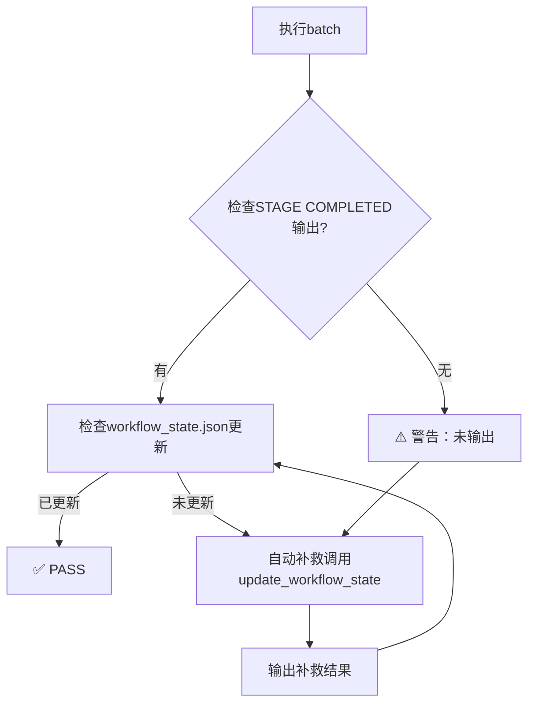

# UT Workflow Resume工具使用指南

> 三重保障机制：代码强制更新、强制输出检查、SKILL硬性约束

---

## 概述

本次实施（2026-07-03）新增了三个核心工具，用于解决batch统计不准确和Agent忘记更新状态的问题：

| 工具 | 用途 | 类型 |
|------|------|------|
| **workflow_state_manager.py** | 状态管理核心模块 | 库模块 |
| **resume.py** | 状态分析工具（只读） | 命令行工具 |
| **loop_executor.py** | 自检补救执行器 | 命令行工具 |

---

## 1. workflow_state_manager.py

### 用途

中央状态管理模块，提供三重保障：
- **代码强制更新**：所有Worker脚本必须调用此模块更新状态
- **状态一致性检查**：自动验证状态转换的正确性
- **统计准确性**：集中管理batch计数和测试统计

### 关键函数

```python
from skills.ut.shared.workflow_state_manager import (
    update_workflow_state,  # 更新状态（强制调用）
    get_batch_status,       # 查询batch状态
    get_statistics,         # 获取统计数据
    validate_state_transition  # 验证状态转换
)
```

### 使用示例

```python
# generate_batch.py 中使用
from workflow_state_manager import update_workflow_state

update_workflow_state(
    state_path="runs/ut-20260630-163959/workflow_state.json",
    batch_id="batch_20260703_093155",
    stage="generated",  # 新增状态：generated → running → completed
    stats={
        "total": 8,
        "pending": 8
    }
)

# execute_batch.py 中使用（两阶段更新）
# 第一阶段：启动时
update_workflow_state(
    state_path=state_path,
    batch_id=batch_id,
    stage="running",
    started_at=datetime.now().isoformat()
)

# 第二阶段：完成时
update_workflow_state(
    state_path=state_path,
    batch_id=batch_id,
    stage="completed",
    completed_at=datetime.now().isoformat(),
    stats={
        "total": 8,
        "passed": 7,
        "failed": 1,
        "error": 0,
        "ignored": 0
    }
)
```

### 强制输出检查

每个函数调用后会输出固定格式的确认：

```
[WORKFLOW_STATE] Updated: batch_20260703_093155 → running
[WORKFLOW_STATE] Statistics: generated=430, running=1, completed=398
```

Agent **必须检查此输出**，否则视为违反硬性约束。

---

## 2. resume.py

### 用途

状态分析工具，用于：
- **分析当前workflow状态**（只读，不执行）
- **识别中间状态batch**（有config无results）
- **生成状态报告**
- **推荐恢复策略**

### 使用方法

```bash
# 基本用法
python skills/ut/terminal-workflow/scripts/resume.py \
    --state-path runs/ut-20260630-163959/workflow_state.json

# 输出报告
python skills/ut/terminal-workflow/scripts/resume.py \
    --state-path runs/ut-20260630-163959/workflow_state.json \
    --output-report tasks/ut/docs/reports/resume-analysis.md
```

### 输出格式

```
=== Workflow State Analysis ===

Run ID: ut-20260630-163959
Status: running
Last Updated: 2026-07-03T09:30:00Z

Statistics:
  Generated: 430 batch
  Running: 0 batch
  Completed: 398 batch
  Intermediate: 32 batch ⚠️

Intermediate Batches:
  - batch_20260702_225530 (有config无results)
  - batch_20260702_225535 (有config无results)
  ...

Recommendations:
  1. 处理32个中间状态batch
  2. 执行剩余702个batch
  3. 生成最终报告
```

### 重要说明

**resume.py 只分析，不执行！** 它不修改任何文件，只生成报告供Agent决策。

---

## 3. loop_executor.py

### 用途

自检补救执行器，提供：
- **自动状态检查**：执行后自动验证workflow_state.json是否更新
- **补救机制**：如果未更新，自动调用workflow_state_manager补救
- **批量执行**：支持执行多个batch并检查状态

### 使用方法

```bash
# 执行单个batch并自检
python skills/ut/terminal-workflow/scripts/loop_executor.py \
    --state-path runs/ut-20260630-163959/workflow_state.json \
    --batch-id batch_20260703_093155 \
    --execute

# 批量执行中间状态batch
python skills/ut/terminal-workflow/scripts/loop_executor.py \
    --state-path runs/ut-20260630-163959/workflow_state.json \
    --process-intermediate \
    --limit 10  # 只处理10个

# 自检模式（不执行，只验证状态）
python skills/ut/terminal-workflow/scripts/loop_executor.py \
    --state-path runs/ut-20260630-163959/workflow_state.json \
    --verify-only
```

### 自检流程



### 输出格式

```
[LOOP_EXECUTOR] Executing batch_20260703_093155...
[STAGE COMPLETED] generate_batch
[WORKFLOW_STATE] Checking update...

✅ PASS: Workflow state updated correctly
  - batch_20260703_093155 → generated
  - Statistics: generated=431

OR

⚠️ WARN: Workflow state NOT updated
[REMEDIATION] Calling update_workflow_state...
[WORKFLOW_STATE] Updated: batch_20260703_093155 → generated
✅ REMEDIATED: State update forced
```

---

## 4. 完整Resume流程示例

### Step 1: 分析状态

```bash
python skills/ut/terminal-workflow/scripts/resume.py \
    --state-path runs/ut-20260630-163959/workflow_state.json
```

输出显示有32个中间状态batch。

### Step 2: 处理中间状态batch

```bash
# 方案1：批量执行
python skills/ut/terminal-workflow/scripts/loop_executor.py \
    --state-path runs/ut-20260630-163959/workflow_state.json \
    --process-intermediate \
    --limit 32

# 方案2：逐个执行（推荐用于调试）
python skills/ut/terminal-workflow/scripts/loop_executor.py \
    --state-path runs/ut-20260630-163959/workflow_state.json \
    --batch-id batch_20260702_225530 \
    --execute
```

每个batch执行后会自动验证状态更新。

### Step 3: 验证最终状态

```bash
python skills/ut/terminal-workflow/scripts/loop_executor.py \
    --state-path runs/ut-20260630-163959/workflow_state.json \
    --verify-only
```

输出：
```
✅ All 430 batches have correct state transitions
✅ Statistics match: generated=430, completed=430, intermediate=0
```

---

## 5. SKILL硬性约束

所有Worker SKILL已添加硬性约束：

### batch-selector SKILL

```
⚠️ 强制约束：generate_batch.py 必须调用 workflow_state_manager.update_workflow_state()
⚠️ 强制约束：必须输出 [WORKFLOW_STATE] Updated 确认消息
```

### unit-test-executor SKILL

```
⚠️ 强制约束：execute_batch.py 必须执行两阶段更新（generated → running → completed）
⚠️ 强制约束：每阶段必须输出 [WORKFLOW_STATE] Updated 确认消息
```

### terminal-workflow SKILL

```
⚠️ 强制约束：Agent 必须逐 stage 执行，不得编写批量自动化脚本
⚠️ 强制约束：每个 stage 后应自检 workflow_state.json 是否更新
⚠️ 建议使用 loop_executor.py 工具（内置自检补救逻辑）
```

---

## 6. 设计文档

详细设计见：
- [tasks/ut/docs/designs/2026-07-03-resume-mechanism-design.md](../designs/2026-07-03-resume-mechanism-design.md)

---

## 7. 常见问题

### Q: resume.py 会修改文件吗？

**A: 不会。** resume.py 只分析状态，生成报告。所有修改操作由 loop_executor.py 或 Worker 脚本执行。

### Q: loop_executor.py 的自检机制可靠吗？

**A: 是的。** 它会：
1. 检查STAGE COMPLETED输出
2. 检查workflow_state.json文件时间戳
3. 检查batch状态字段
4. 如果任何检查失败，自动补救

### Q: 如果Agent忘记调用update_workflow_state怎么办？

**A: loop_executor.py 会自动补救。** 但这是违反硬性约束的行为，应该在code review时发现。

### Q: 中间状态batch如何处理？

**A: 三种方案：**
1. 执行：使用loop_executor.py批量执行
2. 跳过：手动标记为skipped
3. 忽略：继续生成新batch（这些测试会被重新选中）

推荐方案1，使用loop_executor.py自动处理。

---

*Last updated: 2026-07-03*