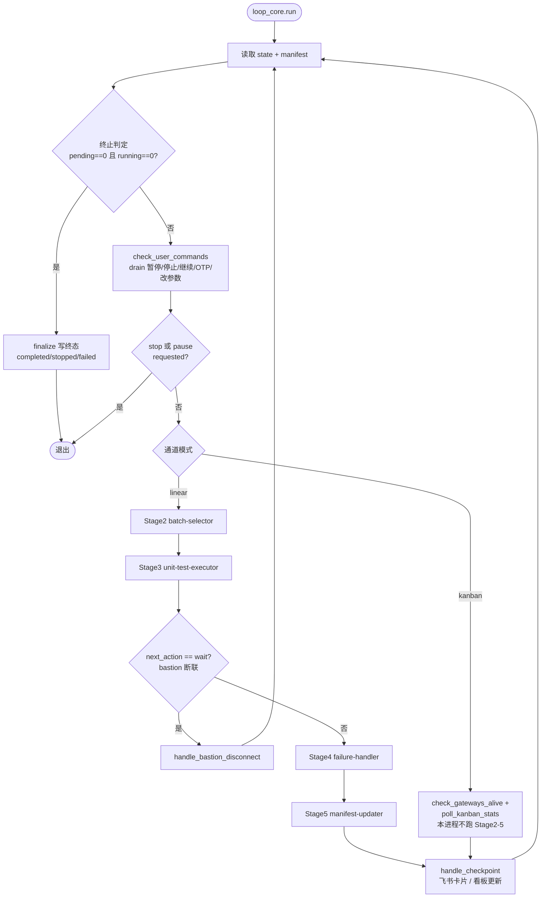
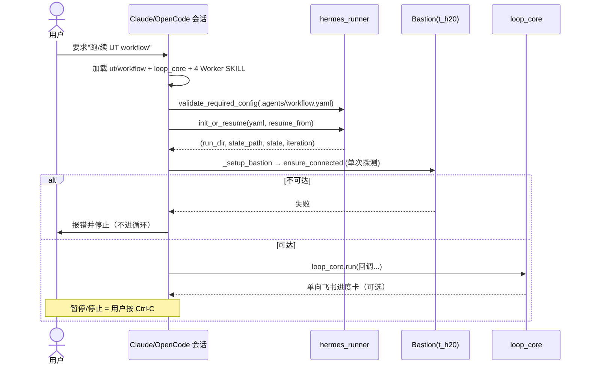
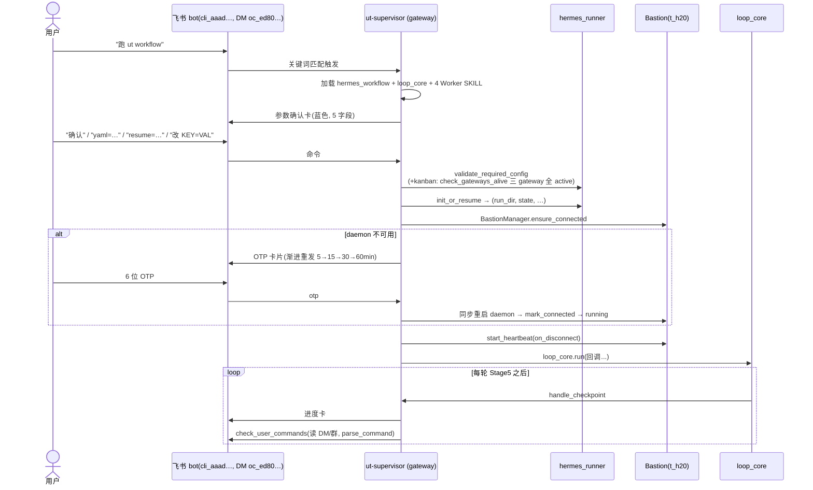
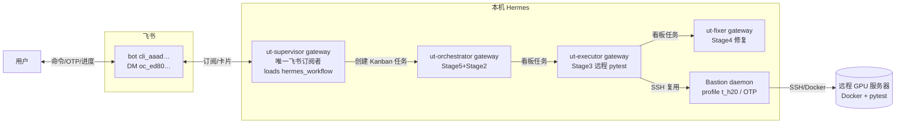

# UT 双通道运行总览 (Channels Overview)

> 一份文档看清两个 UT 测试通道**怎么触发、怎么跑**，以及 hermes 通道**怎么把环境搭起来**。
>
> 权威设计规格：`tasks/ut/docs/designs/2026-06-18-hermes-workflow-dual-channel-design.md`
> 运维细节：`tasks/ut/docs/guides/hermes-runner.md`、`tasks/ut/docs/guides/hermes-supervisor-service.md`、`tasks/ut/docs/guides/hermes-gateway-service.md`

---

## 0. 先选通道

两个通道**共用同一套循环内核**（`workflow_loop_core`）和**同 4 个 Worker SKILL**（batch-selector / unit-test-executor / failure-handler / manifest-updater）。区别只在「谁来驱动、怎么触发、断联怎么恢复」。

| 维度 | `ut/workflow`（终端通道） | `hermes_workflow`（生产通道） |
|---|---|---|
| 触发方式 | 用户在 Claude / OpenCode 会话里要求 | 飞书 DM bot 发「跑 ut workflow」 |
| 运行载体 | 当前交互会话（一个 supervisor 会话内驱动 Stage 2–5） | 长驻 `ut-supervisor` Hermes Agent（gateway） |
| 飞书 | 单向：只推进度/告警卡 | 双向：收命令 + OTP，发进度/确认/OTP 卡 |
| Bastion | 人工维护，断联只轮询 `ping` 等人重连 | 自动管理 + OTP 渐进重连 |
| 状态机 | 无（`current_stage` 只是面包屑） | 有：running / paused / waiting_otp / completed / stopped / failed |
| 暂停/停止 | Ctrl-C | 飞书「暂停 / 继续 / 结束」 |
| 适用场景 | 本地调试、单跑、看日志 | 无人值守、过夜、并行 worker、Kanban 看板 |

> 选不准就用 `ut/workflow` 调通，再切 `hermes_workflow` 跑生产。

---

## 1. 共享内核：`workflow_loop_core`

两个通道都调用 `loop_core.run(stage_skills, handle_checkpoint, handle_bastion_disconnect, check_user_commands, check_terminal_conditions)`。内核只负责 **stage 节奏 + 终止判定 + 命令 drain + checkpoint 节奏**；通道差异全部通过这 5 个回调注入。



- **linear 模式**：supervisor 进程**直接**顺序跑 Stage 2→3→4→5。
- **kanban 模式**：supervisor **不碰 manifest**，3 个 Worker Gateway 在后台跑、写 Kanban 看板 + manifest；supervisor 每轮只 `check_gateways_alive` + 轮询看板 + 只读出进度卡。
- 断联只在 linear 模式由 `handle_bastion_disconnect` 处理；kanban 模式 Gateway 各自持有 daemon，内核此处 no-op。

---

## 2. 通道 A — `ut/workflow`（终端 / linear）

**触发**：用户在 Claude/OpenCode 会话里要求「跑 / 续 UT workflow」。无飞书订阅、无确认卡、无状态机。



启动顺序（SKILL 详见 `skills/ut/workflow/SKILL.md`）：
1. 加载本通道 + loop_core + 4 Worker SKILL（每会话一次）
2. 读 `.agents/workflow.yaml`，`validate_required_config`
3. `init_or_resume` → run_dir/state/iteration
4. `_setup_bastion` 单次 `ensure_connected`，不可达即停、不进循环
5. `loop_core.run(...)`

---

## 3. 通道 B — `hermes_workflow`（生产 / 飞书驱动）

**触发**：飞书 DM 给 bot 发「跑 ut workflow」/「启动测试」/「开始 UT」。`ut-supervisor` 是系统里**唯一**的飞书订阅者。



状态机、命令矩阵（暂停/继续/结束/改参数/OTP）、续跑映射、OTP 渐进重发节奏，详见 `skills/ut/hermes_workflow/SKILL.md` §5–§9。

---

## 4. hermes_workflow 环境搭建

生产通道跑起来需要四件东西就位：**飞书 bot 对接 → bastion profile → 4 个 gateway（3 worker + 1 supervisor）**。拓扑：



### 4.1 飞书 bot 对接（手工，一次性）

bot 信息分两处，**两处都要对**：

| 文件 | 字段 | 作用 |
|---|---|---|
| `.agents/feishu_config.json` | `app_id` (`cli_…`)、`app_secret`、`chat_id` (`oc_…`)、`user_id` (`ou_…`) | bot 凭证 + 默认会话；hermes_runner / feishu_api 用它发卡、读消息 |
| `<profile>/channel_directory.json`（ut-supervisor profile 下） | `{"feishu":[{"id":"oc_…","type":"dm"}]}` | 把该 bot 会话绑定到 ut-supervisor，使其能订阅这条 DM |

要点（踩坑记录）：
- 这个 bot 是 **1:1（DM-only）**，不在任何群里。`channel_directory.json` 的 `type` 用 `dm`，`id` 用 DM chat（`oc_ed80…`），不要用群 id。
- `feishu_config.json` 里曾误填过一个旧群 id（飞书报 `230002`）——必须是当前 DM 的 `oc_ed80…`。
- open_id（`user_id`）是 **按 app 隔离**的；换 bot/app 必须重取，不能跨 app 复用。
- 生产 config（`.agents/workflow.yaml`）里还有 `notifications.feishu_chat_id`，预检会校验它非空。

### 4.2 Bastion daemon（手工先起，OTP 无法脚本化）

profile 名在 `workflow.yaml` 的 `bastion.profile`（默认 `t_h20`）。

```bash
# 首次：存静态凭证（一次性）
python tools/agent.py setcreds t_h20

# 每次开工：另开一个窗口手动起 daemon（输入静态密码 + 6 位 OTP）
python tools/agent.py serve t_h20

# 探活 / 停止
python tools/agent.py -p t_h20 ping
python tools/agent.py -p t_h20 stop
```

- daemon 必须**先于** gateway/supervisor 起来——`start_hermes_ut_runtime.py` 只校验它在运行，不会替你起。
- 生产运行中断联：supervisor 进 `waiting_otp`，飞书发 OTP 卡，你回 6 位码即同步重连。
- 报 `Socket is closed`：daemon 需要一条**活的 SSH 会话**（`serve`，不只是 `ping`），重新 `serve` 并过 OTP。

### 4.3 启动 4 个 gateway

底层每个 gateway 都是：`hermes profile use <profile>` → `hermes gateway run`（后台），用 `hermes gateway list` 看 ✓。**推荐用一键脚本**（daemon 须已在跑）：

```bash
# 一键：预检配置 → 校验 daemon → 起 3 worker gateway → 起 ut-supervisor gateway
python tasks/ut/scripts/start_hermes_ut_runtime.py                      # 默认 L4 frozen config
python tasks/ut/scripts/start_hermes_ut_runtime.py --workflow-yaml .agents/workflow.yaml  # 用生产 config

python tasks/ut/scripts/start_hermes_ut_runtime.py --status             # 只看配置预检 + 运行态
python tasks/ut/scripts/start_hermes_ut_runtime.py --stop               # 停 daemon + 4 gateway
```

预检（`--status` / 启动时）会逐项检查：`.bastion_creds` 存在、`kanban.enabled: true`、`notifications.feishu_chat_id` 已设、4 个 profile（ut-orchestrator / ut-executor / ut-fixer / ut-supervisor）`hermes profile list` 里都在。

手工等价（脚本失败时排错用）：

```bash
for p in ut-orchestrator ut-executor ut-fixer ut-supervisor; do
  hermes profile use "$p" && hermes gateway run &   # Windows 用 start_gateway.py 后台化
done
hermes gateway list        # 4 行都应有 ✓
```

> profile 目录结构：每个 `<profile>/` 含 `profile.yaml`（描述）+ `channel_directory.json`（平台绑定）+ `SOUL.md`（角色定义）。测试 fixture 在 `tests/ut/integration/fixtures/profiles/`；生产 profile 在 Hermes 标准 profile 目录。systemd 常驻部署见 `tasks/ut/docs/guides/hermes-supervisor-service.md`（supervisor）与 `tasks/ut/docs/guides/hermes-gateway-service.md`（3 worker）。

### 4.4 就绪后触发

四样齐了（`--status` 全 `[OK] READY`）→ 飞书 DM 给 bot 发「跑 ut workflow」→ 回参数确认卡「确认」→ 观察 executor → fixer → executor 依赖链。

### 4.5 排错速查

| 症状 | 多半原因 / 处置 |
|---|---|
| `hermes gateway list` 缺某 profile 的 ✓ | 该 gateway 没起；`hermes profile use <p> && hermes gateway run` 重起，看 `.agents/logs/gateway_<p>.log` |
| daemon `Socket is closed` | 需活 SSH 会话，重新 `python tools/agent.py serve t_h20` 过 OTP |
| 飞书发卡 `230002` | `chat_id` 是旧群 id，改成当前 DM `oc_ed80…` |
| bot 收不到消息 | bot 是 DM-only、不在群；确认 `channel_directory.json` 用 `type:dm` + DM id |
| 预检 `.bastion_creds missing` | `python tools/agent.py setcreds t_h20` |
| init 复用旧 run_dir | 已修（commit 8b7e001）；确认 `init_workflow_state.py` 写出了 `.agents/current_run.json` 新指针 |
