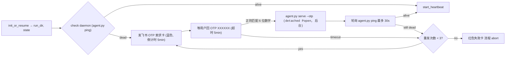
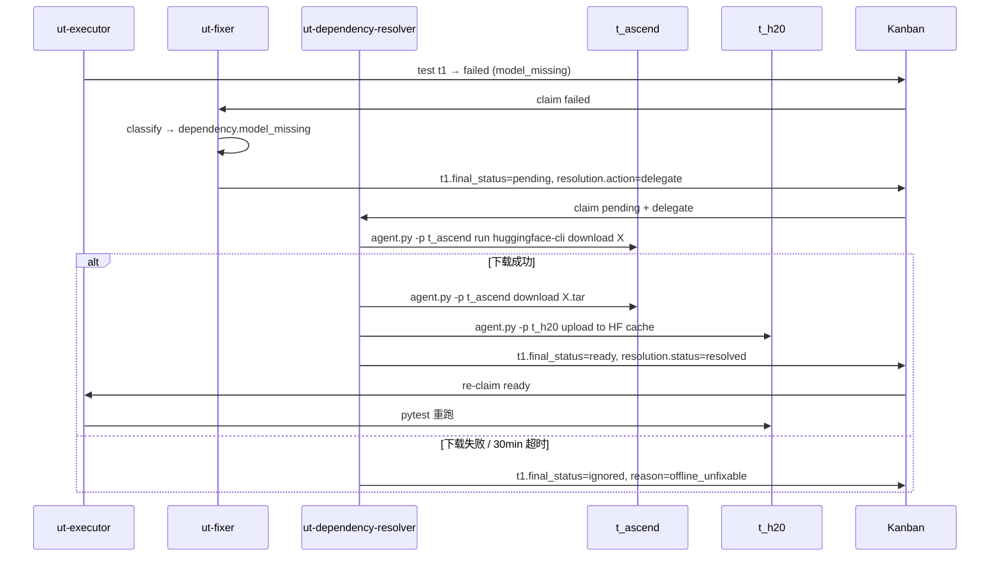

# L4 测试 PASS 后的 3 项产品问题复盘与修复设计

**事故 ID**: 2026-06-23-l4-postmortem-and-fixes
**Run ID**: `ut-20260623-105441`（L4 测试 overall=PASS，但暴露 3 个产品问题）
**严重级别**: 🟡 中（流程可走完但产生不必要人工介入；fixer→resolver 断链如不修，下一次自然完成路径仍会卡死）
**状态**: 📐 设计阶段（本文档）

---

## 0. TL;DR

本次 L4 测试 (`ut-20260623-105441`) check_expected.py 终判 **6/6 hard assertions PASS**（TSD / AF-2 / AF-3 / STG-1..3），但暴露 3 个跨子系统的产品问题：

| # | 问题 | 影响 | 解法 | 工作量 |
|---|---|---|---|---|
| 1 | SOUL.md intent classification 自相矛盾（`"跑 ut workflow"` 同时落在两条规则上） | bot 必须二选一，无法稳定行为；用户体验「不可预测」 | **守保守门：删除「legacy 关键词→start_production conf≥0.9」一条**；`"跑 ut workflow"`（无 tier 后缀）→ unknown → help 卡 | ~10 min |
| 2 | Bastion daemon 必须人工 `serve t_h20` + OTP 后才能跑 run，bot 在 daemon 死时只能心跳上报、无法自起 | 每次 run 之前人工干预；OTP 体验割裂 | Supervisor 启动阶段插入 OTP 自动索取流程（飞书 OTP 卡 → 用户回 6 位码 → `serve --otp <code>` detached Popen） | ~3-4 h |
| 3 | fixer 把 `model_missing` 类失败标 `pending` + `delegate_to_dependency_resolver`，但**没有任何 runner 接这个标签** → pending 永挂 → 用户必须 option-2 人工 ignored | L4 自然完成路径走不通；离线 + 在线环境都受影响 | 新增 **ut-dependency-resolver** 第 5 个 Hermes gateway，订阅 `pending+delegate`，**two-stage download**（t_ascend 联网下载 → t_h20 sync），失败直接 promote `ignored` | ~6-8 h |

**实施顺序**: #1 → #3 → #2（小→中→大；#3 风险孤立，#2 改动跨进程边界 + OTP 安全敏感放最后）

---

## 1. Incident Context

### 1.1 本次 L4 run 概况

| 项 | 内容 |
|---|---|
| Run ID | `ut-20260623-105441` |
| Mode | Kanban（3 worker gateway 依赖链 + supervisor） |
| 总耗时 | ~42 min（10:54 启动 → 11:36 终判 + 11:40 final state） |
| 终止方式 | `user_intervention_option_2`（人工 ignore 3 个 pending） |
| 终判 | `total=3 passed=0 failed=0 ignored=3 pending=0`；overall=PASS |
| trigger | `start_l4`（飞书消息含 tier 后缀，未踩 issue #1） |
| Bastion | `t_h20` daemon 由人工提前 serve（issue #2） |
| Fixer 输出 | 3 个 test 标 `pending + delegate_to_dependency_resolver`，无 runner 接（issue #3） |

### 1.2 6/6 hard assertions 通过表

| ID | 结果 | 说明 |
|---|---|---|
| TSD | ✅ PASS | terminal state 分布精确匹配 `{passed:0, failed:0, ignored:3, pending:0}` |
| AF-1 | ⏭️ SKIP | `--skip-af1`；raw_log 已独立验证存在 |
| AF-2 | ✅ PASS | duration_ms 与 run_count 一致 |
| AF-3 | ✅ PASS | passed+failed+ignored = 3 = expected_total |
| STG-1 | ✅ PASS | failure-handler 触发过（retry_count > 0） |
| STG-2 | ✅ PASS | retry_count ≤ max_retry |
| STG-3 | ✅ PASS | 无终态 retriable_error |
| INV-1..5 | ⏭️ SKIP | dependency-chain audit 尚未接入 check_expected.py |

---

## 2. Issue 1 — Intent Classification SOUL 自相矛盾

### 2.1 现状

`tasks/ut/scripts/.dist/ut-supervisor/SOUL.md` 的 `classify_intent_llm` 描述里有两条互斥规则：

| 规则源 | 内容 |
|---|---|
| L97–98 | `"跑 ut workflow" (no L-suffix) → start_production, conf ≥ 0.9` |
| L102–103 | `NEVER classify as start_* with conf ≥ 0.7 unless the user wrote a tier name (L1/L2/L3/L4) or one of "正式" / "生产" / "全量" explicitly.` |

裸短语 `"跑 ut workflow"` 同时被两条规则覆盖，bot 必须违反一条。

附加上下文（L107–109）：
> *"a wrong high-confidence start_production wastes hours of GPU time"* —— 此句倾向保守。

而 `skills/ut/hermes_workflow/SKILL.md` §3 流程描述（L145–146）：
> *"legacy 关键词「跑 ut workflow」/「启动测试」/「开始 UT」在 v4 是直接进 §3.B；v5 一律交给 Layer 2（这些短语**预期分类为 start_production**）"*

—— 此句又把 legacy 关键词显式推到 start_production。两份文档同时存在，开发态 SKILL.md 和运行时 SOUL.md 期待相反。

### 2.2 根因

v4 → v5 重构时，SKILL.md §3 留了「legacy 关键词预期 → start_production」的说明，但 v5 的 SOUL.md 同时引入了保守门（防误触发数小时生产）。两条规则没有交叉校验过，留下矛盾。

### 2.3 决策

**采纳保守门 + 删除 legacy 推断行为。**

裸短语 `"跑 ut workflow"`（无 L 后缀，无「正式/生产/全量」字眼）→ `unknown` → 飞书发 help 卡列出合法触发词：

| 用户应改写为 | intent |
|---|---|
| `"跑 L1 / L2 / L3 / L4"`、`"L4 走起"`、`"跑 ut workflow 的 l4 测试"` | `start_l1` / `start_l2` / `start_l3` / `start_l4`（蓝色卡） |
| `"跑 ut workflow 的正式生产"`、`"正式开跑"`、`"跑全量"` | `start_production`（橙色 + ⚠️ 警告卡） |

### 2.4 改动

| 文件 | 行为 |
|---|---|
| `tasks/ut/scripts/.dist/ut-supervisor/SOUL.md` L97–98 | 删除 `"跑 ut workflow" (no L-suffix) → start_production, conf ≥ 0.9` 一行（保留 `"正式开跑" / "全量" → start_production` 这条）|
| `skills/ut/hermes_workflow/SKILL.md` L145–146 | 改写为：「legacy 关键词「跑 ut workflow」/「启动测试」/「开始 UT」在 v5 走 Layer 2；**无 tier 后缀**时预期分类为 `unknown` → §3.D help 卡；带 tier 后缀或正式/生产/全量字眼时按 §3.A 走」|
| `skills/ut/hermes_workflow/SKILL.md` §3.D（新增）| 添加 help 卡内容模板（列合法触发词清单 + 示例） |

`§3.B legacy 自由参数确认卡分支`保留作为「unknown + v4 关键词」的回退（向后兼容现网），不变。

### 2.5 测试

- 单测：`tests/ut/unit/test_classify_intent_llm.py`（如不存在则新建），覆盖：
  - `"跑 ut workflow"` → `{intent:"unknown", confidence:<0.7}`
  - `"跑 L4"` → `{intent:"start_l4", confidence:≥0.9}`
  - `"跑 ut workflow 的 L4 测试"` → `{intent:"start_l4", confidence:≥0.9}`
  - `"正式开跑"` → `{intent:"start_production", confidence:≥0.9}`
  - `"跑测试"`（ambiguous Chinese）→ `{intent:"unknown", confidence:<0.7}`
- 集成：飞书消息 `"跑 ut workflow"` → help 卡出现 → 用户改写 `"跑 L4"` → 蓝色启动卡出现 → 确认 → run 起。

---

## 3. Issue 2 — Bastion Daemon 强人工依赖

### 3.1 现状

`tasks/ut/scripts/start_hermes_ut_runtime.py` 在启动 gateways 之前要求 `t_h20` daemon 已在跑，否则 abort：

```python
def ensure_bastion_daemon(profile="t_h20"):
    if check_bastion_daemon(profile):
        return True
    print("先在另一个窗口手动启动 daemon（OTP 无法脚本化）：")
    print(f"  python {_AGENT_PY} serve {profile}")
    return False
```

Supervisor 在 daemon 死亡时只能发心跳卡，不能自起。每次 run 之前都需要人工 `serve t_h20` 输 OTP。

附加约束（来自 `kanban-operations.md` 和 SOUL.md L39–40）：
- worker 不许自起 daemon；daemon 由 supervisor 通过 OTP 管
- OTP 码不准 print/log/store
- worker 看到 daemon 死了就 `next_action=wait` 直接返回

### 3.2 根因

v4 设计把 OTP 索取做成「人工外部步骤」是因为 OTP 必须经过用户的物理设备（手机 token），无法预先静态注入。但 v5 已经有 supervisor↔飞书全双工通道，**OTP 应通过同一通道索取**。

### 3.3 决策

**Supervisor 启动阶段插入「Bastion OTP 自动索取」子流程**（§3.A A5.5 新增）：



**关键设计约束:**

| 项 | 决策 |
|---|---|
| `serve` 进程必须 detached | 不阻塞 supervisor 主循环；用 `subprocess.Popen` + `creationflags=CREATE_NEW_PROCESS_GROUP \| DETACHED_PROCESS`（Windows）；stdout 重定向到 `<workspace>/.agents/logs/bastion_<profile>.log` |
| OTP 永不落盘 | 卡片回复内的 OTP 在 supervisor 内存里直接喂 `serve --otp`，**不写 workflow_state.json / logs / kanban metadata**；处理完即清栈 |
| 卡片格式 | 蓝色 (`template: blue`)，标题 `🔐 Bastion OTP 请求 ({profile})`，正文 `请在 5 分钟内回复 "OTP <6位码>"`；OTP 索取本身可重发 max 3 次 |
| 心跳保留 | A6 阶段 `start_heartbeat` 不变；运行中 daemon 死亡仍走原有 `mark_disconnected` 上报流程（不替 daemon 自恢复，避免循环 OTP） |
| 多 profile | 支持 `t_h20` / `t_ascend` 并行索取（issue #3 要用到 t_ascend）；卡片标题带 profile 名区分 |

### 3.4 改动

| 文件 | 行为 |
|---|---|
| `skills/ut/hermes_workflow/SKILL.md` §3.A | 在 A5 与 A6 之间插入 A5.5「Bastion OTP bring-up」子流程；附 mermaid 图 |
| `skills/ut/workflow_loop_core/scripts/bastion_otp_bringup.py`（新建） | 实现：发 OTP 卡 → 等回复 → 解析 6 位码 → detached Popen `serve --otp` → poll ping → 成功返回 / 超时 raise |
| `tasks/ut/scripts/.dist/ut-supervisor/SOUL.md` | 加 §「OTP recovery」段：描述 OTP 卡格式、超时策略、永不落盘约束 |
| `tasks/ut/scripts/start_hermes_ut_runtime.py` | `ensure_bastion_daemon` 不再 abort；若 daemon 死，由 supervisor 主循环在启动卡确认后通过 A5.5 自起。本脚本仅做 preflight，不再硬要求 daemon |
| `skills/ut/dependency-resolver/SKILL.md` | 在 §「作为 Hermes Gateway 运行」段说明 resolver 复用同一套 OTP bring-up（参数化 profile）|
| `tools/agent.py` | 校验 `serve --otp` 已支持后台模式（如不支持需补；Hermes v0.16 通常已支持） |

### 3.5 测试

- 单测：`tests/ut/unit/test_bastion_otp_bringup.py`（新建）
  - mock `agent.py ping`：先死后活 → bringup 函数走通
  - mock 用户回复 `"OTP 562741"` → 正则提取出 `562741`
  - mock 超时 → 重发 1 次 → 仍超时 → 重发 2 次 → 仍超时 → raise
  - mock 后台 Popen → 验证 `creationflags` 含 `DETACHED_PROCESS`（Windows）
- 集成：手动测试 — 杀掉 daemon → 飞书发 `"跑 L4"` → 收到 OTP 卡 → 回 OTP → 1 分钟内 daemon 起来 → L4 run 开始
- 安全测试：grep `runs/<run_id>/**` 不应出现任何 6 位数字模式（OTP 防泄漏 regression）

### 3.6 边界情况

| 场景 | 处理 |
|---|---|
| 用户回复 `OTP 123456` 但 OTP 已过期（30s rolling）| `serve --otp` 返回 auth error → supervisor 重发 OTP 卡 + 提示「OTP 已过期，请再发一次」|
| 用户回复非 6 位数字 | supervisor 提示「OTP 必须为 6 位数字」，重发 |
| 用户连续 3 次超时 | 红色失败卡 + abort 流程；等下条触发消息 |
| 同时索取 t_h20 + t_ascend | 两张卡按 profile 名区分；并行等待，任一失败两个 daemon 都 abort（避免 t_ascend 起来但 t_h20 死） |

---

## 4. Issue 3 — fixer → dependency-resolver 断链（pending 永挂）

### 4.1 现状

`runs/ut-20260623-105441/batch_0001/handled_tests.json` 显示 fixer 行为：

```json
{
  "id": 1,
  "classification": {"type": "dependency", "subtype": "model_missing"},
  "resolution": {
    "status": "pending_resolver",
    "action": "delegate_to_dependency_resolver",
    "dependency_id": "meta-llama/Llama-3.2-1B-Instruct",
    "dependency_type": "model"
  },
  "final_status": "pending",
  "fix_applied": false
}
```

`summary.next_action = "wait_for_resolver"`、`blocked_reason = "Waiting for dependency-resolver to download 3 missing models"`。

但代码库内**没有任何 runner 订阅这个标签**：
- `skills/ut/dependency-resolver/` 是 skill（脚本：`download_model.py` / `install_package.py` / `check_dependency.py`），不是 long-running gateway
- 没有 hermes profile 叫 `ut-dependency-resolver`
- `skills/ut/failure-handler/scripts/generate_handled_manifest.py:101` 只是**写入**这个 action 标签，没人**读出**

结果：3 个 test 永挂在 `pending`；workflow_loop_core 在 `pending > 0` 时不会判定终态，**自然完成路径走不通**。本次 run 是用户 option-2 人工干预 ignored 才出账。

### 4.2 根因

设计文档 `tasks/ut/docs/designs/2026-06-12-failure-handler-review-analysis.md` Decision 3 写的是「failure-handler can directly `delegate_task(skills=["dependency-resolver"])`」（让 fixer 同进程调子 skill），但实现成了 Kanban-style「写标签等 worker」。两种模型混合，没人真正接单。

### 4.3 决策

**新增第 5 个 Hermes gateway profile `ut-dependency-resolver`**，订阅 Kanban 上 `final_status=pending AND resolution.action=delegate_to_dependency_resolver` 的 task。

**Two-stage download**（关键决策）：resolver host 不直接下载，而是通过两个 bastion：
1. 走 `t_ascend`（联网 bastion）跑 `huggingface-cli download`
2. download → resolver host stage dir → sync 到 `t_h20`（离线，跑测试） HF cache

#### 4.3.1 闭环时序图



#### 4.3.2 关键设计决策

| 项 | 决策 | 理由 |
|---|---|---|
| profile 名 | `ut-dependency-resolver` | 用户指定 |
| skill 复用 | `skills/ut/dependency-resolver/`（已有 3 个脚本） | 已实现，无需重写下载逻辑；resolver gateway 只是把 skill 包成长服务 |
| 订阅过滤 | `kanban.claim_filter`: `final_status == pending AND resolution.action == "delegate_to_dependency_resolver"` | 防 resolver 抢 executor 的 `ready` task |
| 下载主机 | `t_ascend`（联网 bastion） | 用户指定；`t_h20` 离线，必须先到联网环境拉取 |
| 同步路径 | `t_ascend:~/hf_stage/<model>` → resolver host `<workspace>/.resolver_stage/` → `t_h20:~/.cache/huggingface/hub/<model>` | 走 bastion `download` / `upload` 命令（已有）；不开 t_h20→t_ascend 直连 |
| 失败策略 | **resolver 自己 promote `ignored`**，不回吐 fixer | resolver 是叶子节点，回吐 fixer 无价值且易循环 |
| 单 task 超时 | 30 min 硬上限（download + transfer 一起算）；大模型可能慢但不允许无限挂 | 卡住 → ignored |
| 单 task 不重试 | 失败 1 次直接 ignored；防止两个 daemon 重复消耗 OTP 配额 + HF rate-limit | retry 是 executor 层的事，resolver 不重试 |
| 离线环境 | resolver 仍**尝试一下** `t_ascend` download（用户决策：保留在线 env 恢复能力）；`agent.py run` 内部 SSH 命令 30s 网络探测无响应即判网络不可达 → ignored（与 task 总 30 min budget 分两层）| 不一刀切跳过；不同环境复用同一代码路径 |
| Stage dir 清理 | resolve 成功或失败后清理 `.resolver_stage/<model>/` | 防止 disk fill |
| Daemon 寿命 | `ut-dependency-resolver` gateway 与 executor/fixer 同生命周期，常驻 | 用 `start_hermes_ut_runtime.py` 一起拉起；不需要 lazy spawn |
| OTP | t_ascend daemon 通过 issue #2 的 OTP bring-up 自动起 | 不引入新的人工依赖 |

#### 4.3.3 状态机扩展

`resolution.status` 新增取值：

| 值 | 含义 | 写入者 |
|---|---|---|
| `pending_resolver` | fixer 决定委托，等 resolver claim | fixer |
| `resolving` | resolver 已 claim，正在下载/sync | resolver |
| `resolved` | 成功 sync，executor 可重跑 | resolver |
| `failed_offline` | resolver 跑过但失败（网络/超时/auth） | resolver |

`final_status` 流转：

```
failed (executor)
  → pending (fixer 设定，resolution.action=delegate)
  → pending (resolver 处理中，resolution.status=resolving)
  → ready (resolver 成功，resolution.status=resolved) → executor 重 claim
  → ignored (resolver 失败，resolution.status=failed_offline,
             ignored_reason="offline_unfixable: <detail>")
```

### 4.4 改动

| 文件 | 行为 |
|---|---|
| `tasks/ut/scripts/.dist/ut-dependency-resolver/`（新建） | 完整 profile dist：SOUL.md（最小，只描述 claim/resolve/release 三步）+ `skills/ut/dependency-resolver/`（完整复制）+ `skills/ut/shared/`（仅 logging + kanban 客户端子集） |
| `tasks/ut/scripts/deploy_tier.py` | hermes profile distribution 同步新 profile；skill 子集声明：`ut-dependency-resolver = [dependency-resolver, shared]` |
| `tasks/ut/scripts/start_hermes_ut_runtime.py` | `gateway_profiles` 列表加 `ut-dependency-resolver`；preflight `profile_present` 多一项；status display 多一行 |
| `skills/ut/dependency-resolver/SKILL.md` | 补充 §「作为 Hermes Gateway 运行」: claim filter、两阶段下载流程、超时与 ignored promotion、stage dir 约定 |
| `skills/ut/dependency-resolver/scripts/resolver_gateway_runner.py`（新建） | gateway 主循环：claim → resolve → release；调用现有 `download_model.py` / `install_package.py` |
| `skills/ut/dependency-resolver/scripts/two_stage_sync.py`（新建） | t_ascend → resolver host → t_h20 三段路径的封装；30 min 超时；stage dir 清理 |
| `skills/ut/failure-handler/scripts/generate_handled_manifest.py:101` | **不动**（fixer 行为已正确） |
| `skills/ut/workflow_loop_core/` | loop 判终态扩展：`final_status ∈ {passed, failed, ignored}` 才算结题；`pending` 不算 → 自动等 resolver；增加 `pending > 0` 的进度日志（不报 stuck） |
| `tasks/ut/scripts/grade_tier.py` | 新增 INV-6 assertion：终态 `pending == 0`（与 TSD 重叠但显式声明依赖链闭环） |
| `tests/ut/integration/fixtures/L4_expected.json` | **不动**（终态仍是 `passed=0/failed=0/ignored=3/pending=0`；resolver 走 offline 失败 → ignored 与原路径一致） |
| `tasks/ut/docs/designs/2026-06-12-failure-handler-review-design.md` | 加 errata 段：Decision 3 实现采纳了 Kanban-style 而非同进程子 skill；指向本文档 |

### 4.5 Skill 分发子集

```
tasks/ut/scripts/.dist/ut-dependency-resolver/
  SOUL.md                                          # 最小 SOUL: claim/resolve/release
  skills/ut/dependency-resolver/                   # 完整 (含新 runner + sync 脚本)
  skills/ut/shared/                                # 仅 logging + kanban 客户端
```

不分发 `failure-handler` / `unit-test-executor` / `batch-selector` / `manifest-updater` — resolver surface 最小化。

### 4.6 测试

- 单测：`tests/ut/unit/test_resolver_gateway_runner.py`（新建）
  - mock kanban claim → 返回 `pending + delegate` task → runner 调 sync 脚本 → kanban release `ready`
  - mock download 失败 → runner 调 kanban release `ignored` + reason
  - mock 30 min 超时 → runner 调 kanban release `ignored` + reason `"timeout"`
- 单测：`tests/ut/unit/test_two_stage_sync.py`（新建）
  - mock `agent.py -p t_ascend run huggingface-cli` 成功 → 检查 download/upload 调用顺序与路径
  - mock `t_ascend` 网络失败 → raise 明确异常
  - mock `t_h20` upload 失败 → raise；stage dir 已下载的产物不清理（便于重试，但下次 run 会清理）
- 集成：跑 L4 测试，**不人工干预**，期望 ~90 min 内（3 task × 30 min cap，串行 claim）3 个 model_missing 测试走 resolver → t_ascend 下载失败/超时 → ignored，verdict PASS（与本次手动 option-2 等价）；如 t_ascend 上有 HF cache 命中可 fast-path，则可能远低于 90 min
- 回归：`L4_expected.json` 不改 → check_expected.py 终判保持 6/6 PASS

### 4.7 边界情况

| 场景 | 处理 |
|---|---|
| resolver 启动时 t_ascend daemon 死 | 走 issue #2 的 OTP bring-up；OTP 失败则 resolver gateway 进入 stop 状态，所有 `pending+delegate` task 标 `ignored` + reason `"resolver_unavailable"` |
| 同一 model 多个 test 同时 pending（model id 重复）| Kanban claim 互斥：resolver 一次只 claim 1 个 task；同 model 后续 task 会发现 HF cache 已有 → fast-path resolved |
| HF auth-gated model（如 meta-llama） | `huggingface-cli download` 用 t_ascend 上预配的 HF token；失败 → ignored + reason `"hf_auth_failed"` |
| stage dir 磁盘满 | sync 前 check `df` < 10GB → 直接 ignored + reason `"disk_full"`，不下载 |
| t_h20 sync 后 HF cache 损坏 | executor 重跑仍失败 → 走正常 max_retry → ignored（不再回 resolver） |

---

## 5. 影响面与变更清单（汇总）

### 5.1 新增文件

| 文件 | Issue | 说明 |
|---|---|---|
| `tasks/ut/scripts/.dist/ut-dependency-resolver/` (目录) | #3 | 第 5 profile 完整 dist |
| `skills/ut/dependency-resolver/scripts/resolver_gateway_runner.py` | #3 | resolver gateway 主循环 |
| `skills/ut/dependency-resolver/scripts/two_stage_sync.py` | #3 | t_ascend→host→t_h20 同步 |
| `skills/ut/workflow_loop_core/scripts/bastion_otp_bringup.py` | #2 | OTP 索取子流程 |
| `tests/ut/unit/test_classify_intent_llm.py` | #1 | 意图分类 6 个 case |
| `tests/ut/unit/test_bastion_otp_bringup.py` | #2 | OTP 索取 4 个 case |
| `tests/ut/unit/test_resolver_gateway_runner.py` | #3 | runner 3 个 case |
| `tests/ut/unit/test_two_stage_sync.py` | #3 | sync 3 个 case |

### 5.2 修改文件

| 文件 | Issue | 改动 |
|---|---|---|
| `tasks/ut/scripts/.dist/ut-supervisor/SOUL.md` | #1, #2 | 删 L97–98 一行；新增 §OTP recovery |
| `skills/ut/hermes_workflow/SKILL.md` | #1, #2 | §3 流程修订；§3.D 新增 help 卡；§3.A 插入 A5.5 |
| `tasks/ut/scripts/start_hermes_ut_runtime.py` | #2, #3 | 不再 abort on no-daemon；加 5th profile |
| `tasks/ut/scripts/deploy_tier.py` | #3 | distribution 同步 resolver |
| `tasks/ut/scripts/grade_tier.py` | #3 | INV-6 assertion |
| `skills/ut/dependency-resolver/SKILL.md` | #3 | §作为 Hermes Gateway 运行 |
| `skills/ut/workflow_loop_core/` | #3 | loop 终态判定 pending=0 |

### 5.3 不动的文件（与直觉相反，需说明）

| 文件 | 为什么不动 |
|---|---|
| `skills/ut/failure-handler/scripts/generate_handled_manifest.py:101` | fixer 标 `pending+delegate` 行为本身是正确的（与 resolver 协议匹配） |
| `tests/ut/integration/fixtures/L4_expected.json` | 终态分布不变（resolver 离线失败 → ignored，与 option-2 ignored 等价） |
| `skills/ut/dependency-resolver/scripts/{download_model,install_package,check_dependency}.py` | 已实现，复用 |

---

## 6. 实施顺序与里程碑

按风险递增、改动面递增：

### Milestone 1（issue #1，~10 min）

1. 删 SOUL.md L97–98
2. 改写 SKILL.md §3 legacy 描述
3. 新增 SKILL.md §3.D help 卡模板
4. 写 `test_classify_intent_llm.py` 6 个 case → PASS
5. 提交 commit：`fix(ut): SOUL intent rules — 删除 legacy "跑 ut workflow" 冲突分类`

**验收**: 飞书发 `"跑 ut workflow"` → help 卡；发 `"跑 L4"` → 蓝色启动卡。

### Milestone 2（issue #3，~6-8 h）

1. 创建 `tasks/ut/scripts/.dist/ut-dependency-resolver/` profile dist（dist 工具自动同步）
2. 写 `resolver_gateway_runner.py` + `two_stage_sync.py`
3. 写 `SKILL.md §作为 Hermes Gateway 运行` 段
4. 改 `start_hermes_ut_runtime.py` / `deploy_tier.py` / `grade_tier.py`
5. workflow_loop_core 加 `pending=0` 终态判定
6. 写 4 个测试文件
7. 跑一次 L4（不干预），验证 ~30 min 内 verdict PASS
8. 提交 commits（分 3 个：resolver gateway / start script / loop+grade）

**验收**: L4 自然完成路径走通，不需要 user option-2 介入；check_expected.py 6/6 + INV-6 PASS。

### Milestone 3（issue #2，~3-4 h）

1. 写 `bastion_otp_bringup.py`（含 detached Popen / OTP 不落盘）
2. SKILL.md §3.A A5.5 文档
3. SOUL.md §OTP recovery 段
4. `start_hermes_ut_runtime.py` 改为 daemon 可选
5. 写 `test_bastion_otp_bringup.py` 4 个 case
6. 安全 grep regression：`runs/<run_id>/**` 不出现 6 位数字 OTP 泄漏
7. 集成测试：杀 daemon → 飞书 trigger → OTP 卡 → 回 OTP → 1 min 内自起
8. 提交 commit：`feat(ut): bastion OTP 自动索取`

**验收**: 全新机器 / 重启后，飞书发 `"跑 L4"` → bot 自动索取 OTP → 测试启动；无人工 serve 步骤。

---

## 7. 风险与回滚

| 风险 | 严重 | 缓解 |
|---|---|---|
| resolver gateway 抢 executor 的 ready task | 🟡 | `claim_filter` 严格匹配 `pending + delegate`；写入 ready 后由 executor 抢 |
| t_ascend OTP 配额耗尽 | 🟡 | OTP 索取上限 3 次/run；resolver 不重试单个 task |
| HF auth-gated model 持续失败 | 🟢 | 直接 ignored；不阻塞其他 test |
| stage dir 磁盘填满 | 🟢 | 单 task 结束清理；preflight `df` 检查 |
| OTP 卡片误投递到群组 | 🔴 | 严格走 supervisor channel_directory（已配 DM-only） |

**回滚策略**: 每个 milestone 独立 commit；任一 milestone 出问题可单独 revert，前置 milestone 不受影响。

---

## 8. 相关引用

- 本次 L4 run: `runs/ut-20260623-105441/`
- 上次 fabrication 事故复盘: `tasks/ut/docs/incidents/2026-06-22-l4-fabrication.md`
- failure-handler Decision 3: `tasks/ut/docs/designs/2026-06-12-failure-handler-review-analysis.md`（采纳实现路径与本设计不同，将加 errata）
- failure-handler review design: `tasks/ut/docs/designs/2026-06-12-failure-handler-review-design.md`
- hermes_workflow v5 SKILL: `skills/ut/hermes_workflow/SKILL.md`
- supervisor SOUL: `tasks/ut/scripts/.dist/ut-supervisor/SOUL.md`
- tier 设计: `tasks/ut/docs/designs/2026-06-22-ut-tier-fixtures-and-agent-intent-design.md` §4.3
