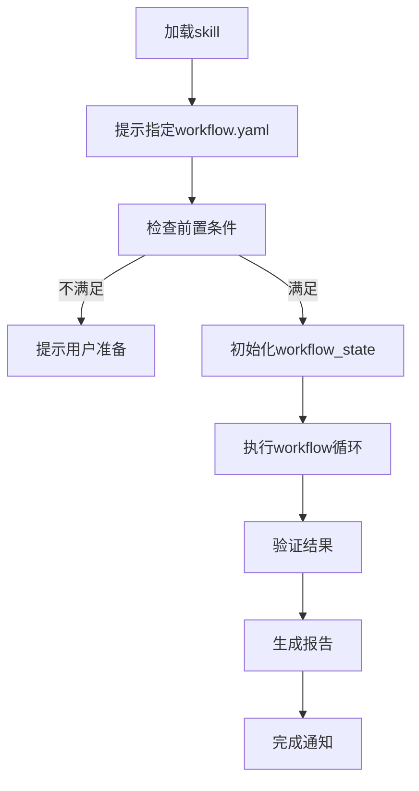

# UT Workflow 优化实现计划

> **历史路径变更：** `.agents/workflow.yaml` → `runs/ut-{timestamp}/workflow.yaml`（配置副本），原路径已废弃（2026-06-29）。

> **For agentic workers:** REQUIRED SUB-SKILL: Use superpowers:subagent-driven-development (recommended) or superpowers:executing-plans to implement this plan task-by-task. Steps use checkbox (`- [ ]`) syntax for tracking.

**Goal:** 优化UT Workflow用户体验，使其更易理解和操作（最小化导引 + 配置标记 + 自主执行）

**Architecture:** 三文件协同架构 - tasks/ut/README.md作为导引入口，workflow.yaml标记用户调整项，SKILL.md实现自主执行逻辑

**Tech Stack:** Python, YAML, Markdown, Claude Code Skill tool

---

## File Structure

| 文件 | 操作 | 职责 |
|------|------|------|
| tasks/ut/README.md | 创建 | 最小化导引，用户入口 |
| .agents/workflow.yaml | 修改 | 添加用户调整标记注释 |
| skills/ut/terminal-workflow/SKILL.md | 修改 | 自主执行逻辑（v3.0 → v4.0） |
| skills/ut/terminal-workflow/scripts/supervisor_loop.py | ✅已完成 | 处理delegate_to/timeout/log_extraction等字段 |
| tasks/ut/workflow_tests/verify_workflow_test.py | 修改 | status字段改为done/failed |

---

### Task 1: 创建 tasks/ut/README.md

**Files:**
- Create: `tasks/ut/README.md`

- [ ] **Step 1: 检查tasks/ut目录是否存在**

Run: `ls tasks/ut/`
Expected: 显示目录内容或确认目录存在

- [ ] **Step 2: 创建README.md文件（最小化导引内容）**

```markdown
# UT Workflow - vLLM单元测试验证流程

## 简介

UT Workflow是一个自动化单元测试验证流程，用于批量执行vLLM单元测试并追踪进度。

## 快速开始

**步骤**：
1. 配置workflow.yaml（设置test_list_path等参数）
2. 加载skill：`加载 ut/workflow skill`
3. 指定workflow.yaml路径
4. skill自动执行并生成报告

**提示**：加载skill后需要指定workflow.yaml位置

## 核心概念

**5阶段流程**：
- Stage 1: collect - 收集测试清单
- Stage 2: select_batch - 选择批次
- Stage 3: execute - 执行测试
- Stage 4: handle_failures - 处理失败
- Stage 5: update_status - 更新状态

**test list来源**：
- workflow.yaml配置指定
- 命令行参数指定

## 相关文档

- [workflow.yaml](../../.agents/workflow.yaml) - Workflow配置（需用户调整）
- [workflow SKILL.md](../../skills/ut/terminal-workflow/SKILL.md) - 详细执行逻辑
```

- [ ] **Step 3: 验证文件内容**

Run: `cat tasks/ut/README.md`
Expected: 显示完整的导引内容

- [ ] **Step 4: Commit**

```bash
git add tasks/ut/README.md
git commit -m "docs: add UT Workflow minimal guide"
```

---

### Task 2: 修改 workflow.yaml 添加用户调整标记

**Files:**
- Modify: `.agents/workflow.yaml` (添加注释标记)

- [ ] **Step 1: 读取当前workflow.yaml内容**

Run: `cat .agents/workflow.yaml`
Expected: 显示完整配置内容

- [ ] **Step 2: 在test_name配置处添加标记**

修改位置：第15行附近（test_name配置）

```yaml
  # ============================================================
  # ⚠️ 用户需调整：测试标识
  # ============================================================
  test_name: "ut"  # 测试名称，运行目录: {runs_dir}/{test_name}-{timestamp}
```

- [ ] **Step 3: 在config部分添加标记**

修改位置：第19-62行（config部分）

```yaml
config:
  # ⚠️ 用户需调整：核心路径定义
  workspace: &workspace "D:/workspace/apmm"
  runs_dir: &runs_dir "D:/workspace/apmm/runs"

  # ... (保持原有配置不变)

  # ⚠️ 用户需调整：远程执行配置
  remote_server: "t_h20"
  docker_container: "v0.13.0_torch2.5.1_compile"
  vllm_dir: &vllm_dir "/gpfs/gcsp/M2.7_verify/vllm"
  ut_logs_dir: "/gpfs/gcsp/M2.7_verify/vllm/ut_logs"

  # ⚠️ 用户需调整：pytest参数和批次大小
  pytest_args: "-q --tb=long"
  batch_size: 50
```

- [ ] **Step 4: 在input_filter部分添加标记**

修改位置：第73-88行（input_filter部分）

```yaml
input_filter:
  # ⚠️ 用户需调整：test_list路径（必须指定）
  test_list_path: null  # 例如: "D:/workspace/apmm/tasks/ut/test_list.txt"

  # ⚠️ 用户需调整：manifest来源（可选）
  manifest_source: null  # 例如: "D:/workspace/apmm/tasks/ut/test_analysis/manifest.json"

  # ⚠️ 用户需调整：范围截取（可选）
  range: null  # 格式: "0-100" 或 "50:100"，null 表示全部

  # ⚠️ 用户需调整：筛选条件（可选）
  filter:
    status: null
    error_type: null
    count: null
```

- [ ] **Step 5: 验证修改**

Run: `cat .agents/workflow.yaml | grep "⚠️"`
Expected: 显示4处标记注释

- [ ] **Step 6: Commit**

```bash
git add .agents/workflow.yaml
git commit -m "docs: add user adjustment markers to workflow.yaml"
```

---

### Task 3: 修改 SKILL.md 实现自主执行

**Files:**
- Modify: `skills/ut/terminal-workflow/SKILL.md` (v3.0 → v4.0)

- [ ] **Step 1: 读取当前SKILL.md头部元数据**

Run: `head -10 skills/ut/terminal-workflow/SKILL.md`
Expected: 显示元数据和版本信息

- [ ] **Step 2: 更新元数据和版本号**

修改位置：第1-6行（元数据）

```yaml
---
name: ut-workflow
description: UT Workflow - vLLM单元测试验证流程，加载skill自动启动完整测试流程
version: 4.0.0
when_to_use: 用户需要执行 vLLM 单元测试验证流程（自动执行）
---
```

- [ ] **Step 3: 替换"启动 Workflow"部分为"自主执行流程"**

修改位置：第12-38行（启动部分）

```markdown
## 🚀 自主执行流程

### 触发方式

用户加载skill：
```
加载 ut/workflow skill
```

skill自动执行以下流程：

---

### 执行步骤

**Step 1: 提示用户指定workflow.yaml**

skill加载后，立即提示：
> "UT Workflow已加载。请指定workflow.yaml路径（或使用默认路径：.agents/workflow.yaml）"

等待用户提供路径或确认默认。

---

**Step 2: 检查前置条件**

自动检查：
1. Bastion连接状态（agent.py serve t_h20）
2. workflow.yaml文件存在
3. test_list文件存在（根据配置）

如果前置条件不满足：
- Bastion未连接 → 提示用户启动：`python agent.py serve t_h20`
- 文件不存在 → 提示用户准备相应文件

---

**Step 3: 初始化workflow_state.json**

调用初始化脚本：
```bash
python skills/ut/terminal-workflow/scripts/init_workflow_state.py \
  --workflow-yaml WORKFLOW_YAML_PATH \
  --test-list TEST_LIST_PATH
```

生成运行目录和初始状态文件。

---

**Step 4: 执行workflow循环**

调用supervisor循环：
```bash
python skills/ut/terminal-workflow/scripts/supervisor_loop.py \
  --workflow-yaml WORKFLOW_YAML_PATH \
  --workflow-state WORKFLOW_STATE_PATH
```

自动执行5个Stage循环，直到pending_count == 0。

---

**Step 5: 验证结果并生成报告**

执行完成后，调用验证脚本：
```bash
python tasks/ut/workflow_tests/verify_workflow_test.py \
  --run-dir RUN_DIR \
  --test-list TEST_LIST_NAME
```

生成验证报告，显示通过/失败状态。

---

**Step 6: 完成通知**

通知用户：
> "UT Workflow执行完成。验证报告已生成：{run_dir}/verification_report.json"
```

- [ ] **Step 4: 添加执行流程图**

在执行步骤后添加：

```markdown
---

### 执行流程图



---

### 错误处理

| 错误类型 | 处理方式 |
|---------|---------|
| Bastion未连接 | 提示用户启动agent.py serve |
| workflow.yaml不存在 | 提示用户检查路径 |
| test_list不存在 | 提示用户准备文件或检查配置 |
| workflow执行失败 | 生成失败报告，提示检查日志 |
| 验证失败 | 显示失败详情，建议检查 |
```

- [ ] **Step 5: 更新"启动方式"部分**

修改位置：第554-570行（启动方式部分）

删除旧的启动方式，替换为：

```markdown
---

## 用户配置提醒

**用户需先配置workflow.yaml再加载skill**：
1. 阅读 tasks/ut/README.md 了解概念
2. 填写 workflow.yaml（test_list_path等）
3. 加载 ut/workflow skill
4. 指定workflow.yaml路径
```

- [ ] **Step 6: 验证修改**

Run: `grep "自主执行流程" skills/ut/terminal-workflow/SKILL.md`
Expected: 显示新增的自主执行部分

- [ ] **Step 7: Commit**

```bash
git add skills/ut/terminal-workflow/SKILL.md
git commit -m "feat: add self-executing logic to workflow skill (v3.0 → v4.0)"
```

---

### Task 4: 修改 verify_workflow_test.py status字段

**Files:**
- Modify: `tasks/ut/workflow_tests/verify_workflow_test.py:101`

- [ ] **Step 1: 读取当前verify_workflow_test.py**

Run: `cat tasks/ut/workflow_tests/verify_workflow_test.py`
Expected: 显示完整验证脚本

- [ ] **Step 2: 定位status字段位置**

Run: `grep -n "status.*PASS.*FAIL" tasks/ut/workflow_tests/verify_workflow_test.py`
Expected: 显示第101行附近

- [ ] **Step 3: 修改status字段为done/failed**

修改位置：第101行

```python
        "status": "done" if all_passed else "failed",
```

原内容：
```python
        "status": "PASS" if all_passed else "FAIL",
```

- [ ] **Step 4: 修改终端输出提示**

修改位置：第141-145行

```python
    if report["status"] == "done":
        print("\n✅ VERIFICATION PASSED")
    else:
        print("\n⚠️ VERIFICATION FAILED - check above for details")
```

原内容：
```python
    if report["status"] == "PASS":
        print("\n🎉 VERIFICATION PASSED")
    else:
        print("\n⚠️ VERIFICATION FAILED - check above for details")
```

- [ ] **Step 5: 验证修改**

Run: `grep "status.*done.*failed" tasks/ut/workflow_tests/verify_workflow_test.py`
Expected: 显示修改后的status字段

- [ ] **Step 6: Commit**

```bash
git add tasks/ut/workflow_tests/verify_workflow_test.py
git commit -m "fix: change verification status from PASS/FAIL to done/failed"
```

---

### Task 5: 验证整体实现

**Files:**
- Test: 整体功能验证

- [ ] **Step 1: 检查所有文件已修改**

Run: `git status`
Expected: 显示所有修改已commit

- [ ] **Step 2: 检查tasks/ut/README.md内容**

Run: `cat tasks/ut/README.md | head -20`
Expected: 显示导引内容，包含快速开始步骤

- [ ] **Step 3: 检查workflow.yaml标记**

Run: `grep -c "⚠️" .agents/workflow.yaml`
Expected: 输出 "4"（4处标记）

- [ ] **Step 4: 检查SKILL.md自主执行逻辑**

Run: `grep "自主执行流程" skills/ut/terminal-workflow/SKILL.md`
Expected: 显示自主执行流程标题

- [ ] **Step 5: 生成最终总结**

```bash
echo "UT Workflow优化实现完成：
- tasks/ut/README.md: 最小化导引已创建
- workflow.yaml: 4处用户调整标记已添加
- SKILL.md: 自主执行逻辑已实现（v4.0）
- verify_workflow_test.py: status字段已修改为done/failed"
```

---

## Self-Review

**1. Spec coverage:** ✅ 所有spec要求已在tasks中实现
- tasks/ut/README.md最小化导引 → Task 1
- workflow.yaml标记 → Task 2
- SKILL.md自主执行 → Task 3
- verify status字段 → Task 4

**2. Placeholder scan:** ✅ 无placeholder（TBD/TODO等）

**3. Type consistency:** ✅ 类型一致（status字段统一为done/failed）

---

*创建日期: 2026-06-11*
*版本: 1.0*