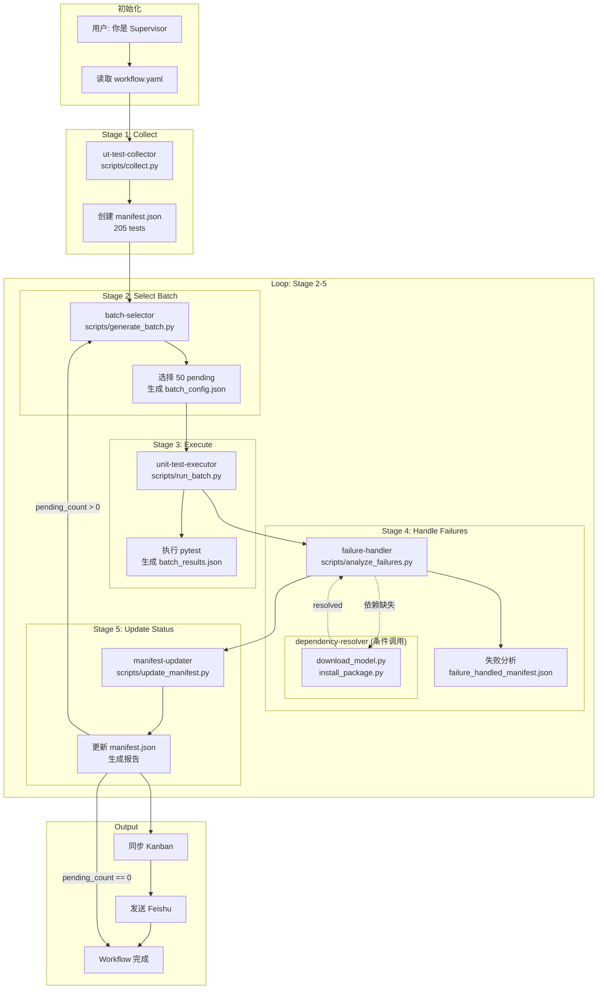

## 2026-06-08-2026-06-12

[TOC]

## 本周单元测试工作产出

+ 搭建标准的单元测试workflow和Agent文档体系，测试流程拆分为各个skill（问题和背景见下文）
+ 调研了在任务执行流程中如何设计匹配的Agent architecture（详细见下文）
+ 引入飞书bot和Hermes agent，单元测试运行状态会及时发送飞书消息并能跟用户互动

+ 单元测试workflow调试运行成功，并完成了Hermes kanban接入

---

## 本周工作明细

### 问题背景

本周没有长时间再跑单元测试，转而将单元测试流程标准化为一个全自动化执行流程。当前单元测试能做到半自动化（人工通过触发claude code执行单元测试），但是还会遇到如下问题：

1.agent执行失败追溯需要人工频繁接入，不够自动化

缺乏超时/错误/失败重试机制，全由人工对话引导耗时，文本和脚本设置规则繁琐

若考虑封装至skill中，也不能逻辑全部放在一个skill中，因此需要更模块化的设计

2.单元测试用例数目很大，运行耗时很长，较难有效追踪测试状态和执行步骤

虽然agent会统计和提取日志信息，但是不够全面，而且时常需人工使用脚本确认

3.agent文档和脚本未作标准化

会使得随着运行时间变长，产生的脚本和文档散落多处，维护困难

因为脚本未作标准化输入输出约束，agent有上下文信息，它熟练知道怎么用，但是用户如果想处理中间结果，直接使用脚本比较难，必须跟agent对话

为此，我们进行了单元测试重设计，制作ut workflow

### 关于agent architecture的讨论

| 方案                                               | 优点                                   | 缺点                                                         |
| -------------------------------------------------- | -------------------------------------- | ------------------------------------------------------------ |
| 单agent+workflow（每个stage只调用脚本）            | 简单                                   | 1.有些stage无法直接使用确定性的脚本解决比如vllm代码修复      |
| ✅单agent+workflow（每个stage加载对应skill）        | 简单上下文信息连贯                     | 1.需要注意上下文长度，及时做压缩（可选用opencode来执行,claude code不行） |
| 单agent+workflow（每个stage delegate task至agent） | 1.agent不会有session超出上下文长度危险 | 1.每次都需要在subagent中加载skill2.subagent存在依赖关系      |
| 主agent+workflow每个stage一个独立agent             |                                        | 1.实现复杂高2.调试困难3.通信延迟大                           |

### ut workflow

### 飞书通知

### Hermes kanban

待跑的单元测试用例

阻塞需要人工接入的

正在进行中的

已完成的等等都可以在UI上看到，在看板任务页面可以看到比较详细的运行信息和日志

## 正在做和下周待办

### 正在做的

+ 大批量单元测试调试ut workflow

### 待办项

将剩余单元测试（包括之前失败的）使用ut workflow运行